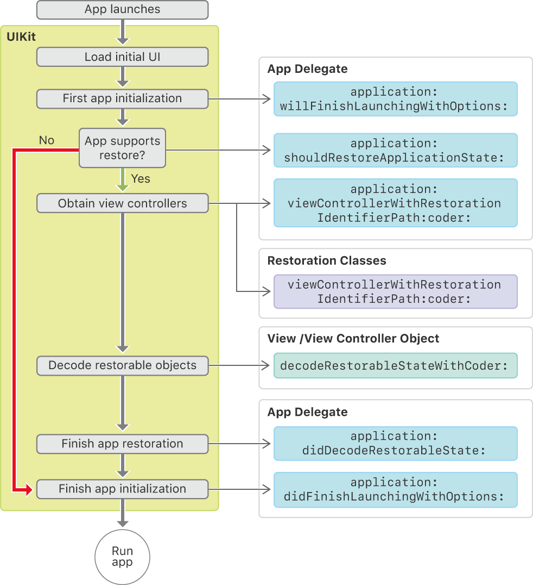

> 导航：[技术](../technologies.md) · [UIKit](../uikit.md) · [视图控制器](view-controllers.md) · [在多次启动间保留你的 App 的 UI](preserving-your-app-s-ui-across-launches.md)

# 关于 UI 恢复过程

<sub>文章</sub>

了解如何自定 UIKit 的状态恢复过程。

## 概述

下面的示意图展示了从你的 App 启动到它被恢复之间发生的调用序列。恢复发生在你的 App 初始化的中段，且只有在状态恢复归档可用、并且你的 App 委托的 [- application:shouldRestoreApplicationState:](<uiapplicationdelegate/application(__shouldrestoreapplicationstate_).md>) 方法返回 [true](../swift/true.md) 时才会继续进行。



恢复过程的第一步是为你的界面创建视图控制器对象（显式或隐式）。第二步是解码并恢复这些对象的状态。要重建你的视图控制器层级结构，两步都不可或缺。例如，在创建了一个导览控制器及其子视图控制器之后，这些对象之间并没有直接的关联。真正重新建立起它与子视图控制器之间关系的，是导航控制器的 [- decodeRestorableStateWithCoder:](<uistaterestoring/decoderestorablestate(with_).md>) 方法。

状态恢复结束后，UIKit 会调用 App 委托的 [- application:didFinishLaunchingWithOptions:](<uiapplicationdelegate/application(__didfinishlaunchingwithoptions_).md>) 方法。用这个方法对界面做最后一刻的修改或补充。例如，你可以向视图控制器层次中添加一个登录界面。

### 重建你的视图控制器

在恢复过程中，UIKit 会尝试根据你保留的界面创建或定位视图控制器对象。UIKit 会先请你提供视图控制器对象；如果你不提供，UIKit 会隐式地寻找它。下面是 UIKit 重建视图控制器时遵循的步骤序列：

1. **询问视图控制器的恢复类。** 恢复类知道如何创建特定的视图控制器。把该类赋给你的视图控制器的 [restorationClass](uiviewcontroller/restorationclass.md) 属性即可指定恢复类。恢复期间，UIKit 会调用恢复类的 [+ viewControllerWithRestorationIdentifierPath:coder:](<uiviewcontrollerrestoration/viewcontroller(withrestorationidentifierpath_coder_).md>) 方法请求视图控制器的新实例，由你的方法返回。如果你返回 `nil`，UIKit 就不再尝试创建该视图控制器，把它排除在恢复过程之外。
2. **询问 App 委托。** 如果该视图控制器没有恢复类，UIKit 会调用 App 委托的 [- application:viewControllerWithRestorationIdentifierPath:coder:](<uiapplicationdelegate/application(__viewcontrollerwithrestorationidentifierpath_coder_).md>) 方法。如果你在那个方法里返回 `nil`，UIKit 会继续搜索。
3. **检查已有对象。** UIKit 查找已经创建、且恢复路径完全相同的视图控制器。
4. **从你的 storyboard 实例化视图控制器。** 如果它仍然没有拿到视图控制器，UIKit 会自动从你的 App 的 storyboard 中将它实例化。

在状态恢复开始之前，UIKit 就已经从你的 storyboard 加载了 App 的默认视图控制器。因为这些视图控制器是 UIKit 自动加载的，最好不要用恢复类或 App 委托再去创建它们。对其他所有视图控制器，只有当它没有定义在 storyboard 中时才指定恢复类。你也可以通过指定恢复类来阻止在特定情况下创建你的视图控制器。例如，如果关联的恢复归档引用的是过期或缺失的数据，你可能就不想显示那个视图控制器。

在代码中重建视图控制器时，除了其他初始化之外，务必为视图控制器的 [restorationIdentifier](uiviewcontroller/restorationidentifier.md) 属性重新赋值；并视情况为 [restorationClass](uiviewcontroller/restorationclass.md) 属性赋值。在创建时赋予这些值，能确保该视图控制器在下一个周期中被保留。

```swift
func viewController(withRestorationIdentifierPath 
                    identifierComponents: [Any], 
                    coder: NSCoder) -> UIViewController? {
   let vc = MyViewController()
        
   vc.restorationIdentifier = identifierComponents.last as? String
   vc.restorationClass = MyViewController.self
        
   return vc
}
```

> [!note] 注意
> 你的恢复类应当始终返回 UIKit 所期望的类。恢复归档里包含每个被保留视图控制器的类。如果你的恢复类返回了另一个类的实例，UIKit 就不会调用那个视图控制器的 [- decodeRestorableStateWithCoder:](<uiviewcontroller/decoderestorablestate(with_).md>) 方法。

## 另请参阅

### 过程细节

- [关于 UI 保留过程](about-the-ui-preservation-process.md) — 了解如何自定义 UIKit 的状态保留过程。
