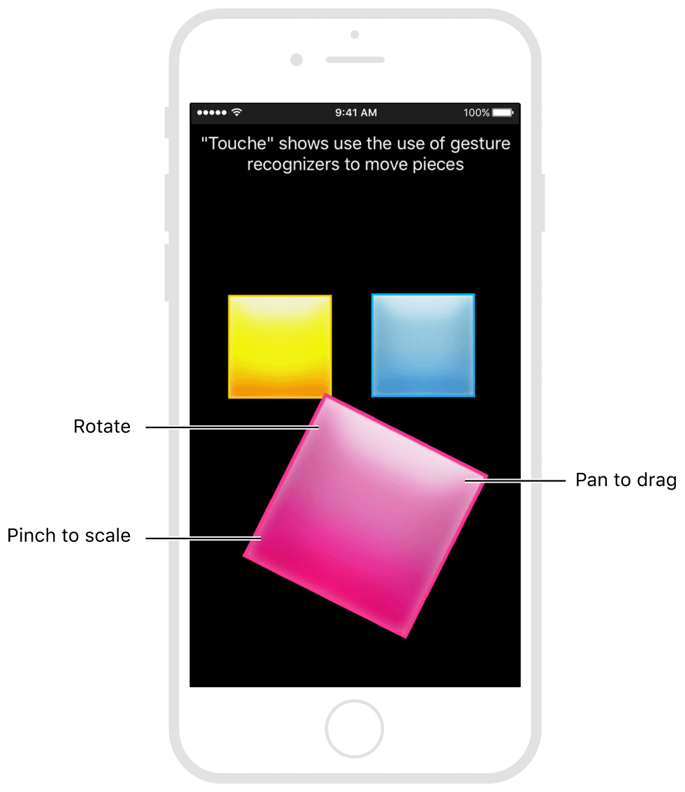

> ???[Technologies](../technologies.md) ? [UIKit](../uikit.md) ? [Touches, presses, and gestures](touches-presses-and-gestures.md) ? [Coordinating multiple gesture recognizers](coordinating-multiple-gesture-recognizers.md)

# ??????????

<sub>??</sub>

????????????????????

## ??

????????????????????????????? App???????????????????????????????????????????????????????????????????????



<sub>?? App ?????????????????????????????????????</sub>

??????????????????????????? [- gestureRecognizer:shouldRecognizeSimultaneouslyWithGestureRecognizer:](<uigesturerecognizerdelegate/gesturerecognizer(__shouldrecognizesimultaneouslywith_).md>) ????????UIKit ????????????????????????? `true` ??????????????

????????? App ?? [- gestureRecognizer:shouldRecognizeSimultaneouslyWithGestureRecognizer:](<uigesturerecognizerdelegate/gesturerecognizer(__shouldrecognizesimultaneouslywith_).md>) ??????????????????????? `true`??????????????????????????????????????? `false`?

```swift
func gestureRecognizer(_ gestureRecognizer: UIGestureRecognizer,
       shouldRecognizeSimultaneouslyWith otherGestureRecognizer: UIGestureRecognizer)
        -> Bool {
   // ???????????????????????
   // ?????
   if gestureRecognizer.view != self.yellowView &&
            gestureRecognizer.view != self.cyanView &&
            gestureRecognizer.view != self.magentaView {
      return false
   }
   // ???????????????????
   // ?????
   if gestureRecognizer.view != otherGestureRecognizer.view {
      return false
   }
   // ?????????????????
   // ?????
   if gestureRecognizer is UILongPressGestureRecognizer ||
          otherGestureRecognizer is UILongPressGestureRecognizer {
      return false
   }

   return true
}
```

## ????

### ??????

- [?????????????](preferring-one-gesture-over-another.md) ? ?????????????????????????
- [????????? UIKit ??](attaching-gesture-recognizers-to-uikit-controls.md) ? ??????????????????? UIKit ?????
