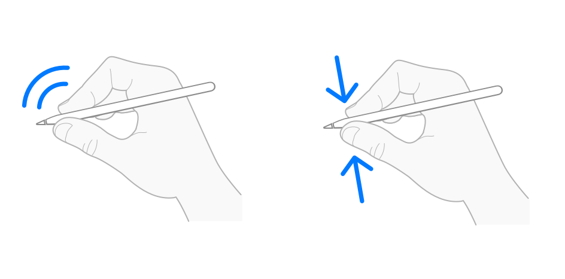

> 导航：[技术](../technologies.md) · [UIKit](../uikit.md)

# Apple Pencil 交互

API 集合

处理 Apple Pencil 上的双击和挤压等用户交互。

## 概述

Apple Pencil 交互让用户能够通过双击或挤压（squeeze）Apple Pencil，在你的 App 中执行某些操作。支持 Apple Pencil 交互，为用户提供一种快速执行首选操作的方式，例如切换绘图工具，或执行你在 App 中定义的自定义操作。

两幅插图，一幅显示一只手用食指双击 Apple Pencil，另一幅显示一只手在靠近笔尖处挤压 Apple Pencil。

- 若要进一步了解如何支持双击和挤压交互，请阅读[处理 Apple Pencil 双击](../applepencil/handling-double-taps-from-apple-pencil.md)和[处理 Apple Pencil 挤压](../applepencil/handling-squeezes-from-apple-pencil.md)。
- 若要进一步了解如何处理触摸，请阅读[处理 Apple Pencil 输入](handling-input-from-apple-pencil.md)。
- 若要进一步了解如何在 App 中加入手绘内容，请参阅[使用 PencilKit 绘图](../pencilkit/drawing-with-pencilkit.md)。

> [!note] 注意
> 只有 Apple Pencil Pro 支持挤压交互。第一代 Apple Pencil 不支持 Apple Pencil 交互。

## 主题

### 基础

- [处理 Apple Pencil 双击](../applepencil/handling-double-taps-from-apple-pencil.md) — 检测并响应用户在 Apple Pencil 上进行的双击。
- [处理 Apple Pencil 挤压](../applepencil/handling-squeezes-from-apple-pencil.md) — 检测并响应用户在 Apple Pencil Pro 上进行的挤压。
- [处理 Apple Pencil 输入](handling-input-from-apple-pencil.md) — 了解如何检测并响应来自 Apple Pencil 的触摸。

### SwiftUI 中的 Apple Pencil 交互

- [onPencilDoubleTap(perform:)](<../swiftui/view/onpencildoubletap(perform_).md>) — 添加一项操作，在用户双击 Apple Pencil 后执行。
- [PencilDoubleTapGestureValue](../swiftui/pencildoubletapgesturevalue.md) — 描述 Apple Pencil 双击手势的值。
- [onPencilSqueeze(perform:)](<../swiftui/view/onpencilsqueeze(perform_).md>) — 添加一项操作，在用户挤压 Apple Pencil 时执行。
- [PencilSqueezeGesturePhase](../swiftui/pencilsqueezegesturephase.md) — 描述 Apple Pencil 挤压手势的阶段和值。
- [PencilSqueezeGestureValue](../swiftui/pencilsqueezegesturevalue.md) — 描述 Apple Pencil 挤压手势的值。
- [PencilPreferredAction](../swiftui/pencilpreferredaction.md) — 用户希望在双击 Apple Pencil 后执行的操作。
- [PencilHoverPose](../swiftui/pencilhoverpose.md) — 一个值，描述 Apple Pencil 悬停在视图边界上方区域时的位置和距离。

### UIKit 中的 Apple Pencil 交互

- [UIPencilInteraction](uipencilinteraction.md) — 一种交互，在用户双击或挤压 Apple Pencil 时通知你的 App。
- [UIPencilInteractionDelegate](uipencilinteractiondelegate.md) — 对象为处理用户在 Apple Pencil 上进行的双击或挤压而实现的接口。
- [Tap](uipencilinteraction/tap.md) — 一种表示 Apple Pencil 双击的交互。
- [Squeeze](uipencilinteraction/squeeze.md) — 一种表示 Apple Pencil 挤压的交互。
- [Phase](uipencilinteraction/phase.md) — 描述 Apple Pencil 交互阶段的常量。
- [UIPencilHoverPose](uipencilhoverpose.md) — 一个对象，描述 Apple Pencil 在双击或挤压等交互期间的悬停姿态。

## 另请参阅

### 用户交互

- [触摸、按压与手势](touches-presses-and-gestures.md) — 将 App 的事件处理逻辑封装在手势识别器中，以便在整个 App 中复用这些代码。
- [菜单与快捷指令](menus-and-shortcuts.md) — 使用菜单系统、上下文菜单、主屏幕快速操作和键盘快捷键，简化与 App 的交互。
- [拖放](drag-and-drop.md) — 通过将交互 API 与视图结合使用，为 App 带来拖放（drag and drop）功能。
- [指针交互](pointer-interactions.md) — 在自定义控制和视图中支持指针交互。
- [基于焦点的导览](focus-based-navigation.md) — 使用遥控器、游戏控制器或键盘导览 UIKit App 的界面。
- [UIKit 辅助功能](accessibility-for-uikit.md) — 让所有 iOS 和 tvOS 用户都能使用你的 UIKit App。
