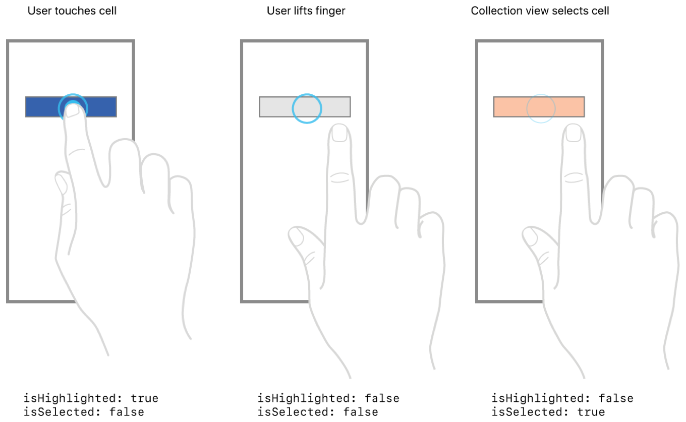

> 导航：[技术](../technologies.md) · [UIKit](../uikit.md) · [视图与控制](views-and-controls.md) · [集合视图](collection-views.md)

# 更改选中和高亮单元格的外观

<sub>示例代码</sub>

向用户提供有关单元格（cell）状态以及状态之间过渡的视觉反馈。

## 概述

这个示例 App 展示了在集合视图（collection view）单元格于未选中、高亮和选中状态之间过渡时如何更改其外观。当用户轻点一个单元格时，App 会判断该单元格的状态，并更改单元格的外观以指示状态之间的过渡。

这个示例中的集合视图支持单项选择，这是集合视图的默认行为。你也可以把集合视图配置为支持多项选择，或者完全禁用选择。

### 判断单元格的状态

这个示例中的集合视图通过检测其边界内的轻点来判断单元格的状态。然后，它会设置相应单元格的 [selected](uicollectionviewcell/isselected.md) 和 [highlighted](uicollectionviewcell/ishighlighted.md) 属性来指示当前状态。集合视图之所以提供这种行为，是因为它的 [allowsSelection](uicollectionview/allowsselection.md) 属性被设为了 `true`。

当触摸一个未选中的单元格时，最初的按下（touch-down）事件会使集合视图把该单元格的 [highlighted](uicollectionviewcell/ishighlighted.md) 属性更改为 `true`。最后的抬起（touch-up）事件会使高亮状态恢复为 `false`。如果抬起事件发生在单元格内部，集合视图会把该单元格的 [selected](uicollectionviewcell/isselected.md) 属性设为 `true`；否则，属性值保持不变。



<sub>示意图，描绘轻点一个未选中的单元格时发生的步骤。第一幅图显示用户的右手食指触摸手机屏幕上一个深色带阴影的矩形，它表示一个集合视图单元格。图像下方列出了该单元格当前的属性值：isHighlighted: true 和 isSelected: false。第二幅图描绘用户抬起手指并把右手移到矩形的右侧，此时手机屏幕上的矩形显示为较浅的颜色。下方列出的属性 isHighlighted 和 isSelected 均为 false。第三幅图描绘用户的手抬在手机屏幕上矩形的上方，集合视图以第三种不同的色调显示该矩形。下方属性 isHighlighted 为 false，isSelected 为 true。</sub>

### 更改单元格的视觉外观

单元格的 [backgroundView](uicollectionviewcell/backgroundview.md) 属性所引用的视图，会在单元格首次加载以及单元格未被高亮或选中时显示为单元格的背景。当单元格的状态变为高亮或选中时，集合视图会修改单元格的属性以指示新状态。不过，它并不会自动更改单元格的视觉外观。也就是说，除非你把单元格的 [selectedBackgroundView](uicollectionviewcell/selectedbackgroundview.md) 属性设置为一个视图。

把 [selectedBackgroundView](uicollectionviewcell/selectedbackgroundview.md) 设置为一个视图后，在高亮或选中单元格时，集合视图会用选中背景替换默认背景。你的 App 不需要再做任何其他事情。随着单元格状态的变化，集合视图会自动更改单元格的视觉外观。例如，这个示例 App 使用 [selectedBackgroundView](uicollectionviewcell/selectedbackgroundview.md) 属性，在选中单元格时把单元格的背景色从红色改为蓝色。

```swift
override func awakeFromNib() {
    super.awakeFromNib()
    
    let redView = UIView(frame: bounds)
    redView.backgroundColor = #colorLiteral(red: 1, green: 0, blue: 0, alpha: 1)
    self.backgroundView = redView

    let blueView = UIView(frame: bounds)
    blueView.backgroundColor = #colorLiteral(red: 0, green: 0, blue: 1, alpha: 1)
    self.selectedBackgroundView = blueView
}
```

### 为状态变化提供额外的视觉指示

在单元格中提供选中背景视图，是让集合视图根据单元格状态更改其外观的一种简单方法，但你能做的不只是更改背景。例如，你可以在选中的单元格中显示一个勾选标记图标，或者在视觉上区分高亮状态和选中状态。

集合视图的 [delegate](uicollectionview/delegate.md)（委托）提供了许多方法，让你有大量机会微调集合视图的选择与高亮外观。例如，如果你更希望自己绘制单元格的选中状态，可以把 [selectedBackgroundView](uicollectionviewcell/selectedbackgroundview.md) 属性保持为 `nil`。然后在 [- collectionView:didSelectItemAtIndexPath:](<uicollectionviewdelegate/collectionview(__didselectitemat_).md>) 委托方法中对单元格应用任何视觉更改。这个示例 App 把该方法与选中背景结合使用，在选中的单元格中显示一颗星。App 会在 [- collectionView:didDeselectItemAtIndexPath:](<uicollectionviewdelegate/collectionview(__diddeselectitemat_).md>) 委托方法中移除这颗星。

```swift
func collectionView(_ collectionView: UICollectionView, didSelectItemAt indexPath: IndexPath) {
    if let cell = collectionView.cellForItem(at: indexPath) as? CustomCollectionViewCell {
        cell.showIcon()
    }
}

func collectionView(_ collectionView: UICollectionView, didDeselectItemAt indexPath: IndexPath) {
    if let cell = collectionView.cellForItem(at: indexPath) as? CustomCollectionViewCell {
        cell.hideIcon()
    }
}
```

如果你更希望绘制高亮状态，请使用 [- collectionView:didHighlightItemAtIndexPath:](<uicollectionviewdelegate/collectionview(__didhighlightitemat_).md>) 和 [- collectionView:didUnhighlightItemAtIndexPath:](<uicollectionviewdelegate/collectionview(__didunhighlightitemat_).md>) 委托方法。这个示例 App 使用这两个方法来显示一种不同的红色色调作为高亮时的背景色。由于这个 App 中的单元格把蓝色视图用作它们的 [selectedBackgroundView](uicollectionviewcell/selectedbackgroundview.md)，委托必须把它的更改应用到单元格的内容视图（content view）上，以确保更改可见。

```swift
func collectionView(_ collectionView: UICollectionView, didHighlightItemAt indexPath: IndexPath) {
    if let cell = collectionView.cellForItem(at: indexPath) {
        cell.contentView.backgroundColor = #colorLiteral(red: 1, green: 0.4932718873, blue: 0.4739984274, alpha: 1)
    }
}

func collectionView(_ collectionView: UICollectionView, didUnhighlightItemAt indexPath: IndexPath) {
    if let cell = collectionView.cellForItem(at: indexPath) {
        cell.contentView.backgroundColor = nil
    }
}
```

## 另请参阅

### 选择管理

- [使用双指平移手势选择多个项目](selecting-multiple-items-with-a-two-finger-pan-gesture.md) — 在表格视图和集合视图上使用多选（multiselect）手势，加快用户选择多个项目的速度。

## 下载

- [ChangingTheAppearanceOfSelectedAndHighlightedCells.zip](https://docs-assets.developer.apple.com/published/50a0506ab5ab/ChangingTheAppearanceOfSelectedAndHighlightedCells.zip)
