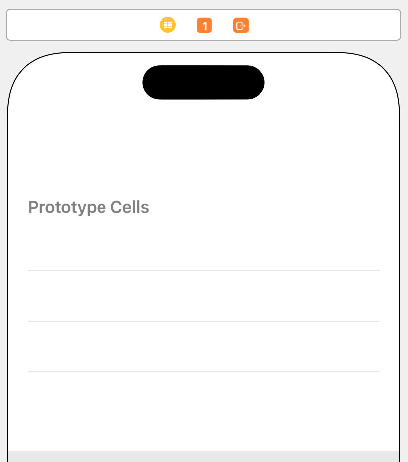
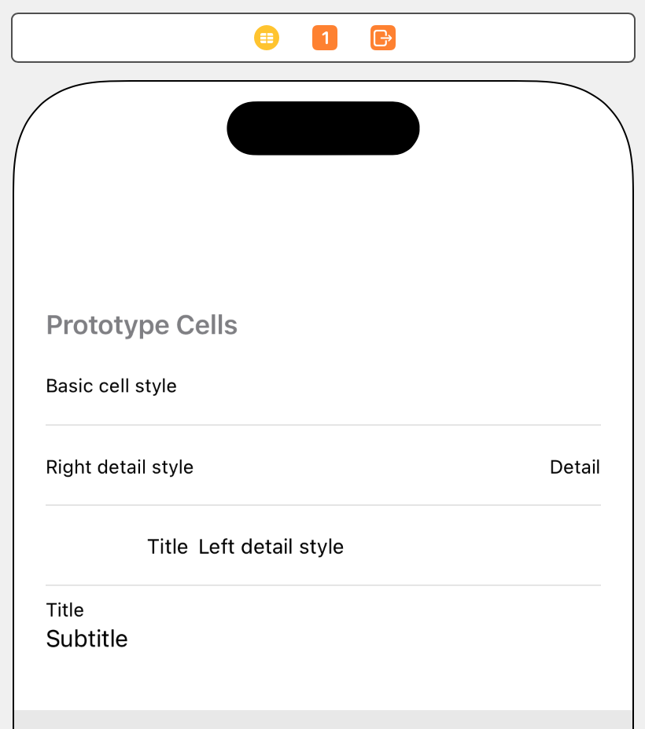
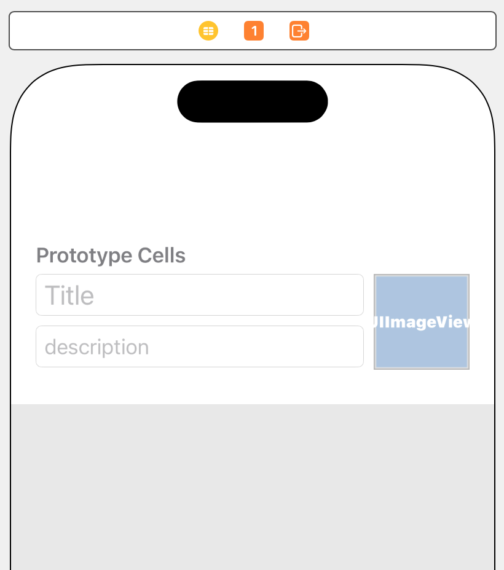

> 导航：[技术](../technologies.md) · [UIKit](../uikit.md) · [视图与控制](views-and-controls.md) · [表格视图](table-views.md)

# 为表格配置单元格

<sub>文章</sub>

通过在 Storyboard 中定义一个或多个原型单元格，指定表格各行的外观和内容。

## 概述

单元格提供表格各行的视觉表示。对于大多数表格，你只需提供一两种不同类型的单元格。设计单元格时，应确保最重要的信息醒目突出。为此，请谨慎选择单元格中的视图和视图配置。

你可以在设计阶段通过 Storyboard 文件指定单元格的外观。Xcode 会为每个表格提供一个原型单元格，你可以根据需要添加更多原型单元格。原型单元格充当单元格外观的模板，其中包含你想显示的视图以及这些视图在单元格内容区域内的排布方式。在运行时，表格的数据源对象根据原型创建实际单元格，并用你的 App 数据配置这些单元格。



有关设计单元格外观的技巧，请参阅《人机界面指南》\> [列表和表格](../design/human-interface-guidelines/lists-and-tables.md)。

### 为每个单元格分配复用标识符（reuse identifier）

复用标识符有助于创建和回收表格单元格。复用标识符是你为表格的每个原型单元格分配的字符串。在 Storyboard 中，选择原型单元格，并为其 Identifier 属性分配一个非空值。表格视图（table view）中的每个单元格都必须具有唯一的复用标识符。

在运行时需要单元格对象时，请调用表格视图的 [- dequeueReusableCellWithIdentifier:forIndexPath:](<uitableview/dequeuereusablecell(withidentifier_for_).md>) 方法，并传入所需单元格的复用标识符。表格视图会维护一个由已创建单元格组成的内部队列。如果队列中包含所请求类型的单元格，表格视图就返回该单元格；否则，它会使用 Storyboard 中的原型单元格创建一个新单元格。复用单元格可以最大限度地减少滚动等关键时刻的内存分配，从而提高性能。

```swift
var cell = tableView.dequeueReusableCell(withIdentifier: "myCellType", for: indexPath)
```

### 使用内建样式配置单元格

配置单元格最简单的方法，是使用 [UITableViewCell](uitableviewcell.md) 提供的某种内建样式。你可以直接使用这些样式，无需提供自定子类来管理单元格。每种样式包含一个或两个标签，样式决定标签在单元格内容区域中的位置。大多数样式还会在单元格内容的前缘包含一个图像。

要使用某种标准样式配置原型单元格，请在 Storyboard 中选择该单元格，并将单元格的 Style 属性设为 `custom` 以外的值。



在你的 [- tableView:cellForRowAtIndexPath:](<uitableviewdatasource/tableview(__cellforrowat_).md>) 方法中，使用 [UITableViewCell](uitableviewcell.md) 的 [textLabel](uitableviewcell/textlabel.md)、[detailTextLabel](uitableviewcell/detailtextlabel.md) 和 [imageView](uitableviewcell/imageview.md) 属性配置单元格内容。这些属性包含视图，但只有在样式支持相应内容时，单元格对象才会分配视图。例如，基本（Basic）单元格样式不支持细节字符串，因此该样式的 [detailTextLabel](uitableviewcell/detailtextlabel.md) 属性为 `nil`。以下示例代码展示了如何配置使用基本单元格样式的单元格。

```swift
override func tableView(_ tableView: UITableView, 
             cellForRowAt indexPath: IndexPath) -> UITableViewCell {
   // 复用或创建一个单元格。 
   let cell = tableView.dequeueReusableCell(withIdentifier: "basicStyle", for: indexPath)

   // 对于标准单元格，使用 UITableViewCell 属性。
   cell.textLabel!.text = "Title text"
   cell.imageView!.image = UIImage(named: "bunny")
   return cell
}
```

### 使用自定视图配置单元格

对于标准样式以外的外观，请使用自定单元格样式。使用自定单元格时，你需要指定单元格中要使用的视图、这些视图的配置以及它们的大小和位置。标签和图像等静态视图最适合作为单元格内容。请避免使用控制等需要用户交互的视图。不要在单元格中包含滚动视图（scroll view）、表格视图、集合视图（collection view）或其他复杂容器视图。可以在单元格中包含叠放视图（stack view），但应尽量减少叠放视图中的条目数量，以提高性能。

要配置自定单元格，请将视图拖入表格的原型单元格中。下图展示了一个采用自定布局和视图格式的单元格。你可以使用约束在单元格内容区域内定位视图。设置约束时，请使用“Constrain to margins”选项，以保留各单元格内容区域之间的间隙。



<sub>显示一个自定单元格的截屏，单元格右侧有一个图像，还有两个分别使用不同字体的标签，以区分其中包含的信息类型。</sub>

对于自定单元格，你需要定义 [UITableViewCell](uitableviewcell.md) 子类来访问单元格的视图。向子类添加出口，并将这些出口连接到原型单元格中的相应视图。

```swift
class FoodCell: UITableViewCell {
    @IBOutlet var name : UILabel?
    @IBOutlet var plantDescription : UILabel?
    @IBOutlet var picture : UIImageView?
}
```

在数据源的 [- tableView:cellForRowAtIndexPath:](<uitableviewdatasource/tableview(__cellforrowat_).md>) 方法中，使用单元格的出口为各个视图分配值。

```swift
override func tableView(_ tableView: UITableView, 
             cellForRowAt indexPath: IndexPath) -> UITableViewCell {

   // 复用或创建一个适当类型的单元格。
   let cell = tableView.dequeueReusableCell(withIdentifier: "foodCellType", 
                         for: indexPath) as! FoodCell

   // 获取该行的数据。
   let theFood = foods[indexPath.row]
        
   // 使用从对象获取的数据配置单元格内容。
   cell.name?.text = theFood.name
   cell.plantDescription?.text = theFood.description
   cell.picture?.image = theFood.picture
        
   return cell
}
```

### 更改行高

表格视图会独立于表示各行的单元格来跟踪行高。[UITableView](uitableview.md) 会提供默认行高，但你可以为表格视图的 [rowHeight](uitableview/rowheight.md) 属性分配自定值，以覆盖默认高度。当所有行的高度都相同时，请始终使用此属性。这样做比从委托对象返回高度值更高效。

如果各行的高度并不完全相同，或者可能动态变化，请使用委托（delegate）对象的 [- tableView:heightForRowAtIndexPath:](<uitableviewdelegate/tableview(__heightforrowat_).md>) 方法提供高度。实现此方法时，必须为表格中的每一行提供值。以下示例代码展示了如何为每个分区的第一行返回自定高度，并为所有其他行使用默认高度。

```swift
override func tableView(_ tableView: UITableView, 
           heightForRowAt indexPath: IndexPath) -> CGFloat {
   // 将第一行放大，以容纳自定单元格。
  if indexPath.row == 0 {
      return 80
   }

   // 对所有其他行使用默认大小。
   return UITableView.automaticDimension
}
```

表格视图只会请求可见行的高度。随着用户滚动，表格视图会在每一行出现时要求你提供它的高度，包括它移出屏幕后又返回屏幕的情况。

### 在复用前恢复单元格的原始外观

当单元格移出屏幕时，表格视图会将其从视图层级结构（view hierarchy）中移除，并放入内部管理的回收队列。当你使用表格视图的 [- dequeueReusableCellWithIdentifier:forIndexPath:](<uitableview/dequeuereusablecell(withidentifier_for_).md>) 方法请求新单元格时，表格视图会优先返回回收队列中的单元格。如果队列为空，表格视图就会从 Storyboard 实例化一个新单元格。

如果你更改了自定单元格视图的外观，请实现单元格子类的 [- prepareForReuse](<uitableviewcell/prepareforreuse().md>) 方法。在实现中，将单元格视图的外观恢复到原始状态。例如，如果更改单元格中某个视图的 [alpha](uiview/alpha.md) 属性，请将该属性恢复为原始值。你不需要清除标签文本、将图像设为 `nil`，也无需执行任何会在你的 [- tableView:cellForRowAtIndexPath:](<uitableviewdatasource/tableview(__cellforrowat_).md>) 方法配置单元格以供显示时得到纠正的操作。

### 向单元格添加附件视图

附件视图是显示在单元格后缘的可选系统定义视图。你可以使用附件视图向用户传达标准单元格行为。例如，添加细节按钮可以让用户知道，轻点该行会显示有关该行的更多信息。

要配置附件视图：

- 在 Storyboard 中，使用单元格的 Accessory 属性选择所需附件视图。
- 在代码中，更改单元格 [accessoryType](uitableviewcell/accessorytype-swift.property.md) 属性的值。

用户期望附件视图在被轻点时具有特定行为。有关如何实现这些行为的信息，请参阅 [AccessoryType](uitableviewcell/accessorytype-swift.enum.md)。

## 另请参阅

### 相关文档

- [估算表格滚动区域的高度](estimating-the-height-of-a-table-s-scrolling-area.md) — 为表格视图的页眉、页脚和行提供高度估算值，确保滚动准确反映内容大小。

### 单元格、页眉和页脚

- [创建自动调整大小的表格视图单元格](creating-self-sizing-table-view-cells.md) — 创建支持动态字体（Dynamic Type）并使用系统间距约束调整文本标签周围间距的表格视图单元格。
- [向表格分区添加页眉和页脚](adding-headers-and-footers-to-table-sections.md) — 通过向表格视图的分区添加页眉和页脚视图，在视觉上区分行组。
- [UITableViewCell](uitableviewcell.md) — 表格视图中单行的视觉表示。
- [UITableViewHeaderFooterView](uitableviewheaderfooterview.md) — 放置在表格分区顶部或底部、用于显示该分区附加信息的可复用视图。
