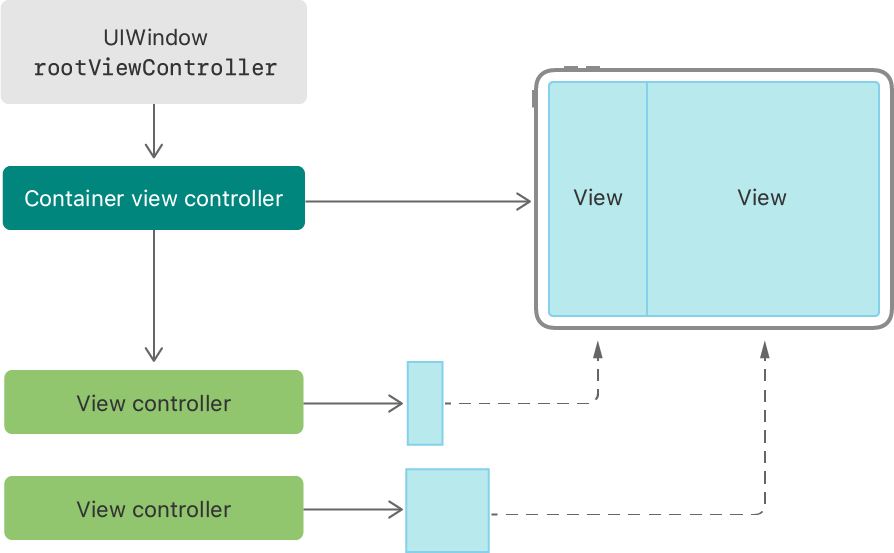
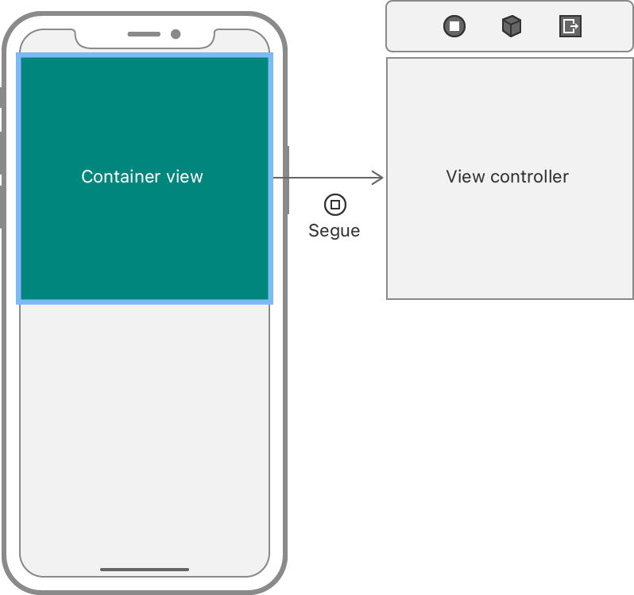

> 导航：[技术](../technologies.md) · [UIKit](../uikit.md) · [视图控制器](view-controllers.md)

# 创建自定容器视图控制器

<sub>文章</sub>

通过将一个或多个视图控制器的内容与其他自定视图结合，创建复合界面。

## 概述

容器视图控制器通过将内容与内容的屏幕显示方式分离，促进了更好的封装。与显示 App 数据的内容视图控制器不同，容器视图控制器显示其他视图控制器，将它们排列在屏幕上，并处理它们之间的导览。

容器视图控制器仍然是一个视图控制器，因此你可以像其他视图控制器一样，在窗口中显示它或呈现它。容器视图控制器还管理一个复合界面，将一个或多个子视图控制器的视图整合到自身的视图层级结构中。每个子视图控制器继续管理自己的视图层级结构，但容器管理该子控制器根视图的位置和大小。



<sub>示意图展示了容器视图控制器与其子控制器之间的关系，以及最终显示在屏幕上的界面。</sub>

许多容器视图控制器有助于在 App 内容的不同部分之间进行导览。例如 [UINavigationController](uinavigationcontroller.md)、[UITabBarController](uitabbarcontroller.md) 和 [UIPageViewController](uipageviewcontroller.md)，它们帮助用户在多个视图控制器之间导览。你也可以使用容器视图控制器来更高效地组织内容。例如，[UISplitViewController](uisplitviewcontroller.md) 在 iPad 上并排显示两个视图控制器。导览和组织之间的唯一区别在于，导览需要自定 API 来更改子视图控制器；除此之外，两者的实现方式是相同的。

### 以编程方式将子视图控制器添加到你的内容中

如果你的容器视图控制器会动态更改其子视图控制器，那么以编程方式添加这些子视图控制器会更简便。自定导览界面通过更改子视图控制器来实现导览，作为配置界面的一部分，你有时也可能需要更改子视图控制器。

对于要添加到界面中的每个新子视图控制器，请按以下顺序执行步骤：

1. 调用容器视图控制器的 [- addChildViewController:](<uiviewcontroller/addchild(__).md>) 方法来配置包含关系。
2. 将子控制器的根视图添加到容器视图控制器的视图层级结构中。
3. 添加约束以设置子控制器根视图的大小和位置。
4. 调用子视图控制器的 [- didMoveToParentViewController:](<uiviewcontroller/didmove(toparent_).md>) 方法来通知它过渡已完成。

以下示例代码从故事板实例化一个新的子视图控制器，并将其嵌入为当前视图控制器的子控制器。调用 [- addChildViewController:](<uiviewcontroller/addchild(__).md>) 后，代码将子控制器的视图添加到视图层级结构中，并设置一些布局约束来确定其大小和位置。在过程结束时，它通知子控制器。

```swift
// 创建一个子视图控制器，并将其添加到当前视图控制器中。
let storyboard = UIStoryboard(name: "Main", bundle: .main)
if let viewController = storyboard.instantiateViewController(identifier: "imageViewController")
                                    as? ImageViewController {
   // 将视图控制器添加到容器中。
   addChild(viewController)
   view.addSubview(viewController.view)
            
   // 创建并激活子视图的约束。
   onscreenConstraints = configureConstraintsForContainedView(containedView: viewController.view,
                             stage: .onscreen)
   NSLayoutConstraint.activate(onscreenConstraints)
     
   // 通知子视图控制器移动已完成。       
   viewController.didMove(toParent: self)
}

```

在视图控制器之间建立容器-子关系可以防止 UIKit 意外干扰你的界面。UIKit 通常独立地将信息路由到 App 的每个视图控制器。当存在容器-子关系时，UIKit 会先将许多请求路由到容器视图控制器，让其有机会更改任何子视图控制器的行为。例如，容器视图控制器可能会重写其子控制器的特征，强制它们采用特定的外观或行为。

### 从你的内容中移除子视图控制器

要从容器中移除子视图控制器，请按以下顺序执行步骤：

1. 使用值 `nil` 调用子控制器的 [- willMoveToParentViewController:](<uiviewcontroller/willmove(toparent_).md>) 方法。
2. 停用或移除子控制器根视图的任何约束。
3. 在子控制器的根视图上调用 [- removeFromSuperview](<uiview/removefromsuperview().md>) 以将其从视图层级结构中移除。
4. 调用子控制器的 [- removeFromParentViewController](<uiviewcontroller/removefromparent().md>) 方法以完成容器-子关系的终结。

断开容器-子关系会告知 UIKit，你的容器视图控制器不再显示该子控制器的内容。你仍然可以保留对该子视图控制器的其他引用。例如，[UINavigationController](uinavigationcontroller.md) 管理一个子视图控制器栈，但在任何给定时刻，它只与其中一个或两个子控制器保持容器-子关系。

### 在故事板 UI 中嵌入子视图控制器

如果你的容器视图控制器组织内容，并且之后不会更改这些内容，请使用容器视图（container view）配置你的 UI。容器视图是一个代理视图，代表子视图控制器的内容。当你将其添加到界面时，它看起来像一个普通的视图，但它有一个关联的视图控制器。



容器视图的大小和位置设置方式与界面中的其他视图相同。添加约束来指定视图在不同设备和不同配置下的大小和位置。但是，不要向容器视图本身添加任何子视图。相反，请将它们添加到关联视图控制器的视图中。

当你实例化一个包含一个或多个容器视图的视图控制器时，UIKit 也会实例化相关联的子视图控制器。创建新的视图控制器后，UIKit 会将其添加为你请求的原始视图控制器的子控制器。你无需自行调用 [- addChildViewController:](<uiviewcontroller/addchild(__).md>)。

### 支持其他容器行为

考虑在你的自定容器视图控制器中实现以下其他行为：

- 重写 [- showViewController:sender:](<uiviewcontroller/show(__sender_).md>)，并使用它来呈现新的子视图控制器。
- 根据需要重写 [- showDetailViewController:sender:](<uiviewcontroller/showdetailviewcontroller(__sender_).md>)，以呈现辅助子视图控制器。
- 更新 [additionalSafeAreaInsets](uiviewcontroller/additionalsafeareainsets.md) 以考虑可能遮挡子控制器内容的装饰视图。
- 调用 [- setOverrideTraitCollection:forChildViewController:](<uiviewcontroller/setoverridetraitcollection(__forchild_).md>) 来更改子视图控制器的特征。例如，你可能指定某个子视图控制器始终为横向或纵向紧致（compact）。
- 重写 [childViewControllerForScreenEdgesDeferringSystemGestures](uiviewcontroller/childforscreenedgesdeferringsystemgestures.md) 或 [childViewControllerForHomeIndicatorAutoHidden](uiviewcontroller/childforhomeindicatorautohidden.md)，让子视图控制器决定系统手势的行为。
- 重写 [- allowedChildViewControllersForUnwindingFromSource:](<uiviewcontroller/allowedchildrenforunwinding(from_).md>) 以限制可以作为 unwind segue 动作目标的子视图控制器集合。

更多信息，请参阅 [UIViewController](uiviewcontroller.md) 中的描述。

## 另请参阅

### 容器视图控制器

- [UISplitViewController](uisplitviewcontroller.md) — 一个实现层级界面的容器视图控制器。
- [UINavigationController](uinavigationcontroller.md) — 一个定义基于栈的导览层级内容方案的容器视图控制器。
- [UINavigationBar](uinavigationbar.md) — 显示在屏幕顶部横条中的导航控制组件，通常与导览控制器配合使用。
- [UINavigationItem](uinavigationitem.md) — 当关联的视图控制器可见时，导航栏显示的项目。
- [UITabBarController](uitabbarcontroller.md) — 一个管理多选界面的容器视图控制器，其中的选择决定了要显示哪个子视图控制器。
- [UITabBar](uitabbar.md) — 一个在标签栏中显示一个或多个按钮的控制，用于在 App 的不同子任务、视图或模式之间进行选择。
- [UITabBarItem](uitabbaritem.md) — 描述标签栏中某个项目的对象。
- [UITab](uitab.md) — 管理标签栏中某个标签的对象。
- [UITabAccessory](uitabaccessory.md)
- [UISearchTab](uisearchtab.md) — 一个代表系统搜索标签的标签子类。
- [UITabGroup](uitabgroup.md) — 管理一组标签对象的对象。
- [UIPageViewController](uipageviewcontroller.md) — 一个管理内容页面之间导览的容器视图控制器，其中每个子视图控制器管理一个页面。
