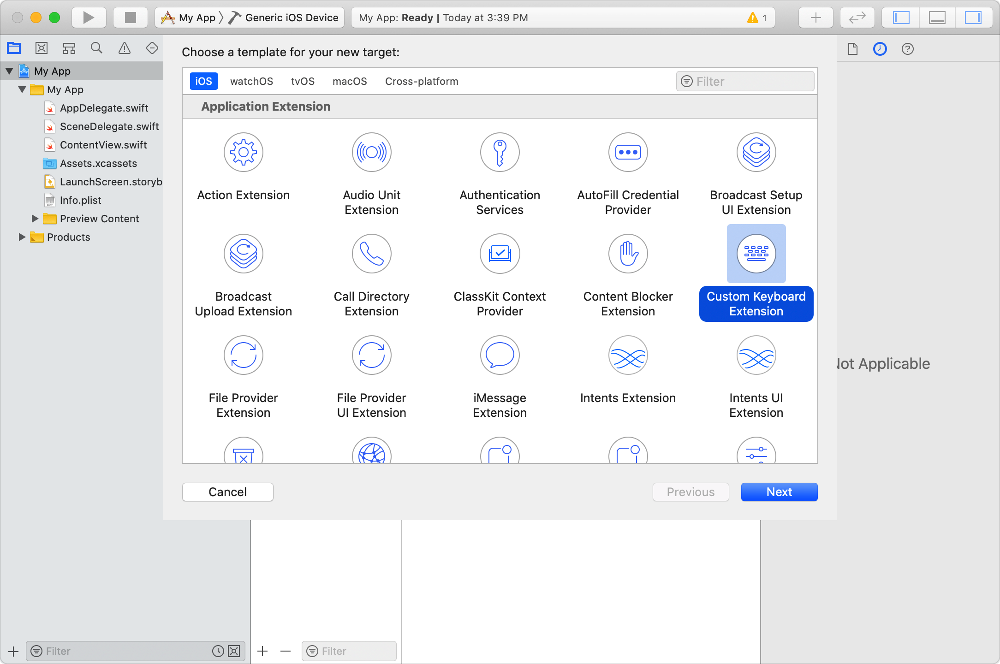
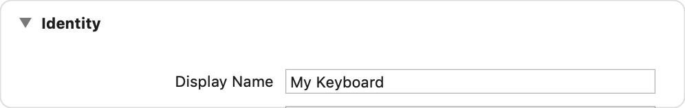
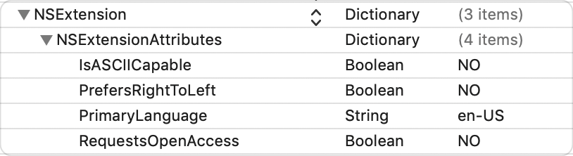
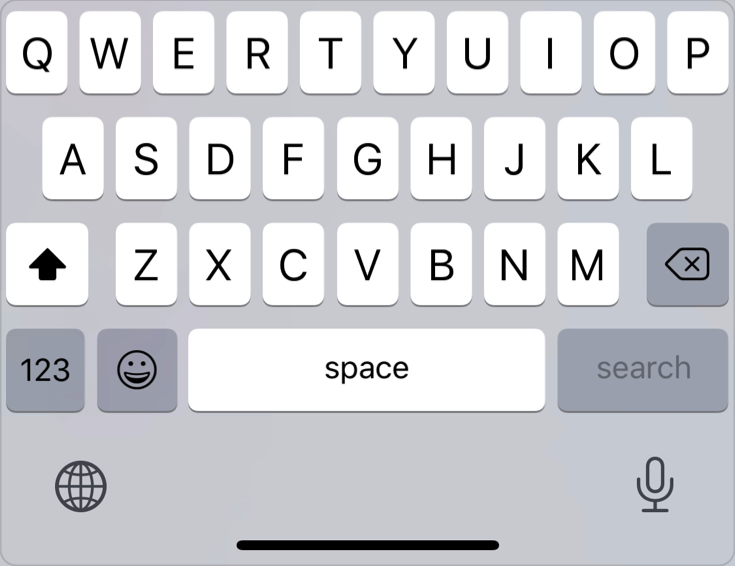
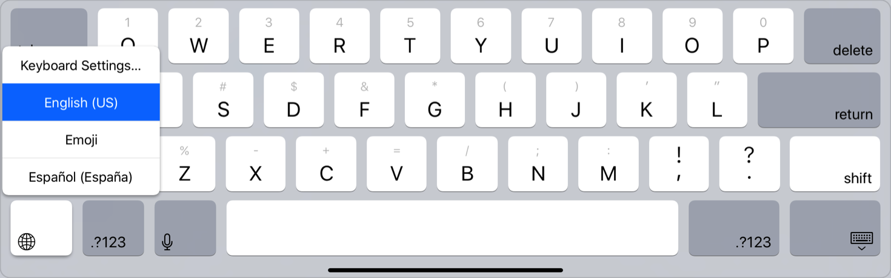
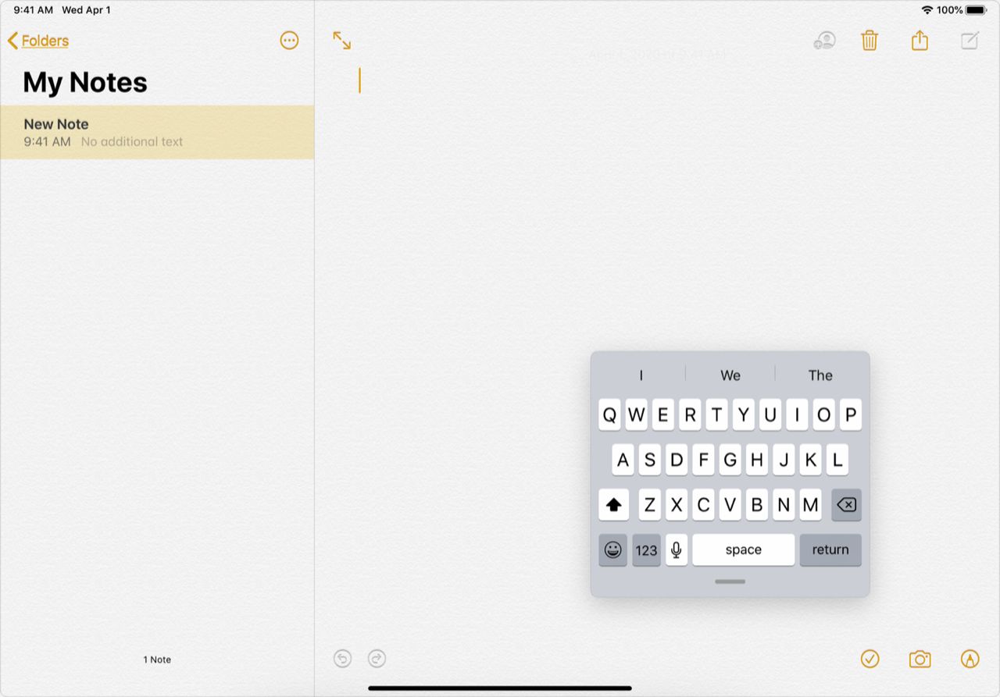

> 导航：[技术](../technologies.md) · [UIKit](../uikit.md) · [键盘与输入](keyboards-and-input.md)

# 创建自定义键盘

向你的 Xcode 项目添加一个扩展，提供系统范围的定制文本输入。

## 概述

自定义键盘会为想要新式文本输入法、或想其他方式无法支持的语言输入文本的用户替换系统键盘。用户在设置中启用你的自定义键盘后，只要支持第三方键盘，他们在系统任何地方都能使用你的键盘。

> [!note] 注意
> 如果你的键盘只服务于你自己的 App，请使用 [UIInputView](uiinputview.md) 而不是创建自定义键盘。把文本字段或文本视图的 [inputView](uitextfield/inputview.md) 属性设为应该替换系统键盘的视图即可。

创建自定义键盘需要几个步骤。除了向项目添加 Custom Keyboard 扩展 target，你还要配置选项、实现你的自定义界面，并决定支持哪些文本交互。用户期待各种常见的键盘交互，例如自动更正、自动大写、智能引号等等。

### 向你的 App 添加 Custom Keyboard target

Custom Keyboard Extension 模板为你构建键盘扩展提供了起点。Xcode 会配置你的项目来构建该扩展，并把它包含进你的 App 的 bundle。

1. 在 Xcode 中打开你的 App 项目。
2. 选取 File \> New \> Target。
3. 从 Application Extension 组中选择 Custom Keyboard Extension。
4. 点按 Next。
5. 指定扩展的名称，并配置语言与其他选项。
6. 点按 Finish。



确保键盘 target 的 General 标签页中的 Display Name 字段准确描述你的键盘。设置 App 会在第三方键盘列表中使用这个值。



如果你支持多种需要不同键盘布局或不同功能的语言，请重复上述步骤，为每种语言添加额外的自定义键盘 target，并在每个 target 的 `Info.plist` 文件中相应设置 `PrimaryLanguage` 的值。

### 配置信息属性列表选项

如果适用于你的自定义键盘，请编辑键盘扩展的 `Info.plist` 来配置以下选项：

| **IsASCIICapable** | 如果你的键盘能生成标准 ASCII 字符，把它设为 [true](../swift/true.md)。 |
|---|---|
| **PrefersRightToLeft** | 如果你的键盘主要支持从右到左的语言，或者在文本字段中编辑时插入光标应默认位于右侧，把它设为 [true](../swift/true.md)。 |
| **PrimaryLanguage** | 把它设为一个字符串，表示你的键盘支持的主要语言。使用两位语言代码（如荷兰语用 `nl`），或语言与国家/地区代码（如比利时的荷兰语用 `nl-BE`）。设置 App 会在键盘列表中显示主要语言。 |
| **RequestsOpenAccess** | 如果你的键盘需要访问网络资源、写入共享的组容器或其他能力，把它设为 [true](../swift/true.md)。更多信息参见[为自定义键盘配置完全访问](configuring-open-access-for-a-custom-keyboard.md)。 |

在 `Info.plist` 文件的 [NSExtension](../bundleresources/information-property-list/nsextension.md) \> [NSExtensionAttributes](../bundleresources/information-property-list/nsextension/nsextensionattributes.md) 字典中设置这些键：



### 添加你的自定义用户界面

当用户激活你的键盘时，它会替换系统键盘。你的自定义键盘扩展的 principal class 提供所显示的视图。默认情况下，Xcode 的自定义键盘模板把名为 `KeyboardViewController` 的类配置为 principal class。这个控制器的视图就是你定义用户界面的地方。

> [!tip] 提示
> 设计指南参见 [Human Interface Guidelines](https://developer.apple.com/design/human-interface-guidelines/components/selection-and-input/onscreen-keyboards)。

设计键盘的用户界面时，要加入一个切换键盘的按钮。系统键盘使用一个带地球图标的按钮，如下图所示。



使用 [UIInputViewController](uiinputviewcontroller.md) 上的 [needsInputModeSwitchKey](uiinputviewcontroller/needsinputmodeswitchkey.md) 属性来判断你是否应该显示切换键盘的按钮。如果用户只启用了一个键盘，就无需显示键盘切换界面。在配备 Face ID 的 iPhone 上，iOS 会自动在你的键盘视图下方显示地球图标并把此属性设为 [false](../swift/false.md)，表示你不应显示自己的按钮。

为你的键盘切换按钮配置一个动作，目标是你的输入视图控制器子类的 [- handleInputModeListFromView:withEvent:](<uiinputviewcontroller/handleinputmodelist(from_with_).md>) 方法。默认的自定义键盘模板通过为按钮添加动作来做到这一点：

```swift
nextKeyboardButton.addTarget(self, action: #selector(handleInputModeList(from:with:)), for: .allTouchEvents)
```

使用 [UIControlEventAllTouchEvents](uicontrol/event/alltouchevents.md) 可以让系统在用户长按按钮时自动显示键盘列表选择器（keyboard list picker）。



<sub>用户长按地球图标后的系统键盘屏幕快照。地球按钮会显示一个弹出菜单，允许用户在已启用的键盘之间选择，或打开键盘设置。</sub>

你的键盘的布局还应当有弹性，因为键盘的宽度可能变化，即使它当前在屏幕上也是如此。所有键盘都应同时支持紧凑（compact）与常规（regular）两种宽度，并允许在两者之间切换。请在竖屏和横屏方向下测试你的键盘；在 iPadOS 上，务必以浮动视图测试你的键盘。



更多细节参见[配置自定义键盘界面](configuring-a-custom-keyboard-interface.md)。

### 处理文本交互

自定义键盘运行在一个隔离的进程中，无法直接访问文本输入视图。[UIInputViewController](uiinputviewcontroller.md) 提供了 [textDocumentProxy](uiinputviewcontroller/textdocumentproxy.md) 属性，让你的键盘得以访问文本输入视图。你使用这个代理获取选中的文本、插入或删除文本、操纵文本插入位置，并获取周围的文本上下文，以支持自动更正或自动补全之类的功能。

```swift
// 向文本输入视图插入一个字符串。
textDocumentProxy.insertText("Hello world.")

// 获取当前选中的文本
let selectedText = textDocumentProxy.selectedText
```

更多信息参见[在自定义键盘中处理文本交互](handling-text-interactions-in-custom-keyboards.md)。

### 调试你的自定义键盘

调试自定义键盘与调试任何 App 扩展类似。Xcode 会提示你选择一个要启动的宿主 App，然后你在该宿主 App 中开始编辑文本，以唤起你的自定义键盘。宿主 App 可以是运行目的地上任何可用的 App，包括含有键盘扩展的你自己的 App。

1. 为你的键盘扩展 target 选择构建 scheme 和运行目的地（模拟器或设备）。
2. 选择 Product \> Run 开始调试会话。
3. Xcode 会提示你选择一个宿主 App。选择一个允许文本输入的 App，比如备忘录。Xcode 会构建并安装带键盘扩展的 App，然后启动你选的 App。
4. 宿主 App 启动后，开始编辑一个文本字段。这时会显示最近使用的键盘。
5. 触摸并按住地球按钮，显示可用键盘的列表。选择你的 App 的键盘。

iOS 会在自己的进程中启动你的键盘扩展，Xcode 会为它附加一个调试会话。现在你可以在扩展代码中设置断点并执行常规调试任务。

> [!important] 重要
> 如果你的键盘没有出现在活动键盘列表中，你需要先启用它。在设置中前往 General \> Keyboard \> Keyboards 并选择 Add New Keyboard。从第三方键盘列表中选择你的键盘。

### 限制内存使用

你的自定义键盘代码在单独的进程中执行，该进程可用的内存量有上限。如果你的键盘扩展超出内存限制，系统会终止它。以下是一些高效管理内存的提示：

- 在各种设备机型上测试你的键盘。内存上限因机型而异。
- 务必处理低内存通知。释放一切并非严格必需的资源。
- 记住，关闭键盘并不一定会终止键盘扩展进程。不要假定键盘在屏幕上不再可见时系统就会释放它占用的内存。

关于与内存用量上限相关的崩溃日志的更多信息，参见[使用崩溃报告和设备日志诊断问题](../xcode/diagnosing-issues-using-crash-reports-and-device-logs.md)和 `EXC_CRASH (SIGQUIT)`。

## 主题

### 键盘配置

- [配置自定义键盘界面](configuring-a-custom-keyboard-interface.md) — 为编辑文本设计一个灵活、实用且响应迅速的界面。
- [为自定义键盘配置完全访问](configuring-open-access-for-a-custom-keyboard.md) — 启用网络访问和对共享组容器的写入权限。

### 文本交互

- [在自定义键盘中处理文本交互](handling-text-interactions-in-custom-keyboards.md) — 通过指向文本输入视图的代理插入、删除和操纵文本。

## 另请参阅

### 自定义键盘

- [UIInputViewController](uiinputviewcontroller.md) — 自定义键盘 App 扩展的主视图控制器。
- [UIInputView](uiinputview.md) — 当某个视图成为第一响应者时，为它显示和管理自定义输入的对象。
- [UILexicon](uilexicon.md) — 供自定义键盘使用的只读词条对数组，每个元素是一个词典条目对象。
- [UILexiconEntry](uilexiconentry.md) — 词典对象中可供自定义键盘使用的只读词条对。
- [UITextDocumentProxy](uitextdocumentproxy.md) — 为自定义键盘提供文本上下文的对象。
