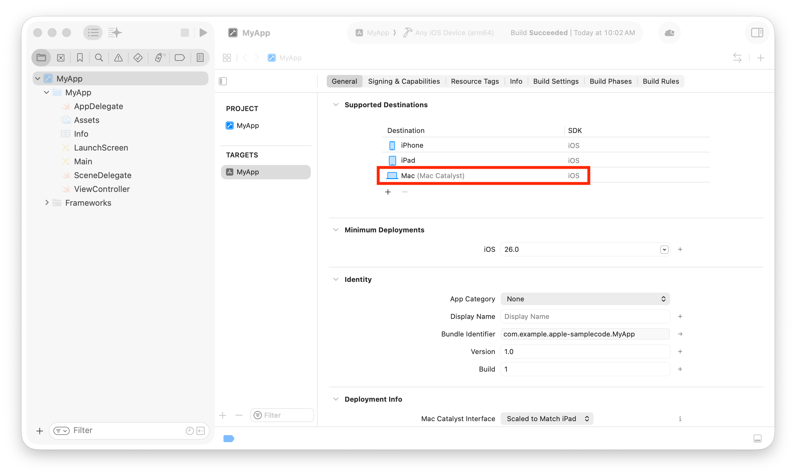
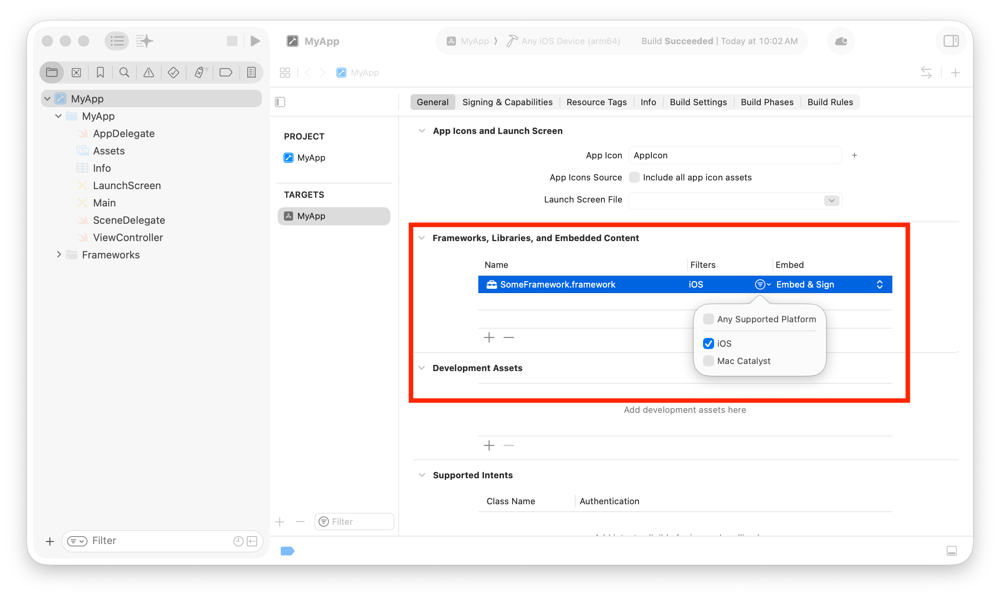

> 导航：[技术](../technologies.md) · [UIKit](../uikit.md) · [Mac Catalyst](mac-catalyst.md)

# 创建你的 iPad App 的 Mac 版本

<sub>文章</sub>

用 Mac Catalyst 把你的 iPad App 带到 macOS。

## 概述

为 Mac 配置你的 iPad App 可以简单到只需在 Xcode 中给 target 支持的目的地列表添加一个条目。根据你的 App 使用的特性和框架，配置过程可能需要额外的几步，比如手动排除其他框架或内容。

> [!note] 注意
> 关于如何设计你的 iPad App 的 Mac 版本，参见 [Human Interface Guidelines \> Mac Catalyst](https://developer.apple.com/design/human-interface-guidelines/technologies/mac-catalyst/introduction)。

### 为 Mac 配置你的 App

要添加对 Mac 的支持，打开你的 Xcode 项目并选择你想配置的 iOS target。在 General 标签页的 Supported Destinations 下，点按添加按钮 (+) 添加一个目的地。选择 Mac，然后选择 Mac Catalyst 来添加该目的地。



启用 Mac 支持时，Xcode 会把 [App Sandbox Entitlement](../bundleresources/entitlements/com.apple.security.app-sandbox.md) 加到你的项目。Xcode 只会在你的 App 的 Mac 版本中包含这个 entitlement，iOS 版本则不会。Xcode 还会把 My Mac 加进目的地列表。选择这个目的地即可从 Xcode 运行你的 Mac App。

到这里，你也许已经能构建并运行你的 App 的 Mac 版本了。想试试看，就选择 My Mac 作为目的地并运行你的项目。

### 不止于勾选框

你可能会发现你的 App 的 Mac 版本仍然无法构建，原因是：

- 你的项目包含不兼容的框架、库或嵌入内容。
- 你的源代码引用了不受支持的 API。

启用 Mac 支持时，Xcode 会尽可能自动为项目的 Mac 构建排除不兼容的框架和嵌入内容。即便如此，你可能仍需手动排除其他框架或内容。

要手动排除某个条目，打开你的 iOS target 的 General 标签页下的 Frameworks, Libraries, and Embedded Content，然后在 Filters 中为该条目只选 iOS。这个设置会把该条目从你的 App 的 Mac 版本中排除。



如果你的源代码引用了 Mac 版本的 App 无法使用的 API，把代码包进一个使用 `targetEnvironment()`（Swift）或 `TARGET_OS_MACCATALYST`（Objective-C）平台条件的编译条件块中。

**Swift**

```swift
#if !targetEnvironment(macCatalyst)
// 从 Mac 版本中排除的代码。
#endif
```

**Objective-C**

```objc
#if !TARGET_OS_MACCATALYST
// 从 Mac 版本中排除的代码。
#endif
```

你也可以用同样的方式纳入仅在 macOS 上可用的框架和代码。对框架，把平台设置选为 macOS；对代码，用 `#if targetEnvironment(macCatalyst)`（Swift）或 `#if TARGET_OS_MACCATALYST`（Objective-C）语句包起来。

### 让你的 App 更像 Mac App

完成这些步骤后，你应该就能在 Mac 上运行你的 iPad App 了。但在把新 App 交付给用户之前，它还需要一些改动，让自己更像一个 Mac App。要了解更多，参见[针对 Mac 优化你的 iPad App](optimizing-your-ipad-app-for-mac.md)。
