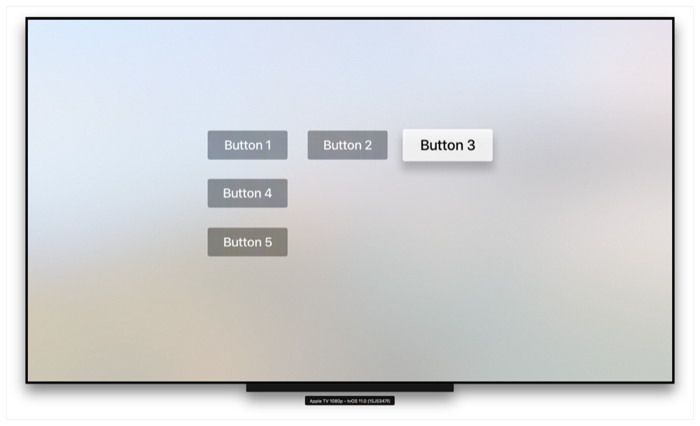
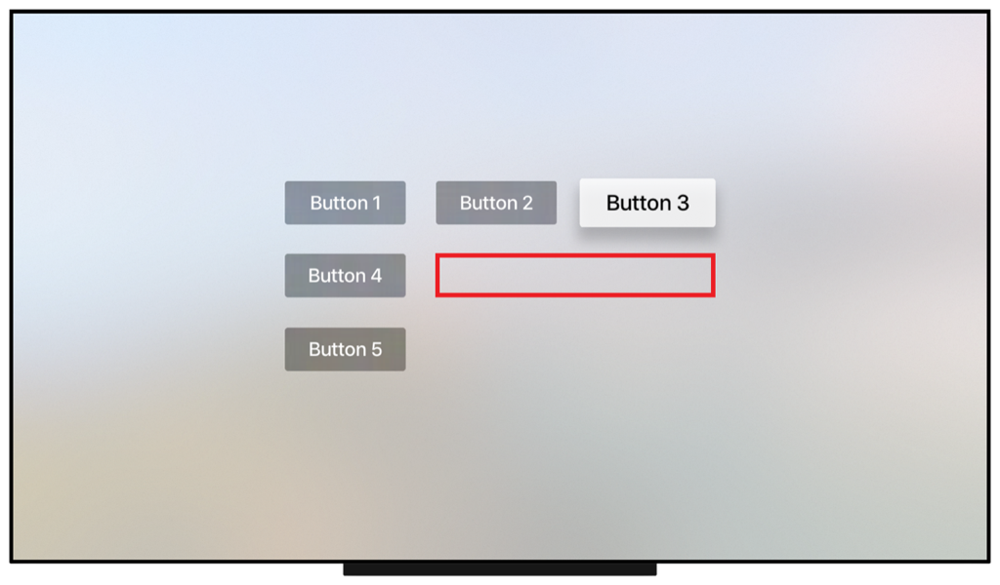
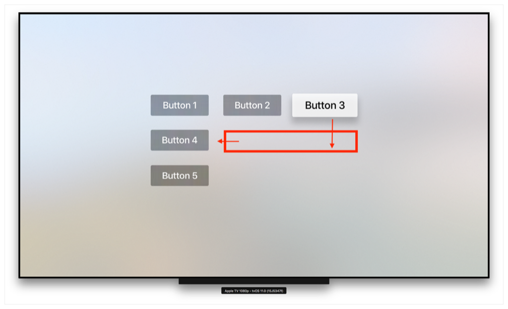

> 导航：[技术](../technologies.md) · [UIKit](../uikit.md) · [基于焦点的导览](focus-based-navigation.md)

# 创建自定义导览交互

<sub>文章</sub>

构建非标准的导览交互，把焦点移动到想要的位置。

## 概述

对大多数 App 来说，简单的布局就足以让用户与你的 App 交互。不过有时焦点引擎（focus engine）没有把焦点移到想要的位置，或者根本不移动焦点。遇到这些情况，使用 [UIFocusGuide](uifocusguide.md) 类创建重定向焦点的不可见区域。

### 放置你的可聚焦条目

在你的 App 中放置可聚焦项目，并按需要排布。在可能的情况下，尽量利用焦点引擎的内建行为。只在绝对必要时才使用焦点指南（focus guide）。下图显示了一行三个按钮和一列三个按钮。焦点会在同一行或同一列的按钮之间自动移动，但当用户从按钮 2 或按钮 3 向下滑动时，焦点引擎不会移动焦点。而对这种布局，目标是让用户向下滑动时按钮 4 获得焦点。



### 添加焦点指南

要让用户从按钮 2 或按钮 3 向下滑动时焦点移到按钮 4，需要一个焦点指南。创建焦点指南并把它加到当前视图。焦点指南可被焦点引擎检测到，并按指示重定向焦点。

```swift
let myFocusGuide = UIFocusGuide()
self.view.addLayoutGuide(myFocusGuide)
```

### 为焦点指南添加约束

当用户从按钮 2 或按钮 3 向下滑动时，焦点应当移到按钮 4。要做到这一点，需要以编程方式为焦点指南添加约束。焦点指南需要与按钮 2 和按钮 3 的总宽度一样宽。把焦点指南的左约束设为按钮 2 的左约束，右约束设为按钮 3 的右约束。为方便起见，本例把焦点指南的顶部和底部约束设为按钮 4 的顶部和底部约束。最后，把 [preferredFocusEnvironments](uifocusguide/preferredfocusenvironments.md) 属性设为按钮 4。下图显示了用下面代码中的约束创建的焦点指南的位置与大小。

```swift
myFocusGuide.leftAnchor.constraint(equalTo: button_2.leftAnchor).isActive = true
myFocusGuide.rightAnchor.constraint(equalTo: button_3.rightAnchor).isActive = true
myFocusGuide.topAnchor.constraint(equalTo: button_4.topAnchor).isActive = true
myFocusGuide.bottomAnchor.constraint(equalTo: button_4.bottomAnchor).isActive = true
myFocusGuide.preferredFocusEnvironments = [button_4]
```

> [!note] 注意
> 只有约束被设为 Active，焦点指南才会生效。



当用户从按钮 2 或按钮 3 向下滑动时，焦点会正确地重定向到按钮 4。



## 另请参阅

### 焦点指南

- [UIFocusGuide](uifocusguide.md) — 把非视图区域暴露为可聚焦的对象。
