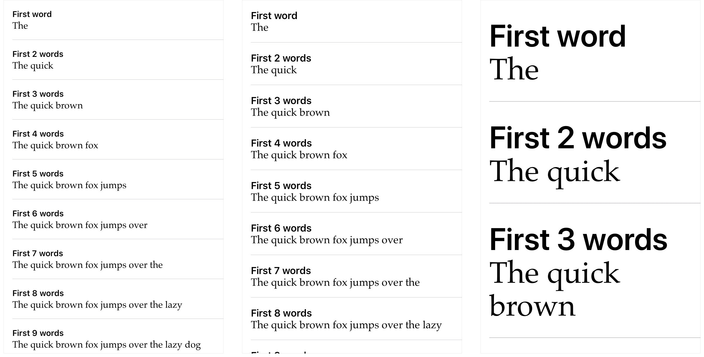

> 导航：[技术](../technologies.md) · [UIKit](../uikit.md) · [文本显示与字体](text-display-and-fonts.md) · [UIFont](uifont.md)

# 创建自定大小的表格视图单元格

<sub>示例代码</sub>

创建支持动态类型（Dynamic Type）的表格视图单元格，并使用系统间距约束调整文本标签周围的间距。

## 概述

本示例代码项目展示了如何创建支持动态类型的自定大小表格视图单元格。因为动态类型让用户控制单元格中显示文本的大小，所以单元格必须能根据文本大小自行调整尺寸。

本项目还展示了如何使用 Auto Layout 约束，根据文本大小自动调整文本标签周围的间距。为了演示自动间距，单元格显示两个 [UILabel](uilabel.md) 对象：一个标题标签和一个正文标签。

### 添加动态类型支持

要添加动态类型支持，单元格为每个标签指定一个可缩放字体。标题标签使用 [UIFontTextStyleHeadline](uifont/textstyle/headline.md) 文本样式对应的首选字体。首选字体即系统字体，可以缩放到不同大小。它的初始文本大小由 `headline` 文本样式的字体度量决定。

```swift
headlineLabel.font = UIFont.preferredFont(forTextStyle: .headline)
headlineLabel.adjustsFontForContentSizeCategory = true
```

正文标签则使用自定义字体。不过，要让自定义字体支持动态类型，必须创建一个采用特定文本样式字体度量的字体版本。就正文标签而言，使用的是 Palatino 自定义字体搭配 [UIFontTextStyleBody](uifont/textstyle/body.md) 文本样式。

```swift
guard let palatino = UIFont(name: "Palatino", size: 18) else {
    fatalError("""
        Failed to load the "Palatino" font.
        Since this font is included with all versions of iOS that support Dynamic Type, verify that the spelling and casing is correct.
        """
    )
}
bodyLabel.font = UIFontMetrics(forTextStyle: .body).scaledFont(for: palatino)
bodyLabel.adjustsFontForContentSizeCategory = true
```

在把每个标签的 [adjustsFontForContentSizeCategory](uicontentsizecategoryadjusting/adjustsfontforcontentsizecategory.md) 属性设为 `true` 之前，动态类型的效果是看不见的。这个属性告诉标签：当用户更改其首选文本大小时，自动为其字体调整文本大小。更多信息参见[自动缩放字体](scaling-fonts-automatically.md)。

### 使用 Auto Layout 约束调整单元格大小与间距

到这里，两个标签已经能自动调整其文本的大小了。但单元格本身还无法调整大小。要用 Auto Layout 约束来调整单元格的 [contentView](uitableviewcell/contentview.md) 及其包含的标签的大小和间距。

### 设置每个标签的水平位置

两个标签的宽度都应延伸填满单元格内容视图的宽度，并且标题标签应出现在正文标签上方。要做到这一点，需要为每个标签添加 Auto Layout 约束，先从定义标签宽度的约束开始。对标题标签，添加的约束告诉它填满内容视图前缘与后缘外边距之间的空间。对正文标签，添加的约束把它的前缘和后缘锚点设为与标题标签的前缘、后缘锚点相等。

```swift
headlineLabel.leadingAnchor.constraint(equalTo: contentView.layoutMarginsGuide.leadingAnchor).isActive = true
headlineLabel.trailingAnchor.constraint(equalTo: contentView.layoutMarginsGuide.trailingAnchor).isActive = true

bodyLabel.leadingAnchor.constraint(equalTo: headlineLabel.leadingAnchor).isActive = true
bodyLabel.trailingAnchor.constraint(equalTo: headlineLabel.trailingAnchor).isActive = true
```

把正文标签的前后缘锚点设为与标题标签的前后缘锚点相等，能保证两个标签的左右边缘始终处于同一位置。这个做法还有一个好处：调整标题标签的左缘或右缘会自动把改动应用到正文标签。虽然只有两个标签时这看似无足轻重，但当有许多标签需要对齐边缘时，把一个标签的前后缘锚点设为与另一个标签的相同锚点相等，能帮你省下不少时间。

### 设置每个标签的垂直位置

水平位置就绪后，接下来设置每个标签的垂直位置。这里再次使用 Auto Layout 约束来定位垂直对齐，把标题文本放在正文文本上方。

设置垂直位置的一种方式，是添加一个基于某个常量值定义两个标签之间距离的约束。但依赖常量值的问题在于：文本大小每次变化你都必须调整这个值，否则文本可能显得松散或拥挤，难以阅读。有了 iOS 11 及更高版本，你可以借助系统间距约束，不必依赖和设置常量值。

系统间距约束依据创建约束时所用的锚点提供的信息，把两个 UI 元素之间的距离设为相应的值。例如，系统间距约束可以把一个标签的 [firstBaselineAnchor](uiview/firstbaselineanchor.md)（标签最顶部文本的基线）定位在另一个标签的 [lastBaselineAnchor](uiview/lastbaselineanchor.md)（该标签最底部文本的基线）之下，距离由系统定义。无论文本大小如何，该约束都能确保两个标签之间始终有足够的间距，而无需调整约束的常量值。

在本示例代码项目中，单元格使用系统间距约束来：

1. 设置单元格内容视图顶部与标题标签之间的间距。
2. 设置正文标签与单元格内容视图底部之间的间距。
3. 设置标题标签与正文标签之间的间距。

```swift
headlineLabel.firstBaselineAnchor.constraint(equalToSystemSpacingBelow: contentView.layoutMarginsGuide.topAnchor, multiplier: 1).isActive = true

contentView.layoutMarginsGuide.bottomAnchor.constraint(equalToSystemSpacingBelow: bodyLabel.lastBaselineAnchor, multiplier: 1).isActive = true

bodyLabel.firstBaselineAnchor.constraint(equalToSystemSpacingBelow: headlineLabel.lastBaselineAnchor, multiplier: 1).isActive = true
```

系统间距约束就位后，系统会根据文本大小自动调整两个标签周围的间距。



<sub>左边是示例 App 在最小文本大小下的屏幕快照；中间是默认文本大小下的屏幕快照；右边是最大文本大小下的屏幕快照。</sub>

### 用 Accessibility Inspector 测试

要测试示例 App 对不同文本大小的反应，请在 Simulator 中运行 App，并使用 Accessibility Inspector 更改文本大小。有了检查器，你无需在 App 与设置 App 之间来回切换，就能用不同文本大小测试 App 的界面。

使用 Accessibility Inspector 的步骤如下：

1. 启动 Xcode，然后运行你的 App。
2. 从 Xcode 菜单栏中选择 **Xcode \> Open Developer Tool \> Accessibility Inspector**，启动检查器。
3. 在 Accessibility Inspector 的左上角，选择 **Simulator** 作为目标。
4. 点按 _Settings_ 图标（齿轮形状）。
5. 拖动 _Font size_ 滑块，更改你的 App 中显示文本的大小。

## 另请参阅

### 创建字体

- [自动缩放字体](scaling-fonts-automatically.md) — 使用动态类型自动缩放界面中的文本。
- [+ preferredFontForTextStyle:](<uifont/preferredfont(fortextstyle_).md>) — 返回指定文本样式的系统字体实例，并按用户选择的内容尺寸类别缩放。
- [+ preferredFontForTextStyle:compatibleWithTraitCollection:](<uifont/preferredfont(fortextstyle_compatiblewith_).md>) — 返回相应文本样式和特性下的系统字体实例。
- [TextStyle](uifont/textstyle.md) — 描述字体首选样式的常量。
- [+ fontWithName:size:](<uifont/init(name_size_).md>) — 为指定的字体名称和大小创建并返回字体对象。
- [+ fontWithDescriptor:size:](<uifont/init(descriptor_size_).md>) — 返回与指定字体描述符匹配的字体。
- [- fontWithSize:](<uifont/withsize(__).md>) — 返回与该字体相同但具有指定大小的字体对象。

## 下载

- [CreatingSelfSizingTableViewCells.zip](https://docs-assets.developer.apple.com/published/097e9c9dad75/CreatingSelfSizingTableViewCells.zip)
