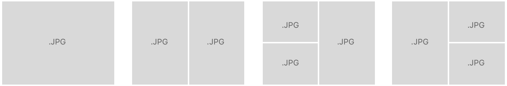

> 导航：[技术](../technologies.md) · [UIKit](../uikit.md) · [视图与控制](views-and-controls.md) · [集合视图](collection-views.md) · [布局](layouts.md)

# 自定集合视图布局

<sub>示例代码</sub>

通过更改流式布局中单元格的大小，或实现马赛克风格，来自定视图布局。

## 概述

要以简单的网格排布 UICollectionView 单元格，你可以直接使用 [UICollectionViewFlowLayout](uicollectionviewflowlayout.md)。要获得更高的灵活性，你可以子类化 [UICollectionViewLayout](uicollectionviewlayout.md) 来创建高级布局。

这个示例 App 演示了两个自定布局子类：

- `ColumnFlowLayout` — 一个 `UICollectionViewFlowLayout` 子类，在窄屏幕上以列表格式排布单元格，在较宽的屏幕上则以网格排布。参见下文“对于简单网格，动态调整单元格大小”。
- `MosaicLayout` — 一个 `UICollectionViewLayout` 子类，以马赛克风格的不规则网格排布单元格。参见下文“对于复杂网格，显式定义单元格大小”。

App 打开后显示的是 Friends 视图控制器，它使用列流式布局来显示一个人员列表。轻点任意单元格会前往 Feed 视图控制器，它使用马赛克布局来显示用户照片图库中的照片。

轻点导航栏右侧的云图标，会演示对集合视图中的项目执行插入、删除、移动和重新加载的批量动画。更多信息参见下文“执行批量更新”。在集合视图上使用下拉刷新会重置数据。

### 对于简单网格，动态调整单元格大小

`ColumnFlowLayout` 是 [UICollectionViewFlowLayout](uicollectionviewflowlayout.md) 的一个子类，它利用集合视图的大小来确定单元格的宽度。如果水平方向只能宽松地容纳一个单元格，布局就会让单元格占据集合视图的整个宽度。否则，布局会显示多列固定宽度的单元格。

实际上，在竖屏模式的 iPhone 设备上，`ColumnFlowLayout` 显示单列垂直排布的单元格。在横屏模式下，或者在 iPad 上，它显示网格布局。

使用 [- prepareLayout](<uicollectionviewlayout/prepare().md>) 函数计算设备的可用屏幕宽度，并据此设置 [itemSize](uicollectionviewflowlayout/itemsize.md) 属性。

```swift
override func prepare() {
    super.prepare()

    guard let collectionView = collectionView else { return }

    let availableWidth = collectionView.bounds.inset(by: collectionView.layoutMargins).width
    let maxNumColumns = Int(availableWidth / minColumnWidth)
    let cellWidth = (availableWidth / CGFloat(maxNumColumns)).rounded(.down)

    self.itemSize = CGSize(width: cellWidth, height: cellHeight)
    self.sectionInset = UIEdgeInsets(top: self.minimumInteritemSpacing, left: 0.0, bottom: 0.0, right: 0.0)
    self.sectionInsetReference = .fromSafeArea
}
```

### 对于复杂网格，显式定义单元格大小

如果你需要的自定程度超出了 [UICollectionViewFlowLayout](uicollectionviewflowlayout.md) 子类所能达到的范围，请改为子类化 [UICollectionViewLayout](uicollectionviewlayout.md)。

`MosaicLayout` 是一个 `UICollectionViewLayout` 子类，可显示任意数量、大小和宽高比各不相同的单元格。`FeedViewController` 类使用马赛克布局来显示用户照片图库中的图像。单元格以四种样式中的一种组织成行，从单个单元格到以不同布局排布的多个单元格。



<sub>图中显示一行四个矩形，每个矩形代表一种马赛克样式。最左侧是单个单元格。左数第二个是两个等大的单元格。左数第三个是一个占据三分之二面积的单元格，以及在大单元格左侧竖排堆叠的两个单元格。最后是一个占据三分之二面积的单元格，以及在大单元格右侧竖排堆叠的两个单元格。</sub>

**计算单元格尺寸**

每当布局失效（invalidate）时，都会调用 [- prepareLayout](<uicollectionviewlayout/prepare().md>) 方法。请重写这个方法，计算每个单元格的位置和大小，以及整个布局的总尺寸。

```swift
override func prepare() {
    super.prepare()

    guard let collectionView = collectionView else { return }

    // 重置缓存的信息。
    cachedAttributes.removeAll()
    contentBounds = CGRect(origin: .zero, size: collectionView.bounds.size)

    // 对于集合视图中的每一项：
    //  - 准备属性。
    //  - 将属性存储到 cachedAttributes 数组中。
    //  - 将 contentBounds 与 attributes.frame 相结合。
    let count = collectionView.numberOfItems(inSection: 0)

    var currentIndex = 0
    var segment: MosaicSegmentStyle = .fullWidth
    var lastFrame: CGRect = .zero

    let cvWidth = collectionView.bounds.size.width

    while currentIndex < count {
        let segmentFrame = CGRect(x: 0, y: lastFrame.maxY + 1.0, width: cvWidth, height: 200.0)

        var segmentRects = [CGRect]()
        switch segment {
        case .fullWidth:
            segmentRects = [segmentFrame]

        case .fiftyFifty:
            let horizontalSlices = segmentFrame.dividedIntegral(fraction: 0.5, from: .minXEdge)
            segmentRects = [horizontalSlices.first, horizontalSlices.second]

        case .twoThirdsOneThird:
            let horizontalSlices = segmentFrame.dividedIntegral(fraction: (2.0 / 3.0), from: .minXEdge)
            let verticalSlices = horizontalSlices.second.dividedIntegral(fraction: 0.5, from: .minYEdge)
            segmentRects = [horizontalSlices.first, verticalSlices.first, verticalSlices.second]

        case .oneThirdTwoThirds:
            let horizontalSlices = segmentFrame.dividedIntegral(fraction: (1.0 / 3.0), from: .minXEdge)
            let verticalSlices = horizontalSlices.first.dividedIntegral(fraction: 0.5, from: .minYEdge)
            segmentRects = [verticalSlices.first, verticalSlices.second, horizontalSlices.second]
        }

        // 为计算出的 frame 创建并缓存布局属性（layout attributes）。
        for rect in segmentRects {
            let attributes = UICollectionViewLayoutAttributes(forCellWith: IndexPath(item: currentIndex, section: 0))
            attributes.frame = rect

            cachedAttributes.append(attributes)
            contentBounds = contentBounds.union(lastFrame)

            currentIndex += 1
            lastFrame = rect
        }

        // 确定下一个分段样式。
        switch count - currentIndex {
        case 1:
            segment = .fullWidth
        case 2:
            segment = .fiftyFifty
        default:
            switch segment {
            case .fullWidth:
                segment = .fiftyFifty
            case .fiftyFifty:
                segment = .twoThirdsOneThird
            case .twoThirdsOneThird:
                segment = .oneThirdTwoThirds
            case .oneThirdTwoThirds:
                segment = .fiftyFifty
            }
        }
    }
}
```

**提供内容大小**

重写 [collectionViewContentSize](uicollectionviewlayout/collectionviewcontentsize.md) 属性，为集合视图提供内容大小。

```swift
override var collectionViewContentSize: CGSize {
    return contentBounds.size
}
```

**定义布局属性**

重写 [- layoutAttributesForElementsInRect:](<uicollectionviewlayout/layoutattributesforelements(in_).md>)，为一个几何区域定义布局属性。集合视图会周期性地调用这个函数来显示项目，这称为_按几何区域查询_（querying by geometric region）。

```swift
override func layoutAttributesForElements(in rect: CGRect) -> [UICollectionViewLayoutAttributes]? {
    var attributesArray = [UICollectionViewLayoutAttributes]()

    // 找出位于查询矩形内的任何单元格。
    guard let lastIndex = cachedAttributes.indices.last,
          let firstMatchIndex = binSearch(rect, start: 0, end: lastIndex) else { return attributesArray }

    // 从匹配处开始，在数组中先向上再向下循环，
    // 直到查询矩形内的所有属性都已添加完毕。
    for attributes in cachedAttributes[..<firstMatchIndex].reversed() {
        guard attributes.frame.maxY >= rect.minY else { break }
        attributesArray.append(attributes)
    }

    for attributes in cachedAttributes[firstMatchIndex...] {
        guard attributes.frame.minY <= rect.maxY else { break }
        attributesArray.append(attributes)
    }

    return attributesArray
}
```

还可以通过实现 [- layoutAttributesForItemAtIndexPath:](<uicollectionviewlayout/layoutattributesforitem(at_).md>) 来提供特定项目的布局属性。集合视图会周期性地调用这个函数来显示某一个特定项目，这称为_按索引路径查询_（querying by index path）。

```swift
override func layoutAttributesForItem(at indexPath: IndexPath) -> UICollectionViewLayoutAttributes? {
    return cachedAttributes[indexPath.item]
}
```

由于这些函数会被频繁调用，它们可能影响你 App 的性能。为了让它们尽可能高效，请尽量严格遵循示例代码。

**处理边界变化**

集合视图每次发生边界变化，或者其大小或原点发生变化时，都会调用 [- shouldInvalidateLayoutForBoundsChange:](<uicollectionviewlayout/shouldinvalidatelayout(forboundschange_).md>) 函数。在滚动期间这个函数也会被频繁调用。默认实现返回 `false`；如果大小和原点发生变化，则返回 `true`。

```swift
override func shouldInvalidateLayout(forBoundsChange newBounds: CGRect) -> Bool {
    guard let collectionView = collectionView else { return false }
    return !newBounds.size.equalTo(collectionView.bounds.size)
}
```

为了获得最佳性能，这个示例在 [- layoutAttributesForElementsInRect:](<uicollectionviewlayout/layoutattributesforelements(in_).md>) 内部执行二分查找，而不是对给定边界区域内每个元素所需的属性做线性查找。

### 执行批量更新

轻点导航栏右上角的按钮，会触发集合视图同时对其集合视图单元格执行由多项动画操作（插入、删除、移动和重新加载）组成的_批量更新_（batch update）。

在调用 [- performBatchUpdates:completion:](<uicollectionview/performbatchupdates(__completion_).md>) 的过程中，系统会同时为所有插入、删除、移动和重新加载操作添加动画。在这个示例中，App 通过处理一个 `PersonUpdate` 对象数组来批量执行更新，其中每个对象封装一项更新：

- `insert`：携带一个 `Person` 对象和一个插入索引。
- `delete`：携带一个索引。
- `move`：从一个索引移动到另一个索引。
- `reload`：携带一个索引。

首先，`reload` 操作在不带动画的情况下执行，因为不涉及任何单元格移动：

```swift
// 不带动画执行所有单元格重新加载，因为没有任何移动。
UIView.performWithoutAnimation {
    collectionView.performBatchUpdates({
        for update in remoteUpdates {
            if case let .reload(index) = update {
                people[index].isUpdated = true
                collectionView.reloadItems(at: [IndexPath(item: index, section: 0)])
            }
        }
    })
}
```

接下来，其余操作会带动画执行：

```swift
// 将所有其他更新类型一起制作动画。
collectionView.performBatchUpdates({
    var deletes = [Int]()
    var inserts = [(person:Person, index:Int)]()

    for update in remoteUpdates {
        switch update {
        case let .delete(index):
            collectionView.deleteItems(at: [IndexPath(item: index, section: 0)])
            deletes.append(index)

        case let .insert(person, index):
            collectionView.insertItems(at: [IndexPath(item: index, section: 0)])
            inserts.append((person, index))

        case let .move(fromIndex, toIndex):
            // 移动某个人员的更新会被拆分为一次添加和一次删除。
            collectionView.moveItem(at: IndexPath(item: fromIndex, section: 0),
                                    to: IndexPath(item: toIndex, section: 0))
            deletes.append(fromIndex)
            inserts.append((people[fromIndex], toIndex))

        default: break
        }
    }

    // 按降序应用删除。
    for deletedIndex in deletes.sorted().reversed() {
        people.remove(at: deletedIndex)
    }

    // 按升序应用插入。
    let sortedInserts = inserts.sorted(by: { (personA, personB) -> Bool in
        return personA.index <= personB.index
    })
    for insertion in sortedInserts {
        people.insert(insertion.person, at: insertion.index)
    }

    // 只有当列表中还有人员时，更新按钮才会启用。
    navigationItem.rightBarButtonItem?.isEnabled = !people.isEmpty
})
```

## 另请参阅

### 手动布局

- [UICollectionViewLayout](uicollectionviewlayout.md) — 为集合视图生成布局信息的抽象基类。
- [UICollectionViewFlowLayout](uicollectionviewflowlayout.md) — 一种布局对象，将项目组织成网格，并可为每个分区提供可选的页眉和页脚视图。
- [UICollectionViewTransitionLayout](uicollectionviewtransitionlayout.md) — 一种特殊的布局对象，让你在集合视图中从一种布局切换到另一种布局时实现特定行为。
- [UICollectionViewLayoutAttributes](uicollectionviewlayoutattributes.md) — 一种布局对象，管理集合视图中给定项目的布局相关属性。
- [UICollectionViewFlowLayoutInvalidationContext](uicollectionviewflowlayoutinvalidationcontext.md) — 一组属性，用于决定是否重新计算项目的大小或其在布局中的位置。

## 下载

- [CustomizingCollectionViewLayouts.zip](https://docs-assets.developer.apple.com/published/ebe75d1feb4d/CustomizingCollectionViewLayouts.zip)
