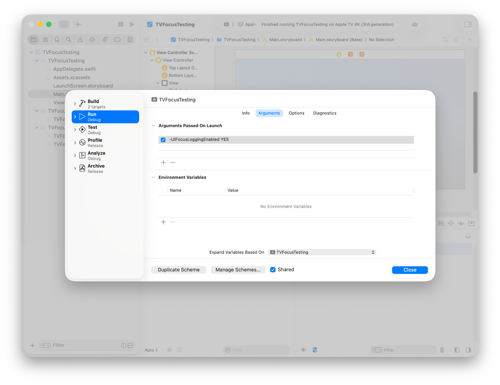
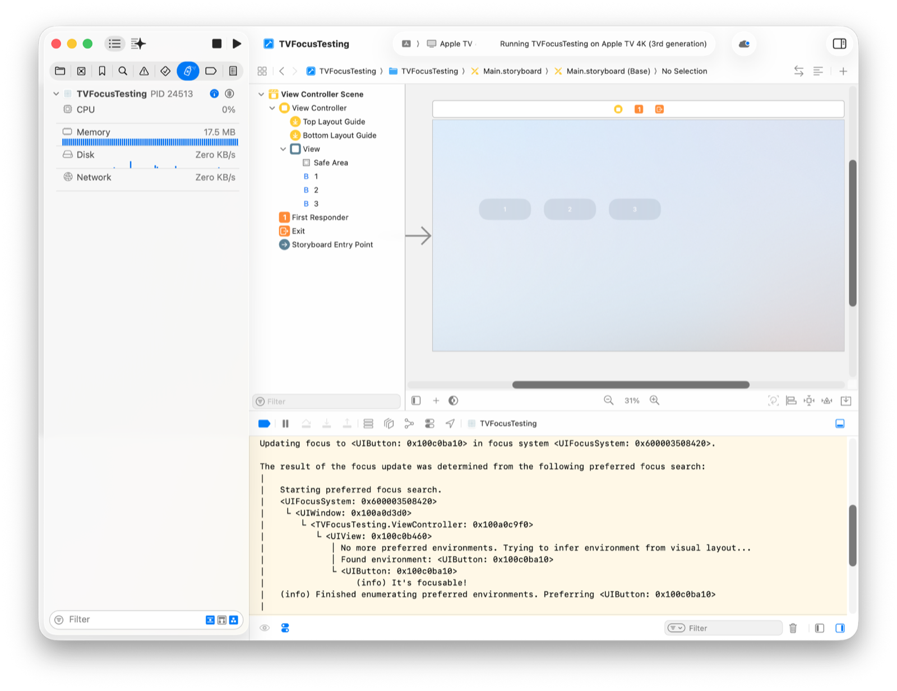

> 导航：[技术](../technologies.md) · [UIKit](../uikit.md) · [基于焦点的导览](focus-based-navigation.md)

# 调试你的 App 中的焦点问题

文章

找出错误，并确定下一个获得焦点的项目为什么不是你所预期的。

## 概述

你的 tvOS App 使用间接控制（indirect controls）进行操作，因此焦点（focus）能正常工作至关重要。为帮助你发现焦点问题，Apple 提供了两个调试工具：`UIFocusLoggingEnabled` 和 [UIFocusDebugger](uifocusdebugger.md)。

### 开启实时焦点日志记录

开启实时焦点日志记录（live focus logging），查看焦点引擎（focus engine）如何确定当前哪个视图获得焦点。当你移动焦点时，日志会随之更新，显示新视图是如何获得焦点的。

在你的 Xcode 项目中，选择 Edit Scheme，然后在 Arguments Passed On Launch 部分添加 `-UIFocusLoggingEnabled YES`。

启动时，调试器会记录所有焦点事件，并把这些事件显示在 Xcode 控制台和“控制台”（Console）App 中。随着你的 App 中焦点发生变化，调试器会更新日志。

### 使用 UIFocusDebugger 查找焦点问题

[UIFocusDebugger](uifocusdebugger.md) 类包含若干可帮助你查找焦点问题的方法。你不会直接在自己的代码中使用这个类或它的方法。相反，在调试会话（debugging session）期间，你可以从 LLDB 调试器命令行调用这个类的方法，以获取焦点系统（focus system）状态的相关信息。例如，`po UIFocusDebugger.status()` 会返回焦点引擎的状态。

## 另请参阅

### 焦点调试

- [UIFocusDebugger](uifocusdebugger.md) — 用于调试焦点相关交互的运行时对象。
