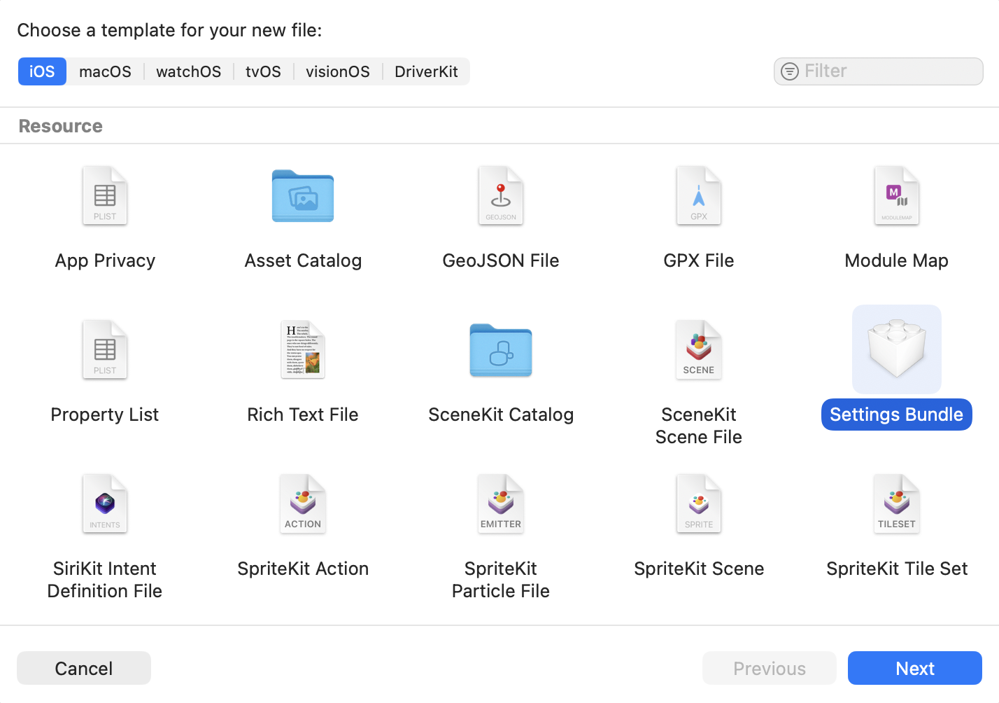

> 导航：[技术](../technologies.md) · [UIKit](../uikit.md) · [Mac Catalyst](mac-catalyst.md)

# 显示「设置」窗口

文章

在使用 Mac Catalyst 构建的 Mac App 中提供「设置」窗口，让用户可以管理在设置捆绑包（Settings bundle）中定义的 App 设置。

## 概述

Mac App 通常使用「设置」窗口显示 App 特有的设置，用户可以通过菜单栏中 App 菜单下的标准「设置」菜单项访问该窗口。

包含 `Settings.bundle` 文件且使用 Mac Catalyst 构建的 Mac App 会自动获得「设置」菜单项和「设置」窗口。当用户选择「设置」菜单项时，系统会根据设置捆绑包中提供的选项，显示适合 Mac 的「设置」窗口。要了解设置捆绑包，请参阅[为 App 构建设置捆绑包](../foundation/building-a-settings-bundle-for-your-app.md)。

### 向 App 添加「设置」窗口

若要在 Mac App 中包含「设置」窗口，首先向 Xcode 项目添加 `Settings.bundle` 文件：

1. 在 Xcode 中打开 App 项目，然后选取 File \> New \> Target。
2. 从 Resource 群组中选择 Settings Bundle，然后点按 Next。
3. 输入设置捆绑包的名称。
4. 点按 Create。

Xcode 中新建文件对话框的截屏，其中选择了 iOS 平台和 Settings Bundle 模板。

### 向「设置」窗口添加工具栏标签页

设置捆绑包可以包含一个或多个子面板，以便按层级组织设置（请参阅[为 App 构建设置捆绑包](../foundation/building-a-settings-bundle-for-your-app.md#Add-a-child-page-element)）。在 iOS 中，「设置」App 将子面板显示为一个设置行。当用户轻点该行时，App 会显示一个新视图，其中包含在子面板属性列表文件中定义的设置。

在 macOS 中，「设置」窗口会将子面板显示为窗口工具栏上的标签页。当用户点按该标签页时，会看到子面板属性列表文件中提供的设置。

子面板的标签页会显示面板标题和系统提供的图标。若要自定图标，请将以下键添加到子面板的属性列表文件中：

- **`Icon`** — 可选。一个字符串，指定要在「设置」窗口中显示为工具栏标签页图标的图像文件名称。

你必须将该图像文件包含在拥有子面板属性列表文件的设置捆绑包中。

### 确认通过切换开关所做的更改

设置捆绑包的另一种元素是切换开关元素，它显示用户可以切换的开/关开关。通过在切换开关元素中包含以下键，你的 Mac App 可以在用户切换开关时提示其确认：

- **`TrueConfirmationPrompt`** — 可选。一个字典，用于定义当用户尝试打开开关时向其显示的提示。
- **`FalseConfirmationPrompt`** — 可选。一个字典，用于定义当用户尝试关闭开关时向其显示的提示。

每个字典都包含以下用于定义提示内容的键：

- **`Type`** — 必需。必须设置为 `PSConfirmationPrompt`。
- **`Title`** — 必需。一个包含提示标题的字符串。该标题可能不会在某些设备上出现。
- **`Prompt`** — 必需。一个包含提示所显示正文文本的字符串。
- **`ConfirmText`** — 可选。一个包含提示确认按钮所显示文本的字符串。用户点按此按钮时，切换开关的值会发生更改。
- **`DenyText`** — 可选。一个包含提示取消按钮所显示文本的字符串。用户点按此按钮时，切换开关的值不会更改。

有关更多信息，请参阅[为 App 构建设置捆绑包](../foundation/building-a-settings-bundle-for-your-app.md#Add-a-toggle-switch-element)。

### 显示切换开关的副标题

一些 iOS App 使用带有页脚文本的群组项目，在切换开关下方的副标题中显示说明文本。虽然「设置」窗口支持这种方法，但它在 Mac 上的外观并不理想。作为替代，请在切换开关元素中包含以下键以显示副标题：

- **`Description`** — 可选。一个较长的说明字符串，显示在切换开关下方。

## 另请参阅

### 用户偏好设置

- [检测偏好设置窗口中的更改](detecting-changes-in-the-preferences-window.md) — 在使用 Mac Catalyst 构建的 Mac App 中，使用 Combine 侦听并响应用户的偏好设置更改。
