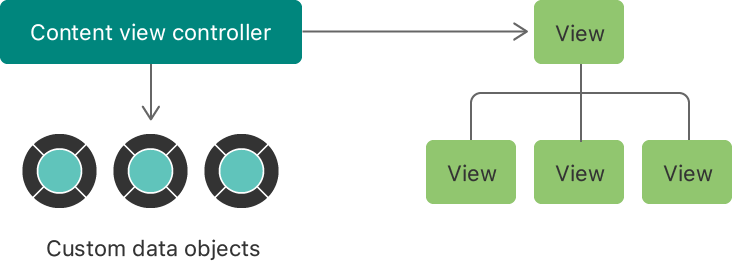
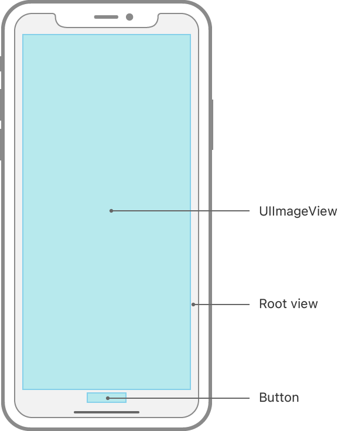

> 导航：[技术](../technologies.md) · [UIKit](../uikit.md) · [视图控制器](view-controllers.md)

# 使用视图控制器显示和管理视图

<sub>文章</sub>

在 Storyboard 中构建视图控制器（view controller），为其配置自定视图，并使用 App 数据填充这些视图。

## 概述

在模型-视图-控制器（model-view-controller）设计范式中，视图控制器位于在屏幕上呈现信息的视图对象与存储 App 内容的数据对象之间。具体而言，视图控制器管理视图层级结构（view hierarchy），以及使这些视图保持最新所需的状态信息。每个 UIKit App 都高度依赖视图控制器来呈现内容，而你通常会定义自定视图控制器来管理视图和 UI 相关逻辑。

你创建的大多数自定视图控制器都是_内容视图控制器（content view controller）_——也就是说，视图控制器拥有其所有视图，并管理与这些视图的交互。使用内容视图控制器在屏幕上呈现 App 的自定内容，并使用视图控制器对象管理数据进出自定视图的传输。



> [!note] 注意
> 与内容视图控制器不同，容器视图控制器（container view controller）会将其他视图控制器的内容纳入自己的视图层级结构。[UINavigationController](uinavigationcontroller.md) 就是容器视图控制器的一个示例。有关如何实现容器视图控制器的信息，请参阅[创建自定容器视图控制器](creating-a-custom-container-view-controller.md)。

若要定义内容视图控制器，首先创建 [UIViewController](uiviewcontroller.md) 的子类。如果界面包含表格视图（table view）或集合视图（collection view），请改为创建 [UITableViewController](uitableviewcontroller.md) 或 [UICollectionViewController](uicollectionviewcontroller.md) 的子类。新的 Xcode 项目会包含一个或多个可供你修改的内容视图控制器类，你也可以添加更多。

### 向视图控制器添加视图

[UIViewController](uiviewcontroller.md) 包含一个内容视图，可通过 [view](uiviewcontroller/view.md) 属性访问，它充当视图层级结构的根视图。你可以向该根视图添加呈现界面所需的自定视图。在 Storyboard 中，可以通过将视图拖到视图控制器场景上来添加视图。例如，下图展示了 iPhone 上包含图像视图和按钮的视图控制器。



向视图控制器添加视图后，务必添加 Auto Layout 约束，以设置这些视图的大小和位置。约束是一些规则，用于指定如何相对于父视图或同级视图调整每个视图的大小和位置，并确保视图自动适应不同环境和设备。有关更多信息，请参阅[视图布局](view-layout.md)。

### 存储对重要视图的引用

在运行时，你可能需要从视图控制器的代码中访问视图。例如，你可能想要获取文本视图中的文本，或更改图像视图中的图像。为此，你需要拥有对视图层级结构中相应视图的引用。你可以使用 outlet 创建这些引用。

outlet 是视图控制器中包含 `IBOutlet` 关键字的属性。该关键字会告知 Xcode 在 Storyboard 中公开相应属性。以下示例代码展示了两个 outlet 的定义。在 Swift 中，请包含 `weak` 关键字，以防止视图控制器持有对视图的第二个强引用——第一个强引用来自视图层级结构本身。

**Swift**

```swift
@IBOutlet weak var imageView : UIImageView?
@IBOutlet weak var button : UIButton?
```

**Objective-C**

```objc
@property IBOutlet UIImageView* imageView;
@property IBOutlet UIButton* button;
```

在 Storyboard 中，将每个 outlet 连接到对应的视图，如[添加 outlet 连接以向 UI 对象发送消息](https://help.apple.com/xcode/mac/current/#/devc06f7ee11)中所述。你不需要存储对视图层级结构中所有视图的引用；只需存储对之后要修改的视图的引用。

实例化视图控制器时，UIKit 会重新连接你在 Storyboard 中配置的所有 outlet。UIKit 会在调用视图控制器的 [- viewDidLoad](<uiviewcontroller/viewdidload().md>) 方法之前重新建立这些连接，因此你可以从该方法访问这些属性中的对象。如果以编程方式创建了任何视图，则必须将这些视图显式赋给视图控制器的相应属性。

### 处理视图和控制中发生的事件

控制（control）使用目标-动作（target-action）设计模式报告用户交互，一些视图则会发布通知，或在发生更改时调用委托（delegate）方法。视图控制器需要了解其中许多交互，以便更新其视图，你可以通过以下几种方式来实现：

- 在视图控制器中实现委托和动作方法。此选项简单且易于实现，但灵活性较低，也会增加代码测试和验证的难度。
- 在视图控制器的类扩展中实现委托和动作方法。此选项将事件处理代码与视图控制器的其他部分分开，使这些代码更易于测试和验证。
- 在专用对象中实现委托和动作方法，再由这些对象将相关信息转发给视图控制器。此选项提供最高的灵活性和可复用性。职责分离也让编写单元测试变得更加容易。

若要响应用户与控制的交互，请使用以下代码清单所示的其中一种签名定义动作方法。在方法定义中，可以将对 [UIControl](uicontrol.md) 的泛型引用替换为更具体的控制类。

**Swift**

```swift
@IBAction func doSomething()
@IBAction func doSomething(sender: UIControl)
@IBAction func doSomething(sender: UIControl, forEvent event: UIEvent)
```

**Objective-C**

```objc
- (IBAction)doSomething;
- (IBAction)doSomething:(UIControl*)sender;
- (IBAction)doSomething:(UIControl*)sender forEvent:(UIEvent*)event;
```

有关目标-动作设计模式以及如何处理控制相关事件的信息，请参阅 [UIControl](uicontrol.md)。

### 准备要在屏幕上显示的视图

在屏幕上显示视图之前，UIKit 会提供多个机会让你配置视图控制器和视图。从 Storyboard 实例化视图控制器时，UIKit 会使用其 [- initWithCoder:](<uiviewcontroller/init(coder_).md>) 方法创建该对象。

> [!note] 注意
> 如果视图控制器需要进行 coder 对象所能提供内容以外的自定初始化，可以使用 [UIStoryboard](uistoryboard.md) 的 [instantiateInitialViewController(creator:)](<uistoryboard/instantiateinitialviewcontroller(creator_).md>) 方法，以编程方式实例化它。该方法让你使用一个 block 和 UIKit 提供的 coder 对象自行创建视图控制器。通过此选项，可以使用视图控制器所需的任何自定数据来初始化视图控制器，同时仍然恢复 Storyboard 中视图及其他对象的配置。

在屏幕上呈现视图控制器时，UIKit 首先需要加载和配置相应的视图，并按以下顺序完成：

1. 使用每个视图的 [- initWithCoder:](<uiview/init(coder_).md>) 方法创建该视图
2. 将视图连接到视图控制器中相应的动作和 outlet
3. 调用每个视图和视图控制器的 [awakeFromNib()](<../objectivec/nsobject-swift.class/awakefromnib().md>) 方法
4. 将视图层级结构赋给视图控制器的 [view](uiviewcontroller/view.md) 属性
5. 调用视图控制器的 [- viewDidLoad](<uiviewcontroller/viewdidload().md>) 方法

加载时，只执行准备视图控制器以供使用所需的一次性配置步骤。利用加载时间创建并配置 Storyboard 中没有的任何其他视图。不要执行每次视图控制器出现在屏幕上时都需要发生的任务。例如，不要启动动画或更新视图的值。

在视图首次出现在屏幕上时，执行任何与视图相关的最终任务。当视图正在屏幕上出现时，UIKit 会通知拥有这些视图的视图控制器，并按以下方式更新视图布局以适应当前环境：

1. 在过渡（transition）开始时调用 [- viewWillAppear:](<uiviewcontroller/viewwillappear(__).md>)
2. 将视图添加到层级
3. 更新视图控制器及其视图的特性集合（trait collection）
4. 更新视图的几何信息，包括其在父视图中的大小和位置。更新布局外边距（layout margin）和安全区（safe area），并在需要时调用 [- viewLayoutMarginsDidChange](<uiviewcontroller/viewlayoutmarginsdidchange().md>) 和 [- viewSafeAreaInsetsDidChange](<uiviewcontroller/viewsafeareainsetsdidchange().md>)
5. 调用 [- viewIsAppearing:](<uiviewcontroller/viewisappearing(__).md>) 方法，通知你视图控制器的视图正在屏幕上出现
6. 调用 [- viewWillLayoutSubviews](<uiviewcontroller/viewwilllayoutsubviews().md>) 方法
7. 更新视图层级结构的布局
8. 调用 [- viewDidLayoutSubviews](<uiviewcontroller/viewdidlayoutsubviews().md>) 方法
9. 在屏幕上显示视图
10. 在所有动画完成后，调用视图控制器的 [- viewDidAppear:](<uiviewcontroller/viewdidappear(__).md>) 方法

在视图控制器的 [- viewIsAppearing:](<uiviewcontroller/viewisappearing(__).md>) 方法中更新视图内容。系统调用此方法时，已将视图添加到视图层级结构，并定义好 frame、bounds、外边距和 inset。系统在 `viewIsAppearing(_:)` 中添加的内容会在视图首次出现在屏幕上时显示。

每当视图执行布局时，系统都会调用 [- viewWillLayoutSubviews](<uiviewcontroller/viewwilllayoutsubviews().md>) 和 [- viewDidLayoutSubviews](<uiviewcontroller/viewdidlayoutsubviews().md>) 方法；只要视图可见，布局随时可能发生。由于系统只在每次出现过渡过程中调用一次 `viewIsAppearing(_:)`，因此你在此方法中所做的更改不会在视图每次执行布局时重复。

系统调用 `viewIsAppearing(_:),` 时，视图控制器及其视图的特性集合是最新的。你可以使用视图控制器的 [traitCollection](uitraitenvironment/traitcollection.md) 属性访问当前环境的相关信息，例如显示比例，或者垂直与水平尺寸类别（size class）。有关可用特性的更多信息，请参阅 [UITraitCollection](uitraitcollection.md)。

## 另请参阅

### 内容视图控制器

- [显示和隐藏视图控制器](showing-and-hiding-view-controllers.md) — 使用不同技术显示视图控制器，并在过渡期间在它们之间传递数据。
- [UIViewController](uiviewcontroller.md) — 管理 UIKit App 视图层级结构的对象。
- [UITableViewController](uitableviewcontroller.md) — 专门用于管理表格视图的视图控制器。
- [UICollectionViewController](uicollectionviewcontroller.md) — 专门用于管理集合视图的视图控制器。
- [UIContentContainer](uicontentcontainer.md) — 使视图控制器内容适应大小和特性变化的一组方法。
