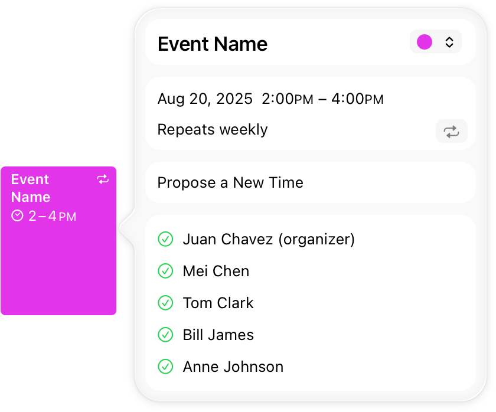

> 导航：[技术](../technologies.md) · [UIKit](../uikit.md) · [窗口和屏幕](windows-and-screens.md)

# 在弹出窗口中显示临时内容

<sub>文章</sub>

在 iPad 上，于 App 内容上方显示临时界面。

## 概述

对于按需出现并在用户使用完毕后消失的 App 内容，请使用弹出窗口（popover）。例如，使用弹出窗口显示当前所选项目的信息、显示工具和配置选项，或向用户收集信息。你可以将弹出窗口锚定到屏幕上的特定位置，弹出窗口会浮在主窗口上方。下图展示了 iPad 上的“日历”App 如何使用弹出窗口显示详细的会议信息。



你使用视图控制器（view controller）指定弹出窗口的内容，然后使用弹出窗口呈现方式（popover presentation style）呈现视图控制器。UIKit 会将弹出窗口锚定到你指定的位置。

以下代码展示了如何从栏按钮项目呈现弹出窗口，该项目充当弹出窗口的锚点。UIKit 使用栏按钮项目的位置来确定弹出窗口的放置位置和箭头方向。视图控制器的 [UIPopoverPresentationController](uipopoverpresentationcontroller.md) 负责管理弹出窗口在屏幕上的显示。

**Swift**

```swift
@IBAction func displayOptionsForSelectedItem() {
   // 加载并配置视图控制器。
   let storyboard = UIStoryboard(name: "Main", bundle: nil)
   let optionsVC = storyboard.instantiateViewController( 
              withIdentifier: "itemOptionsViewController")
    
   // 为视图控制器使用弹出窗口呈现方式。    
   optionsVC.modalPresentationStyle = .popover

   // 指定弹出窗口的锚点。
   optionsVC.popoverPresentationController?.sourceItem = 
              optionsControl

   // 呈现视图控制器（在弹出窗口中）。
   self.present(optionsVC, animated: true) {
      // 弹出窗口可见。
   }
}
```

**Objective-C**

```objc
- (IBAction)displayOptionsForSelectedItem {
    // 加载并配置视图控制器。
    UIStoryboard *storyboard = [UIStoryboard storyboardWithName:@"Main" bundle:nil];
    UIViewController *optionsVC = [storyboard instantiateViewControllerWithIdentifier:@"itemOptionsViewController"];
    
    // 为视图控制器使用弹出窗口呈现方式。
    [optionsVC setModalPresentationStyle:UIModalPresentationPopover];
    
    // 指定弹出窗口的锚点。
    [[optionsVC popoverPresentationController] setSourceItem:optionsControl];
    
    // 呈现视图控制器（在弹出窗口中）。
    [self presentViewController:optionsVC animated:YES completion:^{
        // 弹出窗口可见。
    }];
}
```

在调用 [- presentViewController:animated:completion:](<uiviewcontroller/present(__animated_completion_).md>) 方法之前，配置视图控制器的 [UIPopoverPresentationController](uipopoverpresentationcontroller.md) 对象的其他属性。例如，你可能想要指定一个委托（delegate）来管理弹出窗口的呈现和关闭。

## 另请参阅

### 弹出窗口

- [UIPopoverPresentationController](uipopoverpresentationcontroller.md) — 管理弹出窗口中内容显示的对象。
- [UIPopoverBackgroundView](uipopoverbackgroundview.md) — 弹出窗口的背景外观。
- [UIPopoverBackgroundViewMethods](uipopoverbackgroundviewmethods.md) — 弹出窗口背景视图子类必须实现的一组方法。
