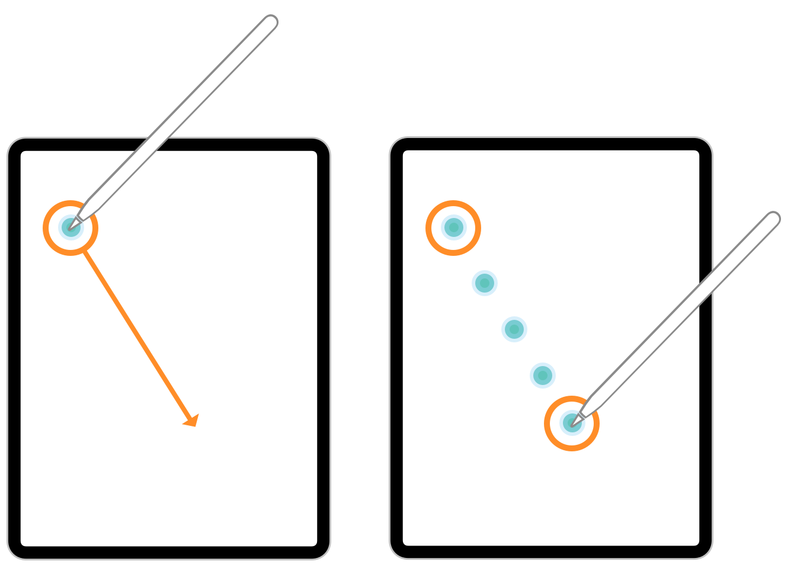

> 导航：[Technologies](../technologies.md) · [UIKit](../uikit.md) · [触摸、按压与手势](touches-presses-and-gestures.md) · [处理视图中的触摸](handling-touches-in-your-view.md)

# 使用合并触摸获取高保真输入

了解如何在你的 App 中支持高精度触摸。

## 概述

UIKit 通常以大约 60 Hz 的频率向你的 App 传递触摸，但某些设备能够以最高 240 Hz 的频率记录触摸信息。在这类设备上，UIKit 不会自动传递额外的触摸信息，以防 App 不需要这些额外数据。相反，它会将任何额外的触摸合并成单个 [UITouch](uitouch.md) 对象，该对象的位置只反映最后一次记录的触摸。不过，需要额外精度的 App 可以获取并使用这些额外的触摸信息。

> [!important] 重要
> 合并触摸适用于需要额外精度、且能够处理相应开销的 App。处理合并触摸意味着要收集额外数据并将其应用到你的内容上。如果你不需要额外的精度，就继续使用 UIKit 传递给视图或手势识别器方法的那组触摸对象。

下图展示了用户在设备上拖动 Apple Pencil 时发生的情况。在 UIKit 向 App 报告一次触摸事件时，Apple Pencil 已经报告了四个触摸位置，但默认情况下 UIKit 只向 App 报告最后一次触摸。其余三次触摸作为合并触摸传递，App 必须显式获取它们才能使用。

一张插图，并排展示了两个 iPad 屏幕。左侧显示了 Apple Pencil 在显示屏左上方发起的初始触摸事件。随着 Apple Pencil 向右下方拖动，拖动结束时触摸被合并，如右侧所示。

要获取合并触摸，请调用包含原始 [UITouch](uitouch.md) 对象的 [UIEvent](uievent.md) 对象的 [- coalescedTouchesForTouch:](<uievent/coalescedtouches(for_).md>) 方法。该方法会返回自上一个事件以来的所有触摸组成的数组，包括实际传递给 App 的最后一个 [UITouch](uitouch.md) 对象。你必须在处理事件时立即获取合并触摸。事件处理完毕后，无法保证任何合并触摸仍然可用。

## 主题

### 示例

- [在 App 中实现合并触摸支持](implementing-coalesced-touch-support-in-an-app.md) — 了解如何创建一个处理合并触摸的简单 App。

## 另请参阅

### 高级触摸处理

- [实现一个多点触控 App](implementing-a-multi-touch-app.md) — 了解如何创建一个处理多点触控输入的简单 App。
- [使用预测触摸最小化延迟](minimizing-latency-with-predicted-touches.md) — 使用 UIKit 对触摸位置的预测，打造流畅且响应迅速的绘图体验。
