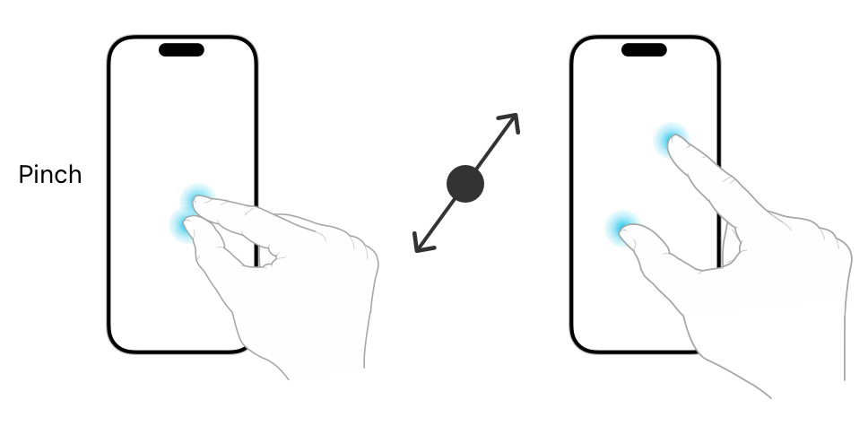

> 导航：[Technologies](../technologies.md) · [UIKit](../uikit.md) · [触摸、按压与手势](touches-presses-and-gestures.md) · [处理 UIKit 手势](handling-uikit-gestures.md)

# 处理捏合手势

<sub>文章</sub>

追踪两根手指之间的距离，并利用该信息缩放你的内容。

## 概述

捏合手势是一种连续手势，用于追踪最先触摸屏幕的两根手指之间的距离。使用 [UIPinchGestureRecognizer](uipinchgesturerecognizer.md) 类来检测捏合手势。

你可以通过以下方式之一附加手势识别器：

- 以编程方式。调用你视图的 [- addGestureRecognizer:](<uiview/addgesturerecognizer(__).md>) 方法。
- 在 Interface Builder 中。从库中拖拽相应的对象，并将其拖放到你的视图上。



捏合手势识别器会报告触摸屏幕的两根手指之间距离的变化。捏合手势是连续的，因此每次两根手指之间的距离变化时，你的操作方法都会被调用。手指之间的距离以缩放因子的形式报告。手势开始时，缩放因子为 `1.0`。随着两根手指之间的距离增大，缩放因子会按比例增大。同样，随着手指之间的距离减小，缩放因子也会减小。捏合手势最常用于改变屏幕上对象或内容的大小。例如，地图视图使用捏合手势来改变地图的缩放级别。

只有在两根手指之间的距离首次发生变化后，捏合手势识别器才会进入 [UIGestureRecognizerStateBegan](uigesturerecognizer/state-swift.enum/began.md) 状态。在这次初始变化之后，距离的后续变化会使手势识别器进入 [UIGestureRecognizerStateChanged](uigesturerecognizer/state-swift.enum/changed.md) 状态，并更新缩放因子。当用户的手指离开屏幕时，手势识别器会进入 [UIGestureRecognizerStateEnded](uigesturerecognizer/state-swift.enum/ended.md) 状态。

> [!important] 重要
> 将捏合手势识别器的缩放因子应用到你的内容时要格外小心，否则可能会得到意想不到的结果。因为你的操作方法可能会被调用很多次，所以你不能简单地把当前的缩放因子应用到你的内容上。如果你把每个新的缩放值乘以你内容当前的值——而该值已经被之前对操作方法的调用缩放过——你的内容就会呈指数级增长或缩小。正确的做法是，缓存你内容的原始值，把缩放因子应用到这个原始值上，然后再把新值应用回你的内容。或者，在应用每次新的变化之后，将 [scale](uipinchgesturerecognizer/scale.md) 因子重置为 `1.0`。

以下代码演示了如何使用捏合手势识别器线性调整视图大小。这个操作方法把当前的缩放因子应用到视图的变换上，然后将手势识别器的 [scale](uipinchgesturerecognizer/scale.md) 属性重置为 `1.0`。重置缩放因子会使手势识别器只报告自上次重置以来的变化量，从而实现视图的线性缩放。

```swift
@IBAction func scalePiece(_ gestureRecognizer: UIPinchGestureRecognizer) {
    guard gestureRecognizer.view != nil else { return }

    if gestureRecognizer.state == .began || gestureRecognizer.state == .changed {
        gestureRecognizer.view?.transform = (gestureRecognizer.view?.transform.
                    scaledBy(x: gestureRecognizer.scale, y: gestureRecognizer.scale))!
        gestureRecognizer.scale = 1.0
    }
}
```

如果你捏合手势识别器的代码没有被调用，或者运行不正常，请检查以下条件是否成立，并按需进行修正：

- 视图的 [userInteractionEnabled](uiview/isuserinteractionenabled.md) 属性被设为 [true](../swift/true.md)。图像视图和标签默认将此属性设为 [false](../swift/false.md)。
- 至少有两根手指正在触摸屏幕。
- 你正确地将缩放因子应用到了你的内容上。当你只是简单地把缩放因子应用到当前值上时，就会发生数值的指数级增长。

## 另请参阅

### 手势

- [处理点按手势](handling-tap-gestures.md) — 使用屏幕上的短促点按操作，实现与你的内容之间类似按钮的交互。
- [处理长按手势](handling-long-press-gestures.md) — 检测屏幕上持续时间较长的点按操作，并利用它们来显示与上下文相关的内容。
- [处理平移手势](handling-pan-gestures.md) — 追踪手指在屏幕上的移动，并将该移动应用到你的内容上。
- [处理轻扫手势](handling-swipe-gestures.md) — 检测屏幕上的水平或垂直轻扫动作，并用它来触发对你内容的导览。
- [处理旋转手势](handling-rotation-gestures.md) — 测量屏幕上两根手指的相对旋转角度，并利用该动作旋转你的内容。
