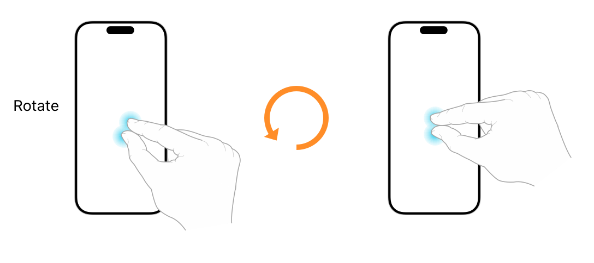

> 导航：[Technologies](../technologies.md) · [UIKit](../uikit.md) · [触摸、按压与手势](touches-presses-and-gestures.md) · [处理 UIKit 手势](handling-uikit-gestures.md)

# 处理旋转手势

<sub>文章</sub>

测量屏幕上两根手指的相对旋转角度，并利用该动作旋转你的内容。

## 概述

旋转手势是一种连续手势，当最先触摸屏幕的两根手指围绕彼此旋转时就会发生。使用 [UIRotationGestureRecognizer](uirotationgesturerecognizer.md) 类来检测旋转手势。

你可以通过以下方式之一附加手势识别器：

- 以编程方式。调用你视图的 [- addGestureRecognizer:](<uiview/addgesturerecognizer(__).md>) 方法。
- 在 Interface Builder 中。从库中拖拽相应的对象，并将其拖放到你的视图上。



<sub>展示旋转手势如何在最先触摸屏幕的两根手指移动以表示旋转时开始的示意图。</sub>

当你想把旋转动作用作 App 的输入时，使用旋转手势识别器。旋转手势通常用于操纵屏幕上的对象。例如，你可以用它来旋转某个视图，或更新自定控制的值。旋转手势是连续的，因此只要旋转值发生变化，你的操作方法就会被调用，让你有机会更新你的内容。

手势识别器以弧度为单位报告旋转值。设想在用户的手指之间画一条线，手指在初始位置形成的这条线代表了测量的初始点，因此代表旋转角度为 `0`。随着用户手指的移动，每个新位置的手指之间都会形成一条新线。手势识别器测量初始线与每条新线之间的夹角，并将得到的值放入其 [rotation](uirotationgesturerecognizer/rotation.md) 属性中。

一旦用户手指的位置变化表明旋转已经开始，旋转手势识别器就会进入 [UIGestureRecognizerStateBegan](uigesturerecognizer/state-swift.enum/began.md) 状态。在这次初始变化之后，后续的变化会使手势识别器进入 [UIGestureRecognizerStateChanged](uigesturerecognizer/state-swift.enum/changed.md) 状态，并更新旋转角度。当用户的手指离开屏幕时，手势识别器会进入 [UIGestureRecognizerStateEnded](uigesturerecognizer/state-swift.enum/ended.md) 状态。

> [!important] 重要
> 将旋转值应用到你的内容时要格外小心，否则可能会得到意想不到的结果。手势识别器报告的旋转角度，代表的是当前手指位置与初始手指位置之间的夹角。如果你把每个新的旋转值原样应用到你的内容上，每个新值都会叠加在前一个值之上，导致你的内容旋转得过快。正确的做法是，缓存你内容的原始值，把旋转应用到这个原始值上，然后再把新值应用回你的内容。或者，在应用每次新的变化之后，将 [rotation](uirotationgesturerecognizer/rotation.md) 因子重置为 `0.0`。

以下代码演示了如何以跟随用户手指的方式旋转视图。这个操作方法把当前的旋转因子应用到视图的变换上，然后将手势识别器的 [rotation](uirotationgesturerecognizer/rotation.md) 属性重置为 `0.0`。重置旋转因子会使手势识别器只报告自上次重置以来的变化量，从而实现视图的线性旋转。

```swift
@IBAction func rotatePiece(_ gestureRecognizer : UIRotationGestureRecognizer) {
   // Move the anchor point of the view's layer to the center of a
   // person's two fingers. This creates a more natural looking rotation.
   guard gestureRecognizer.view != nil else { return }
        
   if gestureRecognizer.state == .began || gestureRecognizer.state == .changed {
      gestureRecognizer.view?.transform = gestureRecognizer.view!.transform.rotated(by: gestureRecognizer.rotation)
      gestureRecognizer.rotation = 0
   }
}
```

如果你旋转手势识别器的代码没有被调用，或者运行不正常，请检查以下条件是否成立，并按需进行修正：

- 视图的 [userInteractionEnabled](uiview/isuserinteractionenabled.md) 属性被设为 [true](../swift/true.md)。图像视图和标签默认将此属性设为 [false](../swift/false.md)。
- 至少有两根手指正在触摸屏幕。
- 你正确地将旋转因子应用到了你的内容上。当你把同一个旋转值应用了不止一次时，就会发生过度旋转。要解决这个问题，请在把当前旋转值应用到你的内容之后，将 [rotation](uirotationgesturerecognizer/rotation.md) 属性设为 `0.0`。

## 另请参阅

### 手势

- [处理点按手势](handling-tap-gestures.md) — 使用屏幕上的短促点按操作，实现与你的内容之间类似按钮的交互。
- [处理长按手势](handling-long-press-gestures.md) — 检测屏幕上持续时间较长的点按操作，并利用它们来显示与上下文相关的内容。
- [处理平移手势](handling-pan-gestures.md) — 追踪手指在屏幕上的移动，并将该移动应用到你的内容上。
- [处理轻扫手势](handling-swipe-gestures.md) — 检测屏幕上的水平或垂直轻扫动作，并用它来触发对你内容的导览。
- [处理捏合手势](handling-pinch-gestures.md) — 追踪两根手指之间的距离，并利用该信息缩放你的内容。
