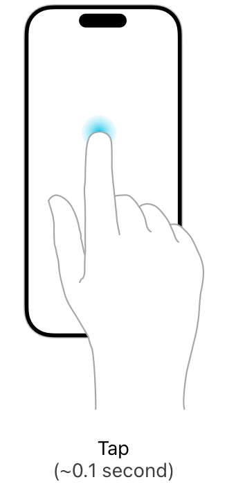

> 导航：[技术](../technologies.md) · [UIKit](../uikit.md) · [触摸、按压和手势](touches-presses-and-gestures.md) · [处理 UIKit 手势](handling-uikit-gestures.md)

# 处理轻点手势

<sub>文章</sub>

利用屏幕上的短暂轻点，为你的内容实现类似按钮的交互。

## 概述

轻点手势检测一根或多根手指对屏幕的短暂触碰。参与这些手势的手指不得明显偏离初始触点，并且你可以配置手指必须触碰屏幕的次数。例如，你可以配置轻点手势识别器来检测单击、双击或三连击。

你可以通过以下两种方式之一附加手势识别器：

- 以编程方式。调用你的视图的 [- addGestureRecognizer:](<uiview/addgesturerecognizer(__).md>) 方法。
- 在 Interface Builder 中。从资源库中把相应对象拖放到你的视图上。



[UITapGestureRecognizer](uitapgesturerecognizer.md) 对象提供与按钮类似的事件处理能力——它检测其视图中的轻点，并把该轻点报告给你的动作方法。轻点手势是离散手势，因此只有当轻点手势被成功识别时，你的动作方法才会被调用。你可以配置轻点手势识别器，要求任意次数的轻点——例如单击或双击——之后才调用你的动作方法。

下面的代码展示了一个动作方法，它通过把视图动画移动到新位置来响应视图上成功的轻点。在执行任何操作之前，务必检查手势识别器的 [state](uigesturerecognizer/state-swift.property.md) 属性，即使是离散手势识别器也不例外。

```swift
@IBAction func tapPiece(_ gestureRecognizer: UITapGestureRecognizer) {
   guard gestureRecognizer.view != nil else { return }
        
   if gestureRecognizer.state == .ended {      // Move the view down and to the right when tapped.
      let animator = UIViewPropertyAnimator(duration: 0.2, curve: .easeInOut, animations: {
         gestureRecognizer.view!.center.x += 100
         gestureRecognizer.view!.center.y += 100
      })
      animator.startAnimation()
   }
}
```

如果你的轻点手势识别器的代码没有被调用，检查以下条件是否成立，并按需修正：

- 视图的 [userInteractionEnabled](uiview/isuserinteractionenabled.md) 属性已设为 [true](../swift/true.md)。图像视图和标签默认把此属性设为 [false](../swift/false.md)。
- 轻点次数等于 [numberOfTapsRequired](uitapgesturerecognizer/numberoftapsrequired.md) 属性中指定的次数。
- 手指数量等于 [numberOfTouchesRequired](uitapgesturerecognizer/numberoftouchesrequired.md) 属性中指定的数量。

## 另请参阅

### 手势

- [处理长按手势](handling-long-press-gestures.md) — 检测屏幕上持续时间较长的按压，并用它们呈现与上下文相关的内容。
- [处理拖移手势](handling-pan-gestures.md) — 追踪手指在屏幕上的移动，并把该移动应用到你的内容上。
- [处理轻扫手势](handling-swipe-gestures.md) — 检测屏幕上的水平或垂直轻扫动作，并用它触发内容间的导览。
- [处理捏合手势](handling-pinch-gestures.md) — 追踪两根手指之间的距离，并用该信息缩放你的内容。
- [处理旋转手势](handling-rotation-gestures.md) — 测量两根手指在屏幕上的相对旋转，并用该动作旋转你的内容。
