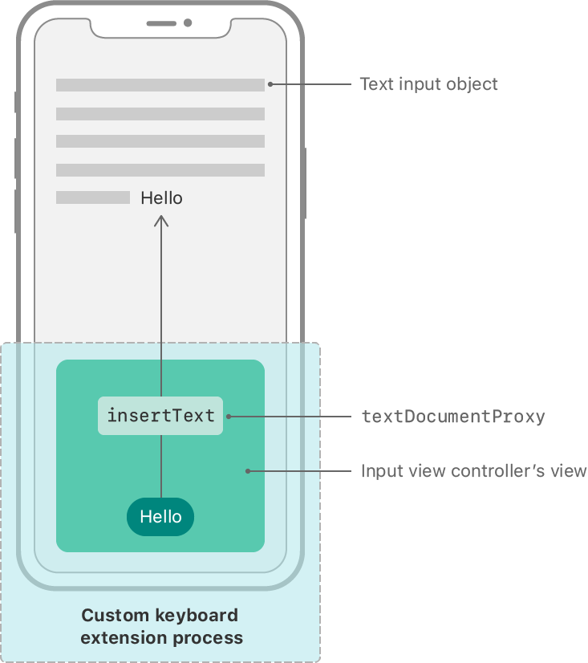
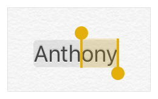

> 导航：[技术](../technologies.md) · [UIKit](../uikit.md) · [键盘与输入](keyboards-and-input.md) · [创建自定义键盘](creating-a-custom-keyboard.md)

# 在自定义键盘中处理文本交互

<sub>文章</sub>

通过指向文本输入视图的代理（proxy），插入、删除和操纵文本。

## 概述

自定义键盘在一个单独的进程中执行，无法直接访问用户正在编辑的文本。代理对象 [UITextDocumentProxy](uitextdocumentproxy.md) 提供对输入文本视图的访问。通过这个文稿文本代理（text document proxy），你可以插入或删除文本、操纵插入点，并访问插入点周围的其他文本上下文。



<sub>示意图：展示自定义键盘扩展进程与文本输入对象的关系。在键盘扩展进程中，输入视图控制器使用文稿文本代理向文本输入视图插入一个字符串。</sub>

### 插入与删除文本

文稿文本代理遵循 [UIKeyInput](uikeyinput.md) 协议，提供插入和删除文本的方法。要向当前输入视图插入一个字符或字符串：

```swift
textDocumentProxy.insertText("Hello world.")
```

要删除当前插入点之前的字符：

```swift
textDocumentProxy.deleteBackward()
```

你可以用 [hasText](uikeyinput/hastext.md) 属性判断输入视图里是否还有文本：

```swift
if textDocumentProxy.hasText {
    // Do something with the text
}

```

### 调整插入点

要移动文本输入视图中的插入点，使用 [- adjustTextPositionByCharacterOffset:](<uitextdocumentproxy/adjusttextposition(bycharacteroffset_).md>) 方法。例如，如果你想实现向前删除（forward delete）操作，先把插入位置向前移动一个字符，再向后删除：

```swift
// Move the text insertion position forward 1 character
textDocumentProxy.adjustTextPosition(byCharacterOffset: 1)

// Delete the previous character
textDocumentProxy.deleteBackward()
```

你可以选择只在插入点不位于正在输入的文本末尾时才启用这项能力，做法是检查插入点之后的上下文。更多细节参见[获取插入点周围的上下文](handling-text-interactions-in-custom-keyboards.md#Get-context-around-the-insertion-point)。

### 响应用户编辑期间的变化

当你的键盘处于活动状态时，用户可能执行改变文本或选择的操作。你的自定义键盘控制器是 [UIInputViewController](uiinputviewcontroller.md) 的子类并遵循 [UITextInputDelegate](uitextinputdelegate.md) 协议，可以自动收到这些文本与选择变化的通知。你可以重写该委托协议中的两组方法来接收这些通知。第一组在文本变化时被调用，第二组在选择变化时被调用。由于你的键盘扩展无法直接访问文本输入字段，这些方法的参数是 `nil`。

```swift
func textWillChange(_ textInput: UITextInput?)
func textDidChange(_ textInput: UITextInput?)

func selectionWillChange(_ textInput: UITextInput?)
func selectionDidChange(_ textInput: UITextInput?)
```

### 获取插入点周围的上下文

要执行自动补全或自动大写之类的操作，你可能需要用户正在输入的文本周围的更多上下文。你可以按如下方式访问插入点之前和之后的上下文：

```swift
let precedingText = textDocumentProxy.documentContextBeforeInput ?? ""
let followingText = textDocumentProxy.documentContextAfterInput ?? ""
let selectedText = textDocumentProxy.selectedText ?? ""
let fullText = "\(precedingText)\(selectedText)\(followingText)"
```

使用 [CFStringTokenizer](../corefoundation/cfstringtokenizer.md) 把周围的文本（或合并后的文本）切分为词、段落或句子，从而更好地理解上下文。这些信息让你得以实现自动大写。

1. 调用 [documentContextBeforeInput](uitextdocumentproxy/documentcontextbeforeinput.md) 获取插入点之前的文本。
2. 用 [CFStringTokenizer](../corefoundation/cfstringtokenizer.md) 定位当前词的开头。
3. 把插入点移动到该词首字符之后。
4. 调用 [- deleteBackward](<uikeyinput/deletebackward().md>)。
5. 调用 [- insertText:](<uikeyinput/inserttext(__).md>) 并传入相应的大写字母。
6. 把插入点移回原位。

### 在用户编辑时标记文本

有些文本输入操作需要多个动作才能完成一个字符或词。例如，你的键盘可能支持一种需要多次按键才能组成单个字符的语言。[UITextDocumentProxy](uitextdocumentproxy.md) 允许你插入文本并标记其中一部分或全部，供后续编辑操作使用。下面的代码展示了如何用 [- setMarkedText:selectedRange:](<uitextdocumentproxy/setmarkedtext(__selectedrange_).md>) 插入一个组合附加符号字符作为标记文本：

```swift
let accentCharacter = " \u{0301}"
let range = NSRange(location: 0, length: accentCharacter.count)
textDocumentProxy.setMarkedText(accentCharacter, selectedRange: range)
```

调用 `setMarkedText` 会选中 `range` 指定的文本。后续的插入会替换该范围内选中的字符。在上面的例子里，显示的是一个带组合尖音符的空格。如果用户接下来输入的是 `a`，你就可以插入组合后的 `á`。

```swift
textDocumentProxy.insertText("a\u{0301}")
```

如果传给 [- setMarkedText:selectedRange:](<uitextdocumentproxy/setmarkedtext(__selectedrange_).md>) 的 range 只覆盖传入字符串的一部分，未被选中的部分会以背景色标记。你可以用它显示自动补全的内容。例如，如果你支持人名的自动补全，而用户已经输入了 “Anth”，你可以显示 “Anthony” 作为补全：

```swift
let text = "Anthony"
let range = NSRange(location: 4, length: 3)
textDocumentProxy.setMarkedText(text, selectedRange: range)
```

上面的代码会把文本显示为：



<sub>屏幕快照：显示标记文本。词的开头被标记，表示正在进行自动补全；词的结尾被选中，表示后续按键将替换文本的这一部分。</sub>

随着用户继续输入，你可以通过后续调用 [- setMarkedText:selectedRange:](<uitextdocumentproxy/setmarkedtext(__selectedrange_).md>) 来更新标记文本。

调用 [- unmarkText](<uitextdocumentproxy/unmarktext().md>) 清除标记文本的指示，把文本留在输入视图中。
