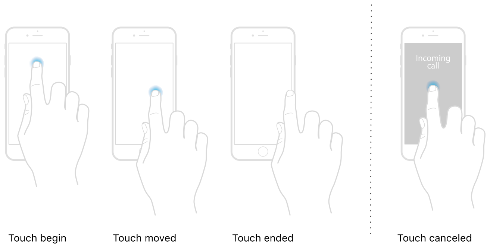

> 导航：[技术](../technologies.md) · [UIKit](../uikit.md) · [触摸、按压与手势](touches-presses-and-gestures.md)

# 在视图中处理触摸

当触摸处理与视图内容紧密相关时，可以直接在视图子类上使用触摸事件。

## 概述

如果你不打算在自定义视图上使用手势识别器，可以直接从视图本身处理触摸事件。由于视图是响应者，它们可以处理多点触控事件和许多其他类型的事件。当 UIKit 确定触摸事件发生在某个视图中时，它会调用视图的 [- touchesBegan:withEvent:](<uiresponder/touchesbegan(__with_).md>)、[- touchesMoved:withEvent:](<uiresponder/touchesmoved(__with_).md>) 或 [- touchesEnded:withEvent:](<uiresponder/touchesended(__with_).md>) 方法。你可以在自定义视图中重写这些方法，并用它们来响应触摸事件。

你在视图（或任何响应者）中重写用于处理触摸的方法，对应于触摸事件处理过程的不同阶段。例如，下图展示了触摸事件的各个阶段。当手指（或 Apple Pencil）触摸屏幕时，UIKit 会创建一个 [UITouch](uitouch.md) 对象，将触摸位置设置为相应的点，并将其 [phase](uitouch/phase-swift.property.md) 属性设置为 [UITouchPhaseBegan](uitouch/phase-swift.enum/began.md)。当同一根手指在屏幕上移动时，UIKit 会更新触摸位置并将触摸对象的 [phase](uitouch/phase-swift.property.md) 属性更改为 [UITouchPhaseMoved](uitouch/phase-swift.enum/moved.md)。当用户从屏幕上抬起手指时，UIKit 会将 [phase](uitouch/phase-swift.property.md) 属性更改为 [UITouchPhaseEnded](uitouch/phase-swift.enum/ended.md)，触摸序列结束。

触摸在用户手指接触屏幕时开始。系统在用户手指移动或触摸参数发生变化时更新触摸。触摸在用户抬起同一根手指离开屏幕时结束。如果发生来电等中断，系统会取消任何活跃的触摸。

同样，系统随时可能取消正在进行的触摸序列；例如，当有来电中断 App 时。此时，UIKit 会通过调用 [- touchesCancelled:withEvent:](<uiresponder/touchescancelled(__with_).md>) 方法通知你的视图。你应使用该方法对视图的数据结构执行任何必要的清理。

对于每根接触屏幕的新手指，UIKit 都会创建一个新的 [UITouch](uitouch.md) 对象。触摸本身会随当前的 [UIEvent](uievent.md) 对象一起传递。UIKit 会区分来自手指和 Apple Pencil 的触摸，你可以分别处理它们。

> [!important] 重要
> 在默认配置下，即使有多根手指触摸视图，一个视图也仅接收与事件关联的第一个 [UITouch](uitouch.md) 对象。要接收其他触摸，必须将视图的 [multipleTouchEnabled](uiview/ismultipletouchenabled.md) 属性设置为 `true`。你也可以在 Interface Builder 的 Attributes 检查器（Attributes inspector）中配置该属性。

## 主题

### 高级触摸处理

- [实现多点触控 App](implementing-a-multi-touch-app.md) — 了解如何创建一个处理多点触控输入的简单 App。
- [使用合并触摸获取高保真输入](getting-high-fidelity-input-with-coalesced-touches.md) — 了解如何在你的 App 中支持高精度触摸。
- [使用预测触摸最小化延迟](minimizing-latency-with-predicted-touches.md) — 使用 UIKit 对触摸位置的预测，创造流畅且响应迅速的绘图体验。

## 另请参阅

### 触摸

- [处理来自 Apple Pencil 的输入](handling-input-from-apple-pencil.md) — 了解如何检测并响应来自 Apple Pencil 的触摸。
- [追踪 3D Touch 事件的力度](tracking-the-force-of-3d-touch-events.md) — 根据触摸力度操作你的内容。
- [演示触摸输入的力度、高度角和方位角属性](illustrating-the-force-altitude-and-azimuth-properties-of-touch-input.md) — 在视图中捕获 Apple Pencil 和触摸输入。
- [利用触摸输入构建绘图 App](leveraging-touch-input-for-drawing-apps.md) — 将触摸捕获为一系列笔画，并在绘图画布上高效渲染。
- [UITouch](uitouch.md) — 表示屏幕上发生的触摸的位置、大小、移动和力度的对象。
