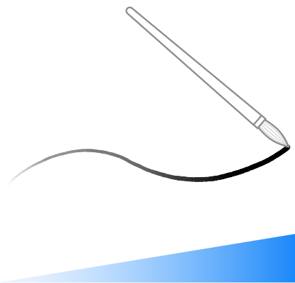
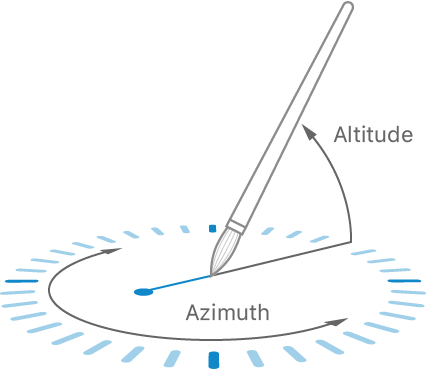

> 导航：[技术](../technologies.md) · [UIKit](../uikit.md) · [触控、按压与手势](touches-presses-and-gestures.md)

# 演示触控输入的力度、高度角和方位角属性

<sub>示例代码</sub>

在视图中捕获 Apple Pencil 和触控输入。

## 概述

Touch Canvas 演示了 Apple Pencil 和触控输入的响应式处理，重点展示了 `UITouch` 的力度、高度角和方位角属性。该示例使用线条粗细来可视化力度，并使用交互式图表来可视化高度角和方位角。若要基于本示例所展示的概念进一步学习如何在绘图 App 中使用 Apple Pencil 和触控输入，请参阅[利用触控输入构建绘图 App](leveraging-touch-input-for-drawing-apps.md)。

### 计算触控的力度

你可以利用手指在支持 3D Touch 的设备上或 Apple Pencil 笔尖施加的触控力度，在 App 中创建视觉效果。例如，触控力度可以改变画布上线条的宽度。



当前力度由 [UITouch](uitouch.md) 的 [force](uitouch/force.md) 属性提供。

```swift
force = touch.force
```

力度值的输入会影响 `UITouch` 处理的结果。在本示例中，力度被解释为表示线条上某个点的大小的值，其中包括了 App 可使用的力度值下限。

```swift
var magnitude: CGFloat {
    return max(force, 0.025)
}
```

本示例使用该大小值来影响画布上的绘制，包括线条宽度值。

```swift
context.setLineWidth(point.magnitude)
```

### 创建 Apple Pencil 高度角和方位角的可视化

Touch Canvas 包含一个可视化效果，当启用 _调试_ 模式时，它会随着你在屏幕上使用 Apple Pencil 绘制而显示其高度角和方位角。该可视化效果是一个图表，会基于 Apple Pencil 的运动持续更新。



Apple Pencil 通过 `UITouch` 的 [altitudeAngle](uitouch/altitudeangle.md) 属性报告其相对于设备表面的角度（高度角）。

```swift
let altitudeAngle = touch.altitudeAngle
```

在这个示例项目中，当 Apple Pencil 完全水平时，线条长度延伸到图表的边缘。如果 Apple Pencil 完全垂直，线条长度会缩短为 Apple Pencil 笔尖下的一个点。线条长度的计算会根据图表的半径变换高度角。

```swift
/*
 指示器线条的长度要能体现 `altitudeAngle`。当角度为
 零弧度（平行于屏幕表面）时，线条最长。当角度为 `.pi` / 2 弧度时，
 只有指示器顶部的点在触控位置正下方可见。
 */
let altitudeRadius = (1.0 - altitudeAngle / (CGFloat.pi / 2)) * radius
var lineTransform = CGAffineTransform(scaleX: altitudeRadius, y: 1)
```

Apple Pencil 报告其相对于与之交互的视图的方向（即方位角）。绘图 App 可能会使用方位角信息来改变特定绘图工具的形状或强度。使用 `UITouch` 的 [- azimuthAngleInView:](<uitouch/azimuthangle(in_).md>) 和 [- azimuthUnitVectorInView:](<uitouch/azimuthunitvector(in_).md>) 方法来获取方位角信息。

```swift
let azimuthAngle = touch.azimuthAngle(in: canvasView)
let azimuthUnitVector = touch.azimuthUnitVector(in: canvasView)
```

交互式图表演示了如何将高度角、方位角和方位角单位向量值结合使用。在这里，方位角会围绕图表沿实际方位角值的相反方向旋转，而高度线末端的点则会通过结合高度角和方位角单位向量属性来移动。通过一个变换（transform）可高效地将计算出的线条旋转和点的位置应用到图表中，使其能对 Apple Pencil 位置的微小变化保持响应。

```swift
// 绘制方位角指示线，为便于可视化，通过旋转 `.pi` 弧度使其指向方位角的相反方向。
var rotationTransform = CGAffineTransform(rotationAngle: azimuthAngle)
rotationTransform = rotationTransform.rotated(by: CGFloat.pi)

var dotPositionTransform = CGAffineTransform(translationX: -azimuthUnitVector.dx * altitudeRadius, y: -azimuthUnitVector.dy * altitudeRadius)
dotPositionTransform = dotPositionTransform.concatenating(centeringTransform)
```

### 切换调试绘图

Touch Canvas 包含一种调试绘图模式，允许你详细查看不同类型输入下这些属性的工作情况，例如使用 Apple Pencil 以不同速度绘制的笔划之间的差异。调试模式会启用高度角和方位角的交互式图表，并改变各个线段的颜色，以标识该线段的 [UIEvent](uievent.md) 是否包含了来自 [- predictedTouchesForTouch:](<uievent/predictedtouches(for_).md>) 或 [- coalescedTouchesForTouch:](<uievent/coalescedtouches(for_).md>) 的数据。

当用户将首选的双击动作配置为切换工具时，该示例使用第二代 Apple Pencil 的双击功能来切换 _调试_ 模式。示例 App 会忽略其他首选动作。更多信息请参阅 [Apple Pencil 交互](apple-pencil-interactions.md)。

```swift
func pencilInteractionDidTap(_ interaction: UIPencilInteraction) {
    guard UIPencilInteraction.preferredTapAction == .switchPrevious else { return }
    
    /* 点击交互是用户在 App 内快速切换工具的一种方式。
     从 Apple Pencil 切换调试绘图模式是一个可发现的操作，因为调试模式的按钮
     就在屏幕上，并且其视觉变化会指示点击交互所执行的操作。
     */
    toggleDebugDrawing(sender: debugButton)
}
```

## 另请参阅

### 触控

- [在视图中处理触控](handling-touches-in-your-view.md) — 如果触控处理与视图的内容紧密相关，则直接在视图子类上使用触控事件。
- [处理来自 Apple Pencil 的输入](handling-input-from-apple-pencil.md) — 了解如何检测和响应来自 Apple Pencil 的触控。
- [跟踪 3D Touch 事件的力度](tracking-the-force-of-3d-touch-events.md) — 根据触控的力度操纵你的内容。
- [利用触控输入构建绘图 App](leveraging-touch-input-for-drawing-apps.md) — 将触控捕获为一系列笔划，并在绘图画布上高效渲染。
- [UITouch](uitouch.md) — 表示屏幕上发生的触控的位置、大小、移动和力度的对象。

## 下载

- [IllustratingTheForceAltitudeAndAzimuthPropertiesOfTouchInput.zip](https://docs-assets.developer.apple.com/published/9afba208ca4a/IllustratingTheForceAltitudeAndAzimuthPropertiesOfTouchInput.zip)
