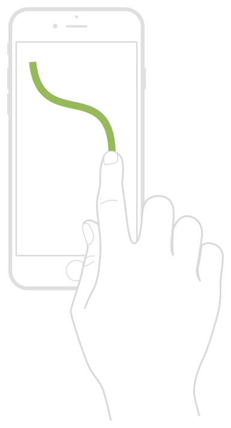

> 导航：[技术](../technologies.md) · [UIKit](../uikit.md) · [触摸、按压与手势](touches-presses-and-gestures.md) · [实现自定手势识别器](implementing-a-custom-gesture-recognizer.md)

# 实现连续手势识别器

<sub>文章</sub>

对于不容易匹配特定模式的手势，或者当你想使用手势识别器来收集触摸输入时，可以创建一个连续手势识别器（continuous gesture recognizer）。

## 概述

连续手势识别器让你可以将事件处理逻辑封装在一处，并在多个视图中复用该逻辑。尽管连续手势识别器在实现状态机（state machine）时需要多花一些功夫，但它们也能完成离散手势识别器（discrete gesture recognizer）难以完成的任务，例如捕获自由形式的输入。

下图展示了一种自由形式手势，你可以利用其输入在屏幕上绘制路径。虽然你可以使用平移手势识别器来捕获输入，但你的操作方法需要处理捕获过程的全部阶段，这增加了其复杂性。通过使用自定手势识别器（custom gesture recognizer），你可以将逻辑分布到子类（subclass）的各个方法中，从而简化代码。使用自定手势识别器也意味着你可以只编写一次捕获路径的代码，并在多个视图中复用。



对于捕获触摸输入的自定手势识别器，没有明确的条件会触发手势失败。相反，手势识别器会一直捕获触摸输入，直到触摸序列结束或被系统取消。在手势进行期间，手势识别器将触摸数据放入一个临时缓冲区。手势识别器的客户端使用它们的操作方法来获取该缓冲区，并将其临时应用到 App 的内容上。例如，客户端可能会使用这些数据在屏幕上绘制路径。只有当触摸序列成功结束时，这些目标对象才会将这些数据永久提交到 App 的数据结构中。

### 保存手势相关数据

跟踪触摸事件的连续手势识别器需要一种存储这些信息的方式。你不能简单地存储对接收到的 [UITouch](uitouch.md) 对象的引用，因为 UIKit 会重用这些对象并覆盖任何旧值。相反，你必须定义自定数据结构来存储所需的触摸信息。

以下代码展示了 `StrokeSample` 结构体的定义，其目的是存储与触摸相关联的位置。在你自己的实现中，你可以向此结构体添加其他属性（property），以存储诸如时间戳或触摸力度等信息。

```swift
struct StrokeSample {
    let location: CGPoint 
 
    init(location: CGPoint) {
        self.location = location
    }
}
```

以下代码展示了用于捕获触摸信息的 `TouchCaptureGesture` 类的部分定义。此类将触摸数据存储在 `samples` 属性中，该属性是一个 `StrokeSample` 结构体数组。该类还存储了与第一根手指关联的 [UITouch](uitouch.md) 对象，以便忽略任何其他触摸。[init(coder:)](<../foundation/nscoding/init(coder_).md>) 方法的实现确保了当从 Interface Builder 文件加载手势识别器时，`samples` 属性被正确初始化。

```swift
class TouchCaptureGesture: UIGestureRecognizer, NSCoding {
   var trackedTouch: UITouch? = nil
   var samples = [StrokeSample]() 
 
   required init?(coder aDecoder: NSCoder) {
      super.init(target: nil, action: nil) 
 
      self.samples = [StrokeSample]()
   } 
   func encode(with aCoder: NSCoder) { }   
   // 重写的方法将在此之后出现...
}
```

### 处理触摸事件

以下代码展示了 `TouchCaptureGesture` 类的 [- touchesBegan:withEvent:](<uiresponder/touchesbegan(__with_).md>) 方法。如果初始事件包含两个触摸，手势会立即失败。如果只有一个触摸，则触摸对象被保存在 `trackedTouch` 属性中，并且自定的 `addSample` 辅助方法会使用触摸数据创建一个新的 `StrokeSample` 结构体。在首次触摸发生后，添加到事件序列中的任何新触摸都会被忽略。

```swift
override func touchesBegan(_ touches: Set<UITouch>, with event: UIEvent) {
   if touches.count != 1 {
      self.state = .failed
   } 
 
   // 捕获第一个触摸并存储一些信息。
   if self.trackedTouch == nil {
      if let firstTouch = touches.first {
         self.trackedTouch = firstTouch
         self.addSample(for: firstTouch)
         state = .began
      }
   } else {
      // 忽略除第一个触摸之外的所有触摸。
      for touch in touches {
         if touch != self.trackedTouch {
            self.ignore(touch, for: event)
         }
      }
   }
}
 
func addSample(for touch: UITouch) {
   let newSample = StrokeSample(location: touch.location(in: self.view))
   self.samples.append(newSample)
}
```

[- touchesMoved:withEvent:](<uiresponder/touchesmoved(__with_).md>) 和 [- touchesEnded:withEvent:](<uiresponder/touchesended(__with_).md>) 方法（如下代码所示）记录每个新的样本并更新手势识别器的状态。将状态设置为 [UIGestureRecognizerStateEnded](uigesturerecognizer/state-swift.enum/ended.md) 等同于将状态设置为 [UIGestureRecognizerStateRecognized](uigesturerecognizer/state-swift.enum/recognized.md)，并会导致调用手势识别器的操作方法。

```swift
override func touchesMoved(_ touches: Set<UITouch>, with event: UIEvent?) {
   self.addSample(for: touches.first!)
   state = .changed
}
 
override func touchesEnded(_ touches: Set<UITouch>, with event: UIEvent?) {
   self.addSample(for: touches.first!)
   state = .ended
}
```

### 重置手势识别器

请始终在你的手势识别器中实现 [- touchesCancelled:withEvent:](<uiresponder/touchescancelled(__with_).md>) 和 [- reset](<uigesturerecognizer/reset().md>) 方法，并使用它们执行清理工作。以下代码展示了 `TouchCaptureGesture` 类中这些方法的实现。这两个方法都将手势识别器的属性恢复为其初始值。

```swift
override func touchesCancelled(_ touches: Set<UITouch>, with event: UIEvent?) {
   self.samples.removeAll()
   state = .cancelled
} 
 
override func reset() {
   self.samples.removeAll()
   self.trackedTouch = nil
}
```

## 另请参阅

### 创建自定手势识别器

- [关于手势识别器状态机](about-the-gesture-recognizer-state-machine.md) — 了解构成手势识别器基础的状态机的状态和过渡（transition）。
- [实现离散手势识别器](implementing-a-discrete-gesture-recognizer.md) — 如果你的手势涉及特定的事件模式，可以考虑为其实现一个离散手势识别器。
