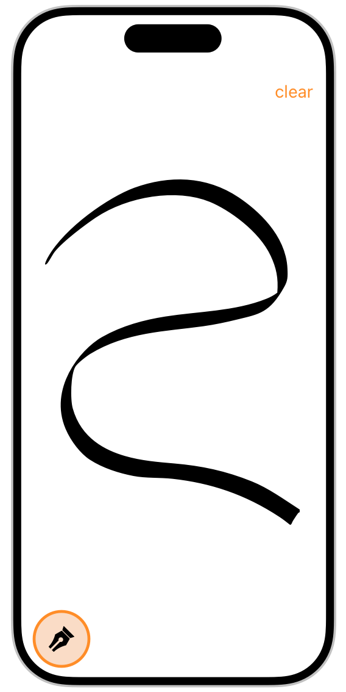

> 导航：[技术](../technologies.md) · [UIKit](../uikit.md) · [触摸、按压与手势](touches-presses-and-gestures.md)

# 实现自定手势识别器

了解何时以及如何构建你自己的手势识别器。

## 概述

当 UIKit 内建的手势识别器无法提供你所需的行为时，你可以定义自定手势识别器。UIKit 定义了高度可配置的手势识别器来处理点按、长按、平移、滑动、旋转和捏合等触摸序列。对于其他触摸序列，或处理涉及按钮按压的手势，你可以定义自定手势识别器。

你也可以使用自定手势识别器来简化 App 中的事件处理代码。例如，[利用触摸输入辅助绘图 App 开发](leveraging-touch-input-for-drawing-apps.md)示例使用了一个手势识别器来捕获输入并将其显示在屏幕上，如下图所示。



要定义自定手势识别器，请派生子类 [UIGestureRecognizer](uigesturerecognizer.md)（或它的某个子类）。在源文件顶部，导入 `UIGestureRecognizerSubclass.h` 头文件（针对 Objective-C）或 `UIKit.UIGestureRecognizerSubclass` 模块（针对 Swift），如下方代码所示。该文件定义了你必须重写以实现自定手势识别器的方法和属性。

**Swift**

```swift
import UIKit
import UIKit.UIGestureRecognizerSubclass
```

**Objective-C**

```objc
#import <UIKit/UIKit.h>
#import "UIGestureRecognizerSubclass.h"
```

在你的自定子类中，实现处理事件所需的任何方法。例如，如果你的手势由触摸事件组成，请实现 [- touchesBegan:withEvent:](<uiresponder/touchesbegan(__with_).md>)、[- touchesMoved:withEvent:](<uiresponder/touchesmoved(__with_).md>)、[- touchesEnded:withEvent:](<uiresponder/touchesended(__with_).md>) 和 [- touchesCancelled:withEvent:](<uiresponder/touchescancelled(__with_).md>) 方法。使用传入的事件来更新手势识别器的 [state](uigesturerecognizer/state-swift.property.md) 属性。UIKit 使用手势识别器的状态来协调与界面中其他对象的交互。

## 主题

### 创建自定手势识别器

- [关于手势识别器状态机](about-the-gesture-recognizer-state-machine.md) — 了解作为手势识别器基础的状态机的状态和过渡。
- [实现离散手势识别器](implementing-a-discrete-gesture-recognizer.md) — 如果你的手势涉及特定的事件模式，可以考虑为其实现一个离散手势识别器。
- [实现连续手势识别器](implementing-a-continuous-gesture-recognizer.md) — 对于不易匹配特定模式的手势，或者当你希望使用手势识别器来收集触摸输入时，可以创建一个连续手势识别器。

## 另请参阅

### 自定手势

- [UIGestureRecognizer](uigesturerecognizer.md) — 具体手势识别器的基类。
- [UIGestureRecognizerDelegate](uigesturerecognizerdelegate.md) — 由手势识别器的委托实现的一组方法，用于微调 App 的手势识别行为。
- [在 App 中支持手势交互](supporting-gesture-interaction-in-your-apps.md) — 通过支持标准和自定手势交互来丰富 App 的用户体验。
