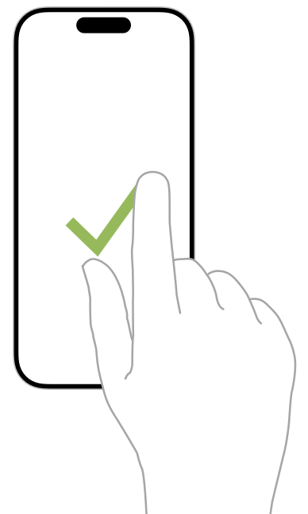

> 导航：[技术](../technologies.md) · [UIKit](../uikit.md) · [触摸、按压与手势](touches-presses-and-gestures.md) · [实现自定手势识别器](implementing-a-custom-gesture-recognizer.md)

# 实现一个离散手势识别器

<sub>文章</sub>

如果你的手势涉及特定的事件模式，可以考虑为其实现一个离散手势识别器（discrete gesture recognizer）。

## 概述

手势识别器会一直处于 [UIGestureRecognizerStatePossible](uigesturerecognizer/state-swift.enum/possible.md) 状态，直到事件表明你的手势成功或失败时才改变状态。离散手势识别器的优点是实现更简单，因为所需的状态转换更少。缺点是由于状态改变通常发生在事件序列的较晚阶段，因此识别过程很容易被附加到同一视图上的连续手势抢占。

下图展示了一个对勾手势，用户通过一根手指先向右下方画线，再向右上方画线来完成。由于该手势遵循特定的路径，因此使用离散手势识别器是合理的。



### 定义成功条件

在实现手势识别器代码之前，先定义手势识别应满足的条件。匹配一个对勾手势的条件如下：

- 只跟踪第一个触摸屏幕的手指，忽略其他所有手指。
- 触摸始终从左向右移动。
- 触摸最初向下移动，但随后改变方向向上移动。
- 向上笔画的结束位置在屏幕上高于初始触摸点。

### 保存手势相关数据

定义好条件后，向你的手势识别器添加属性（property）以跟踪所需信息。对于对勾手势，手势识别器需要知道手势的起始点，以便将其与最终点进行比较。它还需要知道用户的手指是向下移动还是向上移动。

以下代码展示了自定 `CheckmarkGestureRecognizer` 类定义的第一部分。此类存储了初始触摸点和当前手势阶段。此类还存储了与第一根手指关联的 [UITouch](uitouch.md) 对象，以便忽略其他所有触摸。

```swift
enum CheckmarkPhases {
    case notStarted
    case initialPoint
    case downStroke
    case upStroke
} 
class CheckmarkGestureRecognizer : UIGestureRecognizer {
    var strokePhase : CheckmarkPhases = .notStarted
    var initialTouchPoint : CGPoint = CGPoint.zero
    var trackedTouch : UITouch? = nil
   // 待添加的覆盖方法……
```

### 处理触摸事件

以下代码展示了 [- touchesBegan:withEvent:](<uiresponder/touchesbegan(__with_).md>) 方法，它设置了识别手势的初始条件。如果初始事件包含两个触摸，手势会立即失败。如果只有一个触摸，则触摸对象保存在 `trackedTouch` 属性中。由于 UIKit 会重用 [UITouch](uitouch.md) 对象并因此覆盖它们的属性，该方法还会将触摸的位置保存在 `initialTouchPoint` 属性中。在首次触摸发生后，事件序列中添加的任何新触摸都将被忽略。

```swift
override func touchesBegan(_ touches: Set<UITouch>, with event: UIEvent) {
   super.touchesBegan(touches, with: event)
   if touches.count != 1 {
      self.state = .failed
   } 
 
   // 捕获第一个触摸并存储相关信息。
   if self.trackedTouch == nil {
      self.trackedTouch = touches.first
      self.strokePhase = .initialPoint
      self.initialTouchPoint = (self.trackedTouch?.location(in: self.view))!
   } else {
      // 忽略第一个以外的所有触摸。
      for touch in touches {
         if touch != self.trackedTouch {
            self.ignore(touch, for: event)
         }
      }
   }
}
```

当触摸信息发生变化时，UIKit 会调用 [- touchesMoved:withEvent:](<uiresponder/touchesmoved(__with_).md>) 方法。以下代码展示了对勾手势中该方法的实现。该方法验证第一个触摸是否正确——由于所有后续触摸都已被忽略，这一点应该没问题。然后它检查该触摸的运动。当初始运动是向右下方移动时，该方法将 `strokePhase` 属性设置为 `downStroke`。当运动改变方向并开始向上移动时，该方法将笔画阶段改为 `upStroke`。如果手势以任何方式偏离此模式，该方法会将手势的状态设置为失败。

```swift
override func touchesMoved(_ touches: Set<UITouch>, with event: UIEvent) {
   super.touchesMoved(touches, with: event)
   let newTouch = touches.first 
   // 应该只有第一个触摸。
   guard newTouch == self.trackedTouch else { 
      self.state = .failed 
      return
   } 
   let newPoint = (newTouch?.location(in: self.view))!
   let previousPoint = (newTouch?.previousLocation(in: self.view))!
   if self.strokePhase == .initialPoint {
      // 确保初始运动是向右下方移动。
      if newPoint.x >= initialTouchPoint.x && newPoint.y >= initialTouchPoint.y {
         self.strokePhase = .downStroke
      } else {         self.state = .failed
      }
   } else if self.strokePhase == .downStroke {
      // 始终保持从左向右移动。
      if newPoint.x >= previousPoint.x {
         // 如果 y 方向改变，手势会再次向上移动。
         // 否则，向下笔画将继续。
         if newPoint.y < previousPoint.y {
            self.strokePhase = .upStroke
         }
      } else {
        // 如果新的 x 值在左侧，则手势失败。
        self.state = .failed
      }
   } else if self.strokePhase == .upStroke {
      // 如果新的 x 值在左侧，或者新的 y 值
      // 再次改变方向，则手势失败。
      if newPoint.x < previousPoint.x || newPoint.y > previousPoint.y {
         self.state = .failed
      }
   }
}
```

在触摸序列结束时，UIKit 会调用 [- touchesEnded:withEvent:](<uiresponder/touchesended(__with_).md>) 方法。以下代码展示了对勾手势中该方法的实现。如果手势尚未失败，该方法会判断手势结束时是否正在向上移动，并判断最终点是否高于初始点。如果两个条件都满足，该方法将状态设置为 [UIGestureRecognizerStateRecognized](uigesturerecognizer/state-swift.enum/recognized.md)；否则手势失败。

```swift
override func touchesEnded(_ touches: Set<UITouch>, with event: UIEvent) {
   super.touchesEnded(touches, with: event) 
   let newTouch = touches.first
   let newPoint = (newTouch?.location(in: self.view))!
   // 应该只有第一个触摸。
   guard newTouch == self.trackedTouch else { 
      self.state = .failed 
      return
   } 
   // 如果笔画向上移动，且最终点位于
   // 初始点上方，则手势成功。
   if self.state == .possible && 
         self.strokePhase == .upStroke && 
         newPoint.y < initialTouchPoint.y {
      self.state = .recognized
   } else {
      self.state = .failed
   }
}
```

### 重置手势识别器

除了跟踪触摸，`CheckmarkGestureRecognizer` 类还实现了 [- touchesCancelled:withEvent:](<uiresponder/touchescancelled(__with_).md>) 和 [- reset](<uigesturerecognizer/reset().md>) 方法。该类使用这些方法将手势识别器的本地属性重置为适当的值。以下代码展示了这些方法的实现。

```swift
override func touchesCancelled(_ touches: Set<UITouch>, with event: UIEvent) {
   super.touchesCancelled(touches, with: event)
   self.initialTouchPoint = CGPoint.zero
   self.strokePhase = .notStarted
   self.trackedTouch = nil
   self.state = .cancelled
}
 
override func reset() {
   super.reset()
   self.initialTouchPoint = CGPoint.zero
   self.strokePhase = .notStarted
   self.trackedTouch = nil
}
```

## 另请参阅

### 创建自定手势识别器

- [关于手势识别器状态机](about-the-gesture-recognizer-state-machine.md) — 了解手势识别器底层状态机的状态与转换。
- [实现一个连续手势识别器](implementing-a-continuous-gesture-recognizer.md) — 对于不容易匹配特定模式的手势，或者当你希望使用手势识别器收集触摸输入时，创建一个连续手势识别器。
