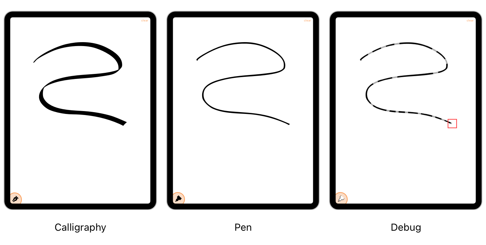

> 导航：[Technologies](../technologies.md) · [UIKit](../uikit.md) · [Touches, presses, and gestures](touches-presses-and-gestures.md) · [Handling touches in your view](handling-touches-in-your-view.md) · [Minimizing latency with predicted touches](minimizing-latency-with-predicted-touches.md)

# 在 App 中融入预测触摸

<sub>文章</sub>

了解如何创建一个在绘图代码中融入预测触摸的简单 App。

## 概述

示例 App Speed Sketch（参阅[在绘图 App 中利用触摸输入](leveraging-touch-input-for-drawing-apps.md)）使用预测触摸，来最小化使用 Apple Pencil 或手指绘图时的延迟。负责收集触摸的关键类是 `StrokeGestureRecognizer` 类。每一段新的触摸事件序列都会在 App 的绘图画布上生成一个 `Stroke` 对象。`Stroke` 对象存储了进行风格化线条绘制所需的触摸数据，并可以使用书法笔、普通笔进行渲染，或者以一种特殊的调试模式为每个独立的触摸事件绘制线段。



### 收集触摸输入

`StrokeGestureRecognizer` 类收集与绘图相关的触摸输入，并使用它创建一个代表待渲染路径的 `Stroke` 对象。除了实际发生的触摸之外，该类还会收集任何预测触摸。以下代码展示了手势识别器 `append` 方法中负责收集预测触摸的部分。这段代码调用的 `collector` 代码块会处理每个触摸事件。传给该代码块的参数指明这个触摸是实际触摸还是预测触摸。

```swift
// Collect predicted touches only while the gesture is ongoing. 
if (usesPredictedSamples && stroke.state == .active) {
   if let predictedTouches = event?.predictedTouches(for: touchToAppend) {
      for touch in predictedTouches {
         collector(stroke, touch, view, false, true)
      }
   }
}
```

收集触摸输入的结果是生成 `StrokeSample` 对象，随后这些对象会被添加到当前的 `Stroke` 对象中。`Stroke` 对象将预测触摸与其他触摸分开存储。将它们分开存储便于之后移除，也能避免它们被意外与真实触摸输入混淆。App 每添加一组新的实际触摸时，都会丢弃前一组预测样本。

以下代码展示了 `Stroke` 类的一部分，该类代表与单条绘制线关联的触摸。对于每一组新的触摸，该类会将实际触摸添加到其主要样本列表中。任何预测触摸则被存储在 `predictedSamples` 属性中。每当 `StrokeGestureRecognizer` 调用 `Stroke` 的 `add` 方法时，该方法会将上一组预测触摸移动到 `previousPredictedSamples` 属性中，并最终被丢弃。因此，`Stroke` 只维护最后一组预测触摸。

```swift
class Stroke {
    static let calligraphyFallbackAzimuthUnitVector = CGVector(dx: 1.0, dy:1.0).normalize! 
    var samples: [StrokeSample] = []
    var predictedSamples: [StrokeSample] = []
    var previousPredictedSamples: [StrokeSample]?
    var state: StrokeState = .active
    var sampleIndicesExpectingUpdates = Set<Int>()
    var expectsAltitudeAzimuthBackfill = false
    var hasUpdatesFromStartTo: Int?
    var hasUpdatesAtEndFrom: Int? 
    var receivedAllNeededUpdatesBlock: (() -> ())?
 
    func add(sample: StrokeSample) -> Int {
        let resultIndex = samples.count
        if hasUpdatesAtEndFrom == nil {
            hasUpdatesAtEndFrom = resultIndex
        }
 
        samples.append(sample)
        if previousPredictedSamples == nil {
            previousPredictedSamples = predictedSamples
        }
 
        if sample.estimatedPropertiesExpectingUpdates != [] {
            sampleIndicesExpectingUpdates.insert(resultIndex)
        }
 
        predictedSamples.removeAll()
        return resultIndex
    } 
 
    func addPredicted(sample: StrokeSample) {
        predictedSamples.append(sample)
    } 
 
    func clearUpdateInfo() {
        hasUpdatesFromStartTo = nil
        hasUpdatesAtEndFrom = nil
        previousPredictedSamples = nil
    } 
 
    // Other methods...
}
```

### 渲染预测触摸

在渲染期间，App 将预测触摸视为实际触摸处理。它把每个 `Stroke` 对象的内容拆分为一个或多个 `StrokeSegment` 对象，绘图代码使用 `StrokeSegmentIterator` 对象获取这些对象。以下代码展示了这个类的实现。当绘图代码遍历笔画样本时，`sampleAt` 方法会先返回实际触摸的样本。只有当该方法返回完所有实际触摸样本之后，迭代器才会返回任何预测触摸的样本。因此，预测触摸始终位于所绘线条的末端。

```swift
class StrokeSegmentIterator: IteratorProtocol {
    private let stroke: Stroke
    private var nextIndex: Int
    private let sampleCount: Int
    private let predictedSampleCount: Int
    private var segment: StrokeSegment!
 
    init(stroke: Stroke) {
        self.stroke = stroke
        nextIndex = 1
        sampleCount = stroke.samples.count
        predictedSampleCount = stroke.predictedSamples.count
        if (predictedSampleCount + sampleCount > 1) {
            segment = StrokeSegment(sample: sampleAt(0)!)
            segment.advanceWithSample(incomingSample: sampleAt(1))
        }
    } 
 
    func sampleAt(_ index: Int) -> StrokeSample? {
        if (index < sampleCount) {
            return stroke.samples[index]
        }
        let predictedIndex = index - sampleCount
        if predictedIndex < predictedSampleCount {
            return stroke.predictedSamples[predictedIndex]
        } else {
            return nil
        }
    }
 
    func next() -> StrokeSegment? {
        nextIndex += 1
        if let segment = self.segment {
            if segment.advanceWithSample(incomingSample: sampleAt(nextIndex)) {
                return segment
            }
        }
        return nil
    }
}
```
</content>
