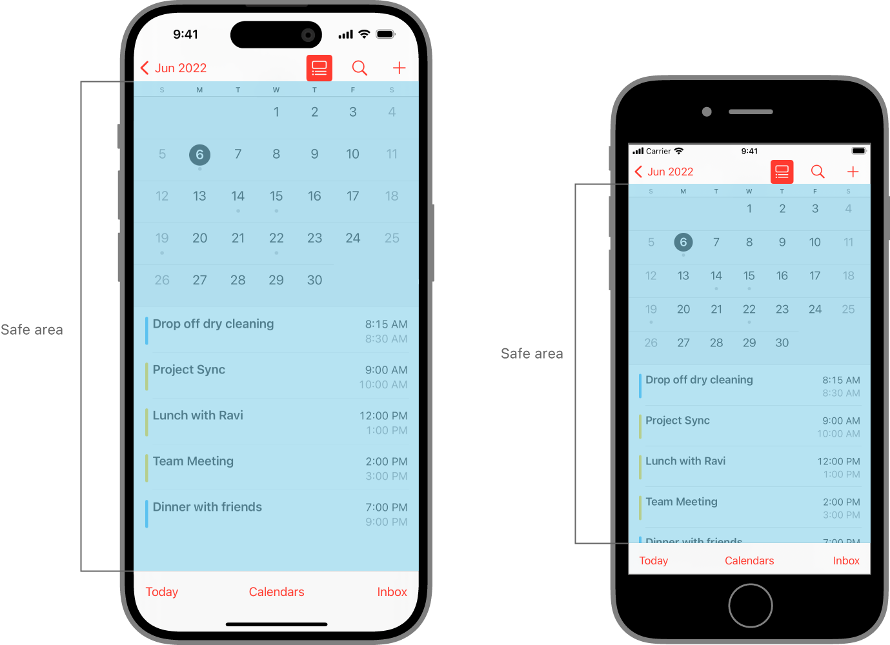
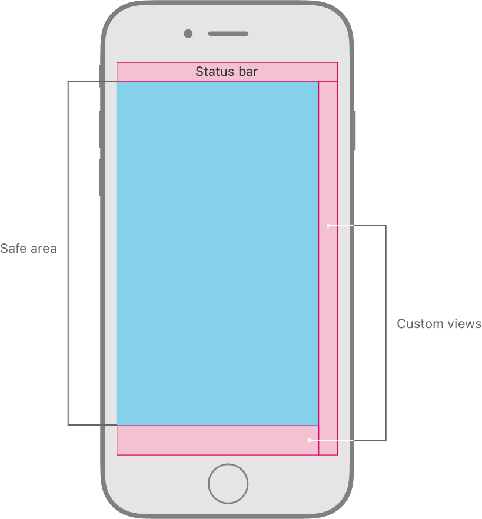

> 导航：[Technologies](../technologies.md) · [UIKit](../uikit.md) · [View layout](view-layout.md)

# 相对于安全区定位内容

<sub>文章</sub>

对视图进行定位，使其不被其他内容遮挡。

## 概述

安全区（safe area）能帮助你把视图放置在整个界面可见的部分内。UIKit 定义的视图控制器可能会把特殊的视图放置在你的内容之上。例如，导览控制器会在其底层视图控制器的内容之上显示一个导航栏。即便这类视图部分透明，它们依然会遮住下方的内容。在 tvOS 中，安全区还包括屏幕的过扫描边距，代表被屏幕边框覆盖的区域。

请把安全区当作布局内容的辅助工具来使用。每个视图都有自己的布局指南（可通过 [safeAreaLayoutGuide](uiview/safearealayoutguide.md) 属性访问），你可以用它来为视图内部的项目创建约束。如果你没有使用 Auto Layout 来定位视图，也可以从视图的 [safeAreaInsets](uiview/safeareainsets.md) 属性中获取原始的边距值。

下图展示了两台不同设备上"日历" App 的视图，以及各自对应的安全区。



### 扩展安全区以纳入自定视图

你的容器视图控制器可以在嵌入的子视图控制器的视图之上显示自己的内容视图。在这种情况下，需要更新子视图控制器的安全区，把容器视图控制器内容视图所覆盖的区域排除在外。UIKit 的容器视图控制器已经会调整其子视图控制器的安全区，以将内容视图纳入考量。例如，导览控制器会扩展其子视图控制器的安全区，以将导航栏纳入考量。

要扩展某个嵌入的子视图控制器的安全区，请修改它的 [additionalSafeAreaInsets](uiviewcontroller/additionalsafeareainsets.md) 属性。假设你定义了一个容器视图控制器，它沿屏幕底部和右侧边缘显示自定视图，如下图所示。由于子视图控制器的内容位于这些自定视图之下，你必须扩展子视图控制器安全区的底部和右侧边距，以将这些视图纳入考量。



下面的代码展示了容器视图控制器的 [- viewDidAppear:](<uiviewcontroller/viewdidappear(__).md>) 方法，它扩展了其子视图控制器的安全区，以将图中所示的自定视图纳入考量。请在这个方法中进行修改，因为在视图被添加到视图层级结构之前，其安全区边距是不准确的。

```swift
override func viewDidAppear(_ animated: Bool) {
   var newSafeArea = UIEdgeInsets()
   // Adjust the safe area to accommodate 
   //  the width of the side view.
   if let sideViewWidth = sideView?.bounds.size.width {
      newSafeArea.right += sideViewWidth
   }
   // Adjust the safe area to accommodate 
   //  the height of the bottom view.
   if let bottomViewHeight = bottomView?.bounds.size.height {
      newSafeArea.bottom += bottomViewHeight
   }
   // Adjust the safe area insets of the 
   //  embedded child view controller.
   let child = self.childViewControllers[0]
   child.additionalSafeAreaInsets = newSafeArea
}
```

## 另请参阅

### Constraints

- [Positioning content within layout margins](positioning-content-within-layout-margins.md) — 对视图进行定位，使其不被其他内容挤占空间。
- [NSLayoutConstraint](nslayoutconstraint.md) — 两个用户界面对象之间必须由基于约束的布局系统所满足的关系。
- [UILayoutSupport](uilayoutsupport.md) — 一组提供布局支持并可访问布局锚点的方法。
