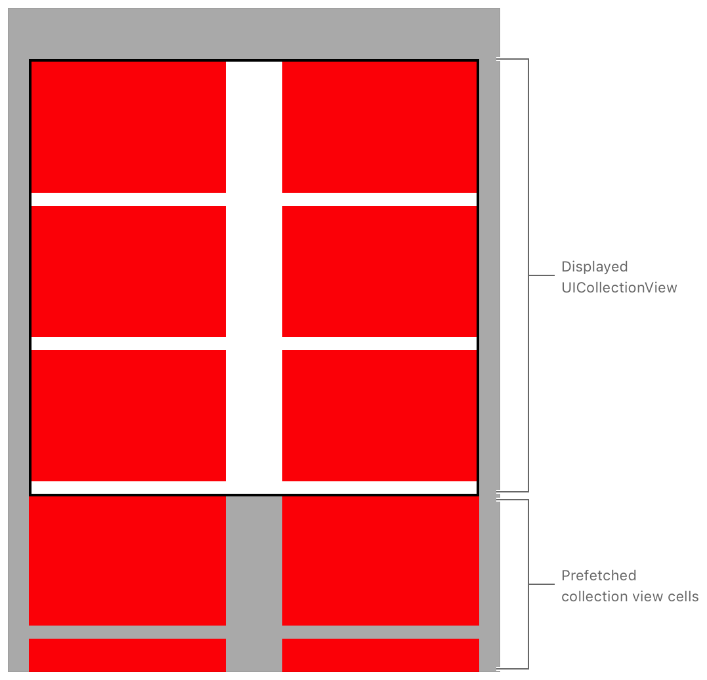

> 导航：[Technologies](../technologies.md) · [UIKit](../uikit.md) · [Views and controls](views-and-controls.md) · [Collection views](collection-views.md) · [UICollectionViewDataSourcePrefetching](uicollectionviewdatasourceprefetching.md)

# 预取集合视图数据

<sub>示例代码</sub>

在集合视图单元格显示之前，为它们加载数据。

## 概述

集合视图以可自定的布局显示一组有序的单元格集合。[UICollectionViewDataSourcePrefetching](uicollectionviewdatasourceprefetching.md) 协议通过预先获取即将显示的集合视图单元格所需的数据，帮助提供更流畅的用户体验。当你启用预取时，集合视图会在需要显示某个单元格之前就请求相应的数据。等到需要显示该单元格时，数据已经在本地缓存好了。

下图展示了集合视图边界之外已被预取的单元格：



<sub>展示了一个集合视图实现的图片。该集合视图有白色背景，以及两列各自带有红色背景的单元格。一个写着 "Displayed UICollectionView" 的标注高亮了前三行单元格。下方另一个写着 "Prefetched collection view cells" 的标注高亮了最后一个完整行的单元格以及一部分行的单元格。</sub>

> [!note] 注意
> 该项目中的 storyboard 包含一个集合视图控制器，其中的集合视图已禁用 Clips To Bounds。在这种配置下，你可以在单元格显示之前将其可视化。

### 启用预取

根视图控制器使用 `CustomDataSource` 类的一个实例，为其 [UICollectionView](uicollectionview.md) 实例提供数据。`CustomDataSource` 类实现了 `UICollectionViewDataSourcePrefetching` 协议，以开始获取填充单元格所需的数据。

```swift
class CustomDataSource: NSObject, UICollectionViewDataSource, UICollectionViewDataSourcePrefetching {
```

除了把 `CustomDataSource` 实例赋值给集合视图的 [dataSource](uicollectionview/datasource.md) 属性之外，该示例代码项目还把它赋值给了 [prefetchDataSource](uicollectionview/prefetchdatasource.md) 属性。

```swift
// Set the collection view's data source.
collectionView.dataSource = dataSource

// Set the collection view's prefetching data source.
collectionView.prefetchDataSource = dataSource
```

### 异步加载数据

当加载数据是一个缓慢或代价高昂的过程时——例如通过网络获取数据——预取数据就是一个有用的工具。在这些情况下，最好异步执行数据加载。在这个示例中，`AsyncFetcher` 类异步获取数据，模拟了一次网络请求。

首先，该示例实现了 [UICollectionViewDataSourcePrefetching](uicollectionviewdatasourceprefetching.md) 的预取方法，调用异步获取器上对应的方法。

```swift
func collectionView(_ collectionView: UICollectionView, prefetchItemsAt indexPaths: [IndexPath]) {
    // Begin asynchronously fetching data for the requested index paths.
    for indexPath in indexPaths {
        let model = models[indexPath.row]
        asyncFetcher.fetchAsync(model.identifier)
    }
}
```

> [!note] 注意
> 开发者可以根据自己的需求创建自己版本的 `AsyncFetcher`。此示例中的实现大量使用了 [`Operation`](../foundation/operation.md) 和 [`OperationQueue`](../foundation/operationqueue.md)，利用了它们处理线程安全和取消操作的能力。开发者可以考虑采用类似的方式。

预取完成后，该示例会把该单元格的数据添加到 `AsyncFetcher` 的缓存中，以便在单元格显示时随时可用。当某个单元格的数据可用时，该单元格的背景色会从白色变为红色。

```swift
/**
 Configures the cell for display based on the model.
 
 - Parameters:
     - data: An optional `DisplayData` object to display.
 
 - Tag: Cell_Config
*/
func configure(with data: DisplayData?) {
    backgroundColor = data?.color
}
```

### 为显示填充单元格

在填充某个单元格之前，`CustomDataSource` 会检查是否有可用的预取数据。如果没有可用的数据，`CustomDataSource` 会发起一次获取请求，并在该请求的完成处理程序中更新单元格。

```swift
func collectionView(_ collectionView: UICollectionView, cellForItemAt indexPath: IndexPath) -> UICollectionViewCell {
    guard let cell = collectionView.dequeueReusableCell(withReuseIdentifier: Cell.reuseIdentifier, for: indexPath) as? Cell else {
        fatalError("Expected `\(Cell.self)` type for reuseIdentifier \(Cell.reuseIdentifier). Check the configuration in Main.storyboard.")
    }
    
    let model = models[indexPath.row]
    let identifier = model.identifier
    cell.representedIdentifier = identifier
    
    // Check if the `asyncFetcher` has already fetched data for the specified identifier.
    if let fetchedData = asyncFetcher.fetchedData(for: identifier) {
        // The system has fetched and cached the data; use it to configure the cell.
        cell.configure(with: fetchedData)
    } else {
        // There is no data available; clear the cell until the fetched data arrives.
        cell.configure(with: nil)

        // Ask the `asyncFetcher` to fetch data for the specified identifier.
        asyncFetcher.fetchAsync(identifier) { fetchedData in
            DispatchQueue.main.async {
                /*
                 The `asyncFetcher` has fetched data for the identifier. Before
                 updating the cell, check whether the collection view has recycled it to represent other data.
                 */
                guard cell.representedIdentifier == identifier else { return }
                
                // Configure the cell with the fetched image.
                cell.configure(with: fetchedData)
            }
        }
    }

    return cell
}
```

### 取消不再需要的获取请求

该示例实现了 [- collectionView:cancelPrefetchingForItemsAtIndexPaths:](<uicollectionviewdatasourceprefetching/collectionview(__cancelprefetchingforitemsat_).md>) 委托方法，来取消任何不再需要的正在进行的数据获取请求。

```swift
func collectionView(_ collectionView: UICollectionView, cancelPrefetchingForItemsAt indexPaths: [IndexPath]) {
    // Cancel any in-flight requests for data for the specified index paths.
    for indexPath in indexPaths {
        let model = models[indexPath.row]
        asyncFetcher.cancelFetch(model.identifier)
    }
}
```

## 另请参阅

### Managing data prefetching

- [- collectionView:prefetchItemsAtIndexPaths:](<uicollectionviewdatasourceprefetching/collectionview(__prefetchitemsat_).md>) — 告知你的预取数据源对象，开始为所提供索引路径处的单元格准备数据。
- [- collectionView:cancelPrefetchingForItemsAtIndexPaths:](<uicollectionviewdatasourceprefetching/collectionview(__cancelprefetchingforitemsat_).md>) — 取消此前触发的数据预取请求。

## 下载

- [PrefetchingCollectionViewData.zip](https://docs-assets.developer.apple.com/published/c211f0af552e/PrefetchingCollectionViewData.zip)
