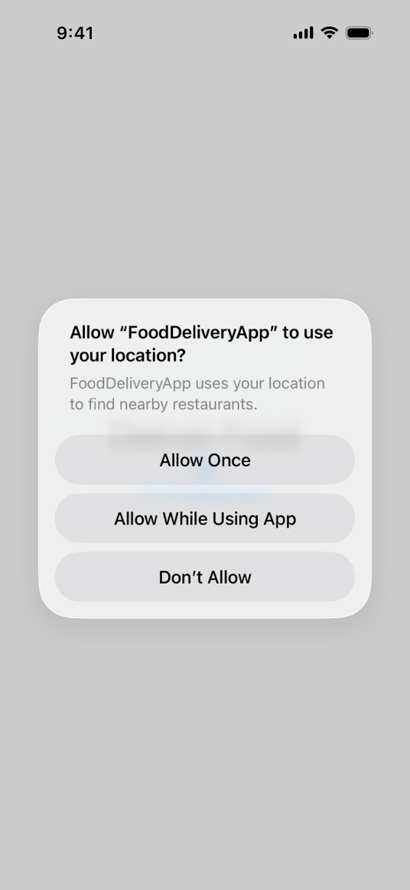
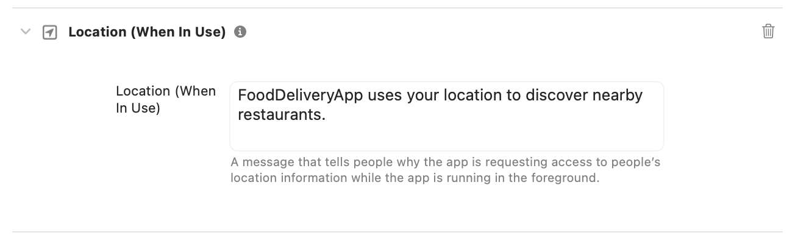
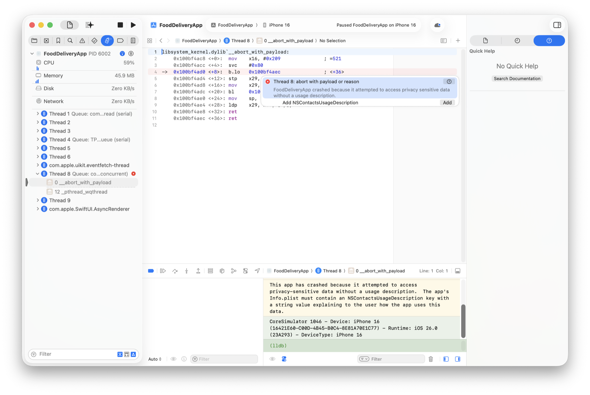

> 导航：[Technologies](../technologies.md) · [UIKit](../uikit.md) · [Protecting the User’s Privacy](protecting-the-user-s-privacy.md)

# 请求访问受保护的资源

<sub>文章</sub>

提供一段用途说明文字，向用户解释你为什么需要访问其设备上受保护的资源。

## 概述

现代设备会收集并存储大量有关其使用者的敏感信息。许多 App 依赖这类数据以及生成这些数据的设备硬件来完成有用的工作。例如，一款导航 App 需要用户的 GPS 坐标才能在地图上定位用户。但并非所有 App 都需要访问全部数据。同一款导航 App 并不需要访问用户的健康历史记录、相机接口或蓝牙外设。

请确保你的 App 只访问其完成工作所需的内容。为支持这一原则，Apple 的操作系统默认限制对受保护数据和资源的访问。App 可以逐项请求访问权限，并说明需要访问的原因。使用该 App 的用户可以决定是批准还是拒绝该请求。

> [!tip] 提示
> 除了向用户请求访问资源的权限外，在某些情况下，你还需要通过为你的 App 添加一项授权，另行声明你的这一意图，具体做法见[授权](../bundleresources/entitlements.md)。

### 提供用途说明字符串

你的 App 首次尝试访问受保护资源时，系统会提示使用该 App 的用户授权。在下面的示例中，一款名为 FoodDeliveryApp、提供送餐服务的 iOS App，生成了一个请求访问用户位置的提示：



<sub>一张 iOS 提醒的屏幕截图，询问用户是否允许 FoodDeliveryApp 访问其位置数据。该提醒包含来自 App 开发者的用途说明信息，并提供"仅本次允许"、"使用 App 期间允许"和"不允许"选项。</sub>

如果用户授予权限，系统会记住用户的选择，之后不会再次提示。如果用户拒绝授权，触发该提示的访问尝试以及后续任何尝试都会以特定于该资源的方式失败。就位置数据访问这一特殊情况而言，用户可以选择点按"仅本次允许"，仅在本次会话中允许访问。

系统会自动生成提示的标题，其中包含你 App 的名称。你需要提供一段称为 _用途说明字符串_（purpose string）或 _使用说明_（usage description）的信息——在本例中是"你的位置信息可让你查看送餐范围内的餐厅。"——用来说明你的 App 为何需要该访问权限。以通常一句完整的话，准确而简洁地向用户说明你的 App 为什么需要访问敏感数据，能让用户做出知情决定，也能提高他们同意授权的可能性。

要提供用途说明字符串，请在 Xcode 中按以下步骤操作：

1. 前往你 App 的 Signing and Capabilities 编辑器。
2. 点按添加（+）按钮以添加一项功能。
3. 选择你想要添加的受保护资源；在本例中是"Location (When in Use)"。
4. 在文本栏中输入用途说明字符串。



<sub>Xcode 功能编辑器的屏幕截图，显示已添加的 NSLocationWhenInUseUsageDescription 键，及与上图中信息相匹配的关联字符串值。</sub>

如果你的 App 使用某项受保护资源，请务必在 Signing and Capabilities 编辑器中提供一个有效的用途说明字符串。如果不这样做，访问该资源的尝试就会失败，还可能导致你的 App 崩溃。Xcode 会检测到你的 App 因此原因而崩溃，并报告一个问题，告诉你需要为 App 添加用途说明字符串。点按添加按钮即可提供该用途说明字符串。



<sub>Xcode 的屏幕截图。调试器处于活动状态，显示该 App 因需要添加用途说明字符串才能访问受保护资源而崩溃。</sub>

Xcode 会向你的 App 添加一项构建设置，将该用途说明字符串配置为[信息属性列表](../bundleresources/information-property-list.md)某个键的值；在本例中，该键是 [NSLocationWhenInUseUsageDescription](../bundleresources/information-property-list/nslocationwheninuseusagedescription.md)，因此该构建设置为 `INFOPLIST_KEY_NSLocationWhenInUseUsageDescription`。有关使用构建设置配置信息属性列表值的更多信息，请参阅[管理 App 的信息属性列表值](../bundleresources/managing-your-app-s-information-property-list.md)。

如果你的 App 支持多种语言环境，除了在 Signing and Capabilities 编辑器中提供用途说明字符串外，还要为你所支持的每种语言环境本地化该用途说明字符串。创建一个名为 `InfoPlist.xcstrings` 的字符串目录文件，并构建你的 App，以在字符串目录中为 App 中的使用说明字符串填充键。将你的使用说明字符串的译文添加到字符串目录的本地化版本中。更多信息，请参阅[使用字符串目录本地化和变化文本](../xcode/localizing-and-varying-text-with-a-string-catalog.md)。

### 遵循用途说明字符串的相关要求

为了向用户提供关于你为何请求访问受保护资源的实用而简洁的信息，请通过检查以下各项，确保你提供的每个用途说明字符串都是有效的：

- 该用途说明字符串不为空，且不仅由空白字符组成。
- 该用途说明字符串的长度短于 4,000 字节。典型的用途说明字符串是一句完整的话，但你也可以提供更多信息，帮助用户就是否分享个人信息做出正确决定。
- 该用途说明字符串具有相应键所要求的正确类型，通常为字符串类型。
- 该用途说明字符串提供的说明准确、有意义，并具体说明了 App 为何需要访问该受保护资源。

请对你 App 中的每一个用途说明字符串（包括本地化的用途说明字符串）遵循这些要求。

App 审核会检查受保护资源的使用情况，并拒绝那些包含访问这些资源的代码却没有提供用途说明字符串的 App。例如，一款访问位置信息的 App 可能会收到来自 App 审核的以下信息，说明必须存在 [NSLocationWhenInUseUsageDescription](../bundleresources/information-property-list/nslocationwheninuseusagedescription.md) 键这一要求：

```console
ITMS-90683: Missing purpose string in Info.plist. 
Your app’s code references one or more APIs that access sensitive user 
data, or the app has one or more entitlements that permit such access. 
The Info.plist file for the "{app-bundle-path}" bundle should contain a 
NSLocationWhenInUseUsageDescription key with a user-facing purpose string 
explaining clearly and completely why your app needs the data.
If you’re using external libraries or SDKs, they may reference APIs that 
require a purpose string. While your app might not use these APIs, a 
purpose string is still required. For details, visit: 
https://developer.apple.com/documentation/uikit/protecting_the_user_s_privacy/requesting_access_to_protected_resources.
```

要解决这个问题，请提供一段用途说明字符串，说明该 App 为何需要访问这项敏感信息，或者移除访问该资源的代码。

> [!note] 注意
> 如果你使用了外部库或 SDK，它们可能引用了需要用途说明字符串的 API。尽管你的 App 本身可能并不使用这些 API，但 App 审核仍然要求提供用途说明字符串。你可以联系该库或 SDK 的开发者，请求了解该开发者使用了哪些受保护资源及其用途，或请求该开发者发布一个不包含这些 API 的代码版本。你需要对所有受保护资源的访问负责，包括外部 SDK 和库的访问。

### 检查授权状态

许多提供受保护资源访问权限的系统框架都有专门的 API，用于检查和请求使用这些资源的授权。这种模型让你可以根据 App 当前拥有的访问权限来调整其行为。例如，如果用户拒绝了你的 App 执行某项操作的权限，你可以从界面中移除相关元素。

由于用户可以随时使用"设置"更改授权状态，因此在访问某项功能之前，请始终检查该功能的授权状态。在没有专门 API 的情况下，请让你的 App 做好优雅处理访问失败的准备。

### 重置授权访问

当你的 App 在首次尝试之后再次尝试访问受保护资源时，系统会记住用户此前的授权选择，不会再次提示。要再次向用户显示提示，你需要在设备或系统上重置对这些资源的访问权限。

要在 iOS App 中重置对某项受保护资源的权限访问，请在设备上点按 设置 \> 通用 \> 传输或还原 iPhone \> 还原 \> 还原定位服务与隐私。

> [!important] 重要
> 使用"还原定位服务与隐私"会重置你设备上所有服务的定位与隐私设置。

要在 macOS App 中重置某项特定服务的权限，请在终端中运行 `tccutil reset <service name>` 命令。例如，要重置 AppleEvents 的所有权限，请输入：

```swift
$ tccutil reset AppleEvents
```

此命令会重置所有使用该受保护资源的 App 的授权访问权限。你也可以类似地指定 Camera、Calendar、Reminders 或其他服务，单独重置它们。更多信息，请参阅[在 macOS 中重置对受保护资源的访问](../xcode/resetting-access-to-protected-resources-in-macos.md)。

## 另请参阅

### 支持隐私

- [Encrypting Your App’s Files](encrypting-your-app-s-files.md) — 通过在磁盘上加密数据，在 iOS 中保护用户的数据。
