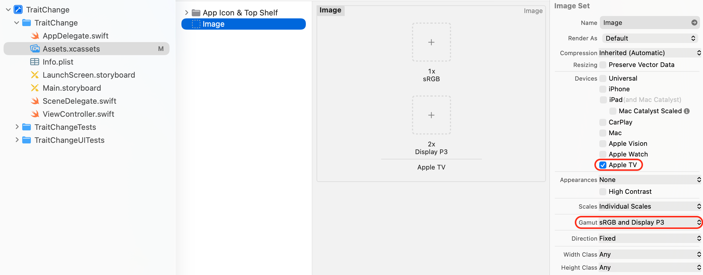
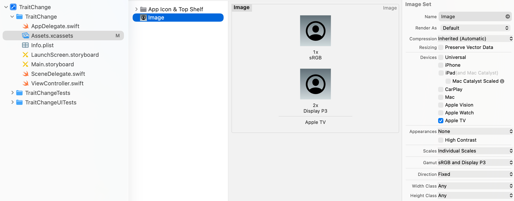

> 导航：[Technologies](../technologies.md) · [UIKit](../uikit.md) · [App and environment](app-and-environment.md)

# 响应 Apple TV 上不断变化的显示模式

<sub>文章</sub>

在设备的屏幕色域发生变化时动态更换图像和资源。

## 概述

在 Apple TV（第 5 代）上，App 所需的资源取决于所使用电视的屏幕色域：4K 电视使用 Display P3 色域，其他所有分辨率使用 sRGB 色域。此外，电视的屏幕色域可能随时发生变化，在 4K 与其他分辨率之间切换。你的 App 需要响应这些变化，并在需要时呈现合适的资源。

### 创建并放置图像资源

在 Xcode 中，于资源目录里创建一个图像资源。在属性检查器中，将资源目录配置为支持 Display P3 图像。在设备面板中，确保选中了 Apple TV。从色域菜单中，选择 sRGB 和 Display P3。下图展示了正确的设置。



### 向资源目录中添加图像

将非 4K 图像放入 1x（sRGB）槽位，将 4K 图像放入 2x（Display P3）槽位。系统会根据电视的显示色域自动加载正确的图像。下图展示了将资源放入其对应容器的效果。



### 以编程方式适配屏幕变化

实现 [- traitCollectionDidChange:](<uitraitenvironment/traitcollectiondidchange(__).md>) 方法以响应设备特性的变化。如果你的 App 会根据当前的显示色域执行开销较大的图像生成相关操作，那么在执行这些操作之前，务必先验证显示色域是否确实发生了变化。以下代码展示了如何测试显示色域是否发生了变化。

```swift
override func traitCollectionDidChange(_ previousTraitCollection: UITraitCollection?) {
    let currentDisplayGamut = self.traitCollection.displayGamut
    if (previousTraitCollection?.displayGamut == .SRGB) && (currentDisplayGamut == .SRGB) {
        // 分辨率没有变化。你的代码写在这里。
    } else if (previousTraitCollection?.displayGamut == .P3) && (currentDisplayGamut == .P3) {
        // 分辨率没有变化。你的代码写在这里。
    } else {
        // 分辨率发生了变化。你的代码写在这里。
    }
}
```

## 另请参阅

### 适配性与特性

- [Traits and the trait environment](traits-and-the-trait-environment.md) — 获取有关特性和 App 运行环境的信息，并与视图层级结构共享数据。
