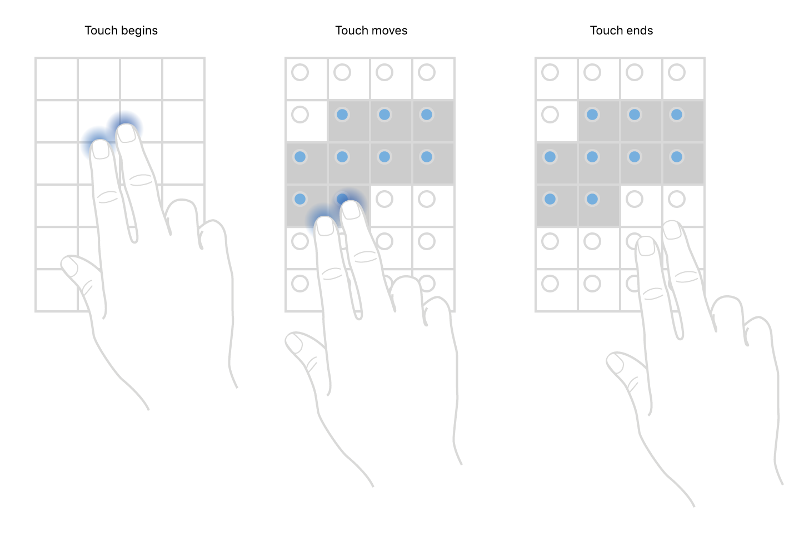

> 导航：[Technologies](../technologies.md) · [UIKit](../uikit.md) · [Views and controls](views-and-controls.md) · [Collection views](collection-views.md)

# 使用双指平移手势选择多个项目

<sub>示例代码</sub>

使用表格视图和集合视图上的多选手势，加快用户对多个项目的选择速度。

## 概述

在 iOS 13 及更高版本中，你可以让 App 的用户在表格视图和集合视图上通过双指平移手势选择多个项目。选择启用这项功能的 App 能让用户快速选择多个项目。例如，当表格视图识别到双指平移手势时，App 可以自动将表格视图切换到编辑模式，用户无需点按"编辑"或"选择"按钮。

要选择多个项目，用两根手指在你想选择的项目上拖动。当视图识别出双指平移手势时，它会切换到编辑模式，让你可以选择多个项目。



<sub>展示用户在网格中选择多个项目时发生的触摸事件的示意图。第一张图中，用户用食指和中指触碰网格第二行中的一个项目，从而开始触摸事件。第二张图显示用户将两根手指移过三行项目，触发触摸移动事件，使被触碰的项目呈现为已选中状态。第三张图描绘用户将手指从设备上抬起，结束触摸事件。</sub>

被选中的项目不必是连续的。用两根手指选择几个项目，滚动视图，再次用两根手指选择更多项目。你也可以使用同样的双指平移手势取消选择多个项目。只需在已选中的项目上拖动两根手指，表格视图和集合视图都会取消对这些项目的选择。

本示例向你展示如何在你的 App 中支持这项功能。示例 App 会显示一个表格视图和一个集合视图。在 iPad 上运行该示例时，App 会使用拆分视图并排显示这两个视图。在 iPhone 上运行该 App 时，App 会显示一个标签页栏，让你可以在表格视图和集合视图之间切换。

### 在表格视图中支持多项目选择

要在表格视图中启用双指平移手势，请实现委托方法 [- tableView:shouldBeginMultipleSelectionInteractionAtIndexPath:](<uitableviewdelegate/tableview(__shouldbeginmultipleselectioninteractionat_).md>)，并返回 `true`。表格视图检测到双指触摸时会调用此方法，以确定 App 是否支持多选手势。

```swift
override func tableView(_ tableView: UITableView, shouldBeginMultipleSelectionInteractionAt indexPath: IndexPath) -> Bool {
    return true
}
```

返回 `true` 之后，表格视图会调用 [- tableView:didBeginMultipleSelectionInteractionAtIndexPath:](<uitableviewdelegate/tableview(__didbeginmultipleselectioninteractionat_).md>) 委托方法。示例 App 利用这个时机将表格视图切换到编辑模式，而无需用户点按"编辑"按钮。表格视图还会选中当前行。用户在表格视图上向上或向下平移两根手指以选择更多行。

```swift
override func tableView(_ tableView: UITableView, didBeginMultipleSelectionInteractionAt indexPath: IndexPath) {
    // Replace the Edit button with Done, and put the
    // table view into editing mode.
    self.setEditing(true, animated: true)
}
```

当用户将两根手指从设备上抬起时，表格视图会调用 [- tableViewDidEndMultipleSelectionInteraction:](<uitableviewdelegate/tableviewdidendmultipleselectioninteraction(__).md>) 委托方法。这向 App 表明用户不再使用双指平移手势。示例 App 对这个方法的实现不执行任何操作，这样用户仍有机会继续使用双指平移手势选择更多项目。用户也可以通过沿表格显示选择复选框的边缘移动单指来选择更多项目。

```swift
override func tableViewDidEndMultipleSelectionInteraction(_ tableView: UITableView) {
    print("\(#function)")
}
```

### 在集合视图中支持多项目选择

在集合视图中提供相同的多选行为，与表格视图的实现方式类似。首先实现集合视图委托方法 [- collectionView:shouldBeginMultipleSelectionInteractionAtIndexPath:](<uicollectionviewdelegate/collectionview(__shouldbeginmultipleselectioninteractionat_).md>)，它决定用户是否可以使用该手势。示例 App 在此方法中返回 `true`。

接下来，实现委托方法 [- collectionView:didBeginMultipleSelectionInteractionAtIndexPath:](<uicollectionviewdelegate/collectionview(__didbeginmultipleselectioninteractionat_).md>)。与表格视图委托的对应方法一样，示例 App 对此方法的实现会将集合视图切换到编辑模式。

要实现的第三个也是最后一个委托方法是 [- collectionViewDidEndMultipleSelectionInteraction:](<uicollectionviewdelegate/collectionviewdidendmultipleselectioninteraction(__).md>)。这里示例 App 不执行任何操作，以便用户可以继续通过点按或再次用两根手指平移来选择项目。

```swift
func collectionView(_ collectionView: UICollectionView, shouldBeginMultipleSelectionInteractionAt indexPath: IndexPath) -> Bool {
    // Returning `true` automatically sets `collectionView.isEditing`
    // to `true`. The app sets it to `false` after the user taps the Done button.
    return true
}

func collectionView(_ collectionView: UICollectionView, didBeginMultipleSelectionInteractionAt indexPath: IndexPath) {
    // Replace the Select button with Done, and put the
    // collection view into editing mode.
    setEditing(true, animated: true)
}

func collectionViewDidEndMultipleSelectionInteraction(_ collectionView: UICollectionView) {
    print("\(#function)")
}
```

用户也可以沿受限的轴平移单指来选择更多项目。例如，如果集合视图是垂直滚动的，用户可以水平平移单指来选择更多项目。

## 另请参阅

### 选择管理

- [Changing the appearance of selected and highlighted cells](changing-the-appearance-of-selected-and-highlighted-cells.md) — 向用户提供关于单元格状态及状态间转换的视觉反馈。

## 下载

- [SelectingMultipleItemsWithATwoFingerPanGesture.zip](https://docs-assets.developer.apple.com/published/56f75761a3d9/SelectingMultipleItemsWithATwoFingerPanGesture.zip)
