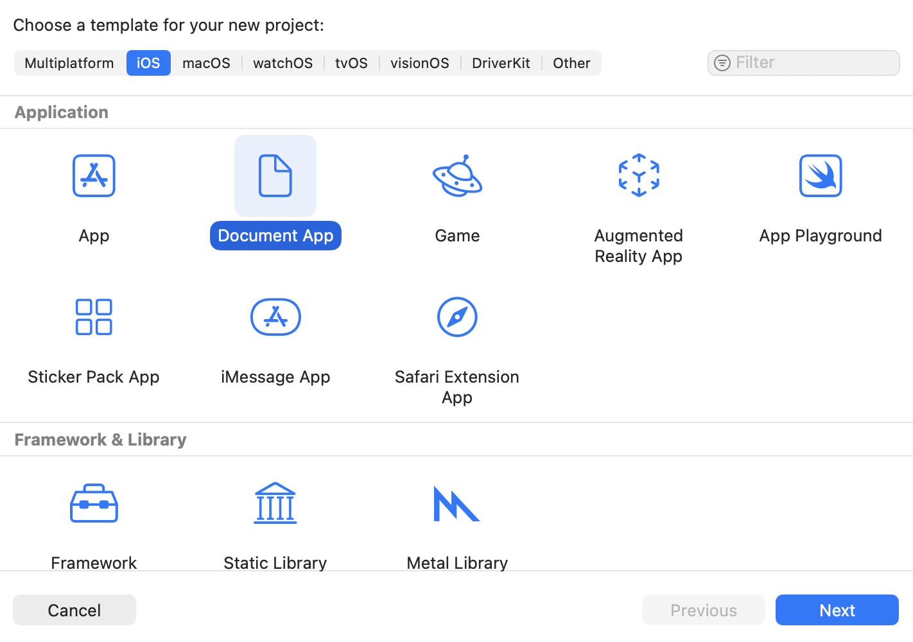
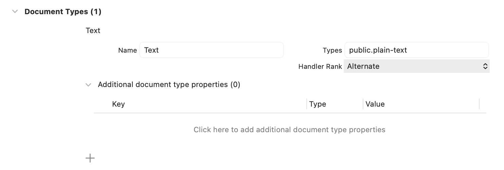

> 导航：[Technologies](../technologies.md) · [UIKit](../uikit.md) · [View controllers](view-controllers.md) · [Adding a document browser to your app](adding-a-document-browser-to-your-app.md)

# 设置文稿浏览器 App

<sub>文章</sub>

为你的 App 添加一个文稿浏览器视图控制器。

## 概述

设置文稿浏览器分为三个步骤：

1. 将浏览器设为你 App 的根视图控制器。
2. 为你的 App 声明文稿浏览器支持。
3. 定义文稿浏览器可以打开的文稿类型。

完成这三步最简单的方式，是使用"基于文稿的 App"模板创建一个新项目。

### 创建一个新的基于文稿的 App

要创建一个新的基于文稿的 App，打开 Xcode，选择 File \> New \> Project。在模板选择器中，在 Application 下选择 Document Based App 模板，然后点按 Next。



<sub>Xcode 项目模板面板的屏幕截图，显示 iOS 选项卡和 Document App 图标均处于选中状态。</sub>

继续按提示操作，创建一个基于文稿的项目。以下条目会出现在你的新项目中：

- `Main.storyboard` 包含一个文稿浏览器视图控制器，作为其初始视图控制器。这个 Storyboard 将文稿浏览器设为你 App 的根视图控制器，确保浏览器在 App 的整个生命周期内始终留在内存中。
- 在你 App 的 `Info.plist` 文件中，[UISupportsDocumentBrowser](../bundleresources/information-property-list/uisupportsdocumentbrowser.md) 键被设置为 `YES`，为你的 App 声明文稿浏览器支持。具体而言，这个键允许其他 App 打开和编辑存储在你 App 的 Documents 目录中的文件，也允许用户在"设置"中设置该 App 的默认保存位置。
- 该 App 声明支持 `public.image` 文稿类型。这样一来，用户就可以在文稿浏览器中选择图像文件，也可以从其他 App 中分享图像文件。

大多数默认值可以照原样使用；不过，除非你在制作一个基于图像的 App，否则你可能需要更新所支持的文稿类型。

### 设置所支持的文稿类型

对于你 App 支持的每一种文稿类型，请在项目编辑器的 Info 面板中按以下步骤操作：

1. 点按 Document Types 的展开三角形，然后点按添加按钮（+）以添加新的文稿类型，或打开一个已有的文稿类型。
2. 设置该文稿类型的名称及其统一类型标识符（UTI）。
3. 点按"Additional document type properties"的展开三角形。
4. 添加 [LSHandlerRank](../bundleresources/information-property-list/cfbundledocumenttypes/lshandlerrank.md) 键，并将其值设置为 `Owner` 或 `Alternate`。
5. 你也可以选择设置其他文稿类型属性。

例如，对于一个编辑文本文件的 App，请使用下图所示的设置：



<sub>展示文本文件的文稿类型设置的屏幕截图。文件类型被设置为 public.plain-text，处理程序等级被设置为 Alternate。</sub>

这些条目会在你 App 的 `Info.plist` 文件中设置 [CFBundleDocumentTypes](../bundleresources/information-property-list/cfbundledocumenttypes.md) 键，如下所示：

```xml
<key>CFBundleDocumentTypes</key>
<array>
    <dict>
        <key>CFBundleTypeIconFiles</key>
        <array/>
        <key>CFBundleTypeName</key>
        <string>Text</string>
        <key>LSHandlerRank</key>
        <string>Alternate</string>
        <key>LSItemContentTypes</key>
        <array>
            <string>public.plain-text</string>
        </array>
    </dict>
</array>
```

更多信息，请参阅[设置所支持的文稿类型](http://help.apple.com/xcode/mac/current/#/devddd273fdd)。

## 另请参阅

### 配置

- [Presenting selected documents](presenting-selected-documents.md) — 在你的浏览器视图控制器之上显示用户选中的文稿。
- [Enabling document sharing](enabling-document-sharing.md) — 让用户能够从你的 App 中导入和导出文稿。
