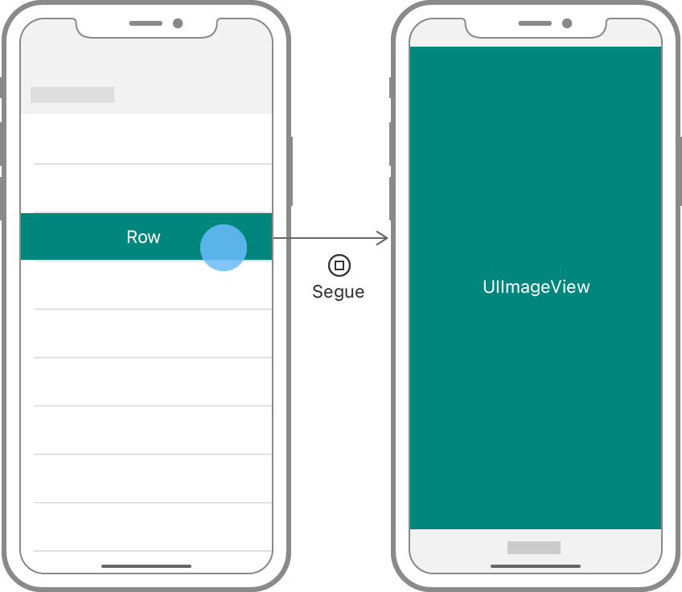

> 导航：[Technologies](../technologies.md) · [UIKit](../uikit.md) · [View controllers](view-controllers.md)

# 显示与隐藏视图控制器

使用不同的技术显示视图控制器，并在转场过程中在它们之间传递数据。

## 概述

你通过呈现和关闭视图控制器来改变 App 的界面。每个窗口都有一个根视图控制器，为你的窗口提供初始内容。呈现一个新的视图控制器会通过在窗口中安装一组新视图来改变这些内容。当你不再需要某个视图控制器时，关闭它会将其视图从窗口中移除。你可以通过以下方式之一呈现视图控制器：

- 在 Storyboard 中以可视化方式配置呈现。
- 将其嵌入到一个容器视图控制器中。
- 直接调用 [UIViewController](uiviewcontroller.md) 的方法。

每种技术都能让你对呈现和关闭过程拥有不同程度的控制权。

### 在 Storyboard 文件中以可视化方式指定呈现

在 Storyboard 中使用转场是呈现和关闭视图控制器的推荐方式。转场是从一个视图控制器过渡到另一个视图控制器的可视化表示。转场以某个操作开始，例如在初始视图控制器中点按按钮或选中表格行。当该操作发生时，UIKit 会创建转场另一端的视图控制器并自动呈现它。由于你是在 Storyboard 中创建和配置转场，因此可以非常快速地对其进行修改。



<sub>两个视图控制器之间转场的示意图。在第一个视图控制器中点按表格行会触发该转场。</sub>

你可以从任何实现了操作方法的对象（例如控制或手势识别器）启动转场，也可以从表格行和集合视图单元格启动转场。

1. 在当前视图控制器中右键点击控制或对象。
2. 将光标拖动到你想要呈现的视图控制器上。
3. 从 Xcode 提供的列表中选择你想要的转场类型。

Storyboard 会将转场显示为两个视图控制器之间的一个箭头。选中该转场会显示有关它的信息，包括你希望 UIKit 执行的呈现类型。你可以修改呈现类型或配置其他细节，例如转场标识符。你可以在运行时使用这些信息进一步自定该转场，具体做法见[自定基于转场的呈现的行为](customizing-the-behavior-of-segue-based-presentations.md)。

有关如何在 Storyboard 中关闭视图控制器的信息，请参阅[使用返回转场关闭视图控制器](dismissing-a-view-controller-with-an-unwind-segue.md)。

### 让当前上下文决定呈现技术

在多个地方复用同一个视图控制器会带来一个潜在的问题：需要根据当前上下文以不同方式呈现它。例如，你可能希望在某处将它嵌入导览控制器中，而在另一处以模态方式呈现它。UIKit 通过 [UIViewController](uiviewcontroller.md) 的 [- showViewController:sender:](<uiviewcontroller/show(__sender_).md>) 和 [- showDetailViewController:sender:](<uiviewcontroller/showdetailviewcontroller(__sender_).md>) 方法解决了这个问题，这两个方法会以最适合当前上下文的方式呈现视图控制器。

当你调用 [- showViewController:sender:](<uiviewcontroller/show(__sender_).md>) 或 [- showDetailViewController:sender:](<uiviewcontroller/showdetailviewcontroller(__sender_).md>) 方法时，UIKit 会确定最适合呈现的上下文。具体来说，它会调用 [- targetViewControllerForAction:sender:](<uiviewcontroller/targetviewcontroller(foraction_sender_).md>) 方法，查找实现了对应 `show` 方法的父视图控制器。如果某个父视图控制器实现了该方法并希望处理该呈现，UIKit 就会调用该父视图控制器的实现。[UINavigationController](uinavigationcontroller.md) 对象对 [- showViewController:sender:](<uiviewcontroller/show(__sender_).md>) 方法的实现会将新的视图控制器压入其导览栈。如果没有任何视图控制器处理该呈现，UIKit 就会以模态方式呈现该视图控制器。

以下代码示例创建一个视图控制器，并使用 [- showViewController:sender:](<uiviewcontroller/show(__sender_).md>) 方法显示它。这段代码等价于创建一个类型设置为 Show 的转场。

```swift
@IBAction func showSecondViewController() {
    let storyboard = UIStoryboard(name: "Main", bundle: nil)
    let secondVC = storyboard.instantiateViewController(identifier: "SecondViewController")

    show(secondVC, sender: self)
}
```

在显示某个视图控制器之后，使用当前上下文来确定如何关闭它。调用 [- dismissViewControllerAnimated:completion:](<uiviewcontroller/dismiss(animated_completion_).md>) 方法可能并非总是最合适的选择。例如，如果某个导览控制器已将该视图控制器加入其导览栈，就不要调用该方法。此时应改用 [presentingViewController](uiviewcontroller/presentingviewcontroller.md)、[splitViewController](uiviewcontroller/splitviewcontroller.md)、[navigationController](uiviewcontroller/navigationcontroller.md) 和 [tabBarController](uiviewcontroller/tabbarcontroller.md) 属性来确定当前上下文，并采取相应的操作。这种响应也可能包括修改你的视图控制器 UI，隐藏"完成"按钮或其他用于关闭 UI 的控制。

> [!note] 注意
> 在实现自定容器视图控制器时，请实现 [- showViewController:sender:](<uiviewcontroller/show(__sender_).md>) 和 [- showDetailViewController:sender:](<uiviewcontroller/showdetailviewcontroller(__sender_).md>) 方法来处理呈现。更多信息，请参阅[创建自定容器视图控制器](creating-a-custom-container-view-controller.md)。

### 将一个视图控制器嵌入容器视图控制器中

容器视图控制器会嵌入一个或多个子视图控制器的内容，并将组合后的界面呈现在屏幕上。嵌入一个子视图控制器时，会使用特定于该容器的方式来呈现它。例如，导览控制器最初会将子视图控制器定位在屏幕外，然后通过动画将其移动到屏幕上的位置。

标准的 UIKit 容器视图控制器可以配合转场以及 [- showViewController:sender:](<uiviewcontroller/show(__sender_).md>) 和 [- showDetailViewController:sender:](<uiviewcontroller/showdetailviewcontroller(__sender_).md>) 方法，将视图控制器作为子级嵌入。它们还定义了以编程方式添加和移除子视图控制器的其他 API。大多数转场请使用转场和 show 方法来处理。使用下表中的方法对你的视图控制器执行一次性配置，例如在将 App 的 UI 恢复到先前状态时。

| 容器 | 呈现选项 |
|---|---|
| UISplitViewController | 使用 [viewControllers](uisplitviewcontroller/viewcontrollers.md) 属性替换两个初始视图控制器。第一个（主要）视图控制器出现在前导窗格中，第二个（详情）视图控制器出现在后随窗格中。 |
| UINavigationController | 使用 [viewControllers](uinavigationcontroller/viewcontrollers.md) 属性替换导览栈的内容。使用 [- setViewControllers:animated:](<uinavigationcontroller/setviewcontrollers(__animated_).md>) 方法同时添加或移除一部分视图控制器。 |
| UITabBarController | 使用 [viewControllers](uitabbarcontroller/viewcontrollers.md) 属性替换初始标签页。使用 [- setViewControllers:animated:](<uitabbarcontroller/setviewcontrollers(__animated_).md>) 方法动态更改当前的标签页。 |
| UIPageViewController | 使用 [UIPageViewControllerDataSource](uipageviewcontrollerdatasource.md) 对象提供所有子视图控制器。 |

请始终使用容器视图控制器的 API 来移除或替换已呈现的视图控制器。

### 以模态方式呈现视图控制器

使用模态呈现在 App 的工作流程中创建临时性的中断，例如提示用户输入重要信息。模态呈现会全部或部分覆盖当前视图控制器，具体取决于你使用的呈现样式。全屏呈现总是替换先前的内容，而表单样式呈现可能会保留部分底层内容可见。每种呈现样式的实际外观取决于当前的特性环境。

要配置模态呈现，创建新的视图控制器并调用 [- presentViewController:animated:completion:](<uiviewcontroller/present(__animated_completion_).md>) 方法。该方法会使用 [UIModalPresentationAutomatic](uimodalpresentationstyle/automatic.md) 样式和 [UIModalTransitionStyleCoverVertical](uimodaltransitionstyle/coververtical.md) 转场动画，将新的视图控制器动画移动到位。要更改这些样式，请修改你所呈现的视图控制器的 [modalPresentationStyle](uiviewcontroller/modalpresentationstyle.md) 和 [modalTransitionStyle](uiviewcontroller/modaltransitionstyle.md) 属性。以下代码示例更改了这两种样式，使用交叉溶解动画创建一个全屏呈现。

```swift
    @IBAction func presentSecondViewController() {
        let storyboard = UIStoryboard(name: "Main", bundle: nil)
        let secondVC = storyboard.instantiateViewController(identifier: "SecondViewController")
        
        secondVC.modalPresentationStyle = .fullScreen
        secondVC.modalTransitionStyle = .crossDissolve
        
        present(secondVC, animated: true, completion: nil)
    }
```

要关闭一个以模态方式呈现的视图控制器，调用该视图控制器的 [- dismissViewControllerAnimated:completion:](<uiviewcontroller/dismiss(animated_completion_).md>) 方法。

## 主题

### 转场管理

- [Customizing the behavior of segue-based presentations](customizing-the-behavior-of-segue-based-presentations.md) — 在转场过程中在视图控制器之间传递数据，并以编程方式控制转场何时发生。
- [Dismissing a view controller with an unwind segue](dismissing-a-view-controller-with-an-unwind-segue.md) — 在 Storyboard 文件中配置一个返回转场，动态选择接下来最合适的视图控制器进行显示。

## 另请参阅

### 内容视图控制器

- [Displaying and managing views with a view controller](displaying-and-managing-views-with-a-view-controller.md) — 在 Storyboard 中构建一个视图控制器，用自定视图对其进行配置，并用 App 的数据填充这些视图。
- [UIViewController](uiviewcontroller.md) — 一个为你的 UIKit App 管理视图层级结构的对象。
- [UITableViewController](uitableviewcontroller.md) — 一个专门用于管理表格视图的视图控制器。
- [UICollectionViewController](uicollectionviewcontroller.md) — 一个专门用于管理集合视图的视图控制器。
- [UIContentContainer](uicontentcontainer.md) — 一组用于使你的视图控制器内容适配大小和特性变化的方法。
