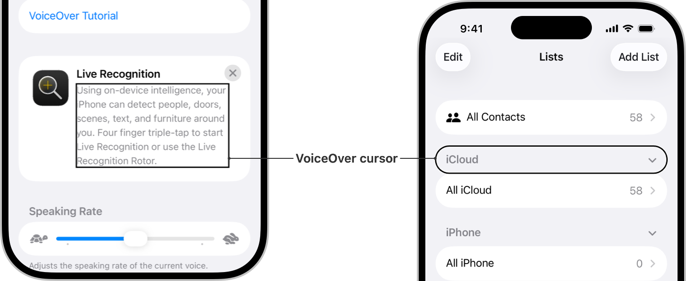
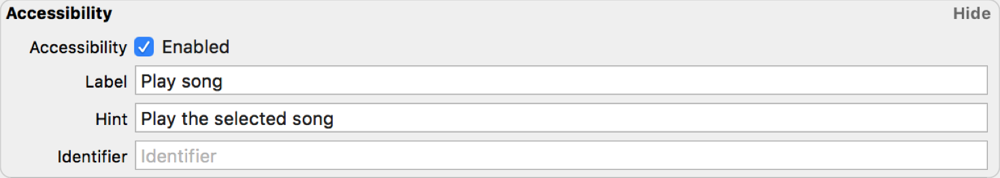
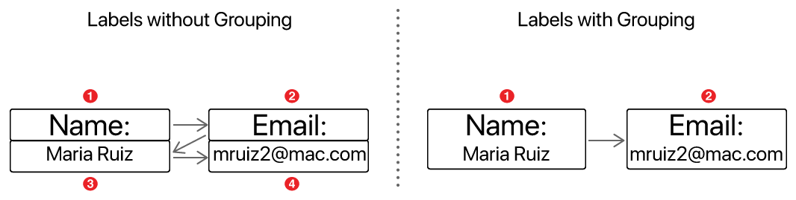

> 导航：[技术](../technologies.md) · [UIKit](../uikit.md) · [UIKit 辅助功能](accessibility-for-uikit.md)

# 在你的 App 中支持「旁白」

<sub>文章</sub>

添加「旁白」（VoiceOver）支持，让失明或低视力用户更易于使用你的 iOS App。

## 概述

「旁白」是一款基于手势的屏幕阅读器，让人们无需看见屏幕即可体验设备上的界面。失明人士在使用 iOS 设备时依赖「旁白」提供听觉反馈，但「旁白」并非只面向失明或低视力用户。例如，容易晕车的人可能会选择在乘坐移动的车辆时打开「旁白」。「旁白」可以帮助各种人群，而失明人士每次使用设备时都会依赖「旁白」。

只需几个步骤，你就可以在 Xcode 中或以编程方式让 App 支持「旁白」。提升辅助功能（accessibility）可让更多受众使用你的 App，也让每个人都能更轻松地使用它。



<sub>图中显示两部已打开「旁白」的 iPhone。左侧手机显示「设置 \> 辅助功能 \> 旁白」，「旁白」光标高亮显示了「实时识别」的描述文本。右侧手机显示「通讯录」App 中的「列表」视图，「旁白」光标高亮显示了 iCloud 分区页眉。</sub>

### 打开「旁白」审查你的 App

要测试 App 的辅助功能，请打开「旁白」并在界面中导览。打开「旁白」使用 App，可以确立其辅助功能基准。要开始审查，请选取「设置 \> 辅助功能 \> 旁白」并启用「旁白」。然后打开你的 App，并在每次想测试「旁白」时使用指定操作。

审查会揭示哪些元素可以通过「旁白」访问、哪些不能，还会展示「旁白」导览是否清晰且合乎逻辑。请记录无法访问的元素，并创建一份改进清单，以添加更完善的「旁白」支持。

### 打开「旁白」进行导览

要在打开「旁白」的情况下审查 App，你需要使用「旁白」特有的一组手势在 App 中导览。测试时可能会用到以下五种关键手势：

- 向左或向右轻扫，导览到下一个或上一个 UI 元素。
- 单指轻点两下来激活所选元素。
- 双指轻点以停止和继续朗读。
- 双指向上轻扫以朗读屏幕上的所有内容。
- 三指轻点三下以打开或关闭「幕帘屏」（Screen Curtain）。

要了解更多信息，请参阅[使用「旁白」手势操作 iPhone](https://support.apple.com/guide/iphone/operate-iphone-using-voiceover-gestures-iph3e2e2329/ios)。

要重现完全依赖「旁白」的用户所获得的体验，请使用「幕帘屏」测试你的 App。顾名思义，「幕帘屏」会使整个屏幕变黑。你仍然可以使用「旁白」手势导览，但无法看到屏幕上的元素。

### 识别常见辅助功能问题

要审查 App，请检查能否访问每个元素，以及这些元素的顺序是否符合预期。请记录「旁白」可以或无法访问哪些元素。此外，当你发现某项任务难以执行，因为你认为它依赖视觉信息时，也要特别留意。例如，当你导览回 App 的初始视图，或者与另一个 App 或用户共享内容时，如何使用「旁白」使其可访问？审查 App 时，请留意以下常见问题：

- **为 App 的元素添加辅助功能信息。** 「旁白」默认无法识别自定 UI 元素。你需要向这些元素添加额外的辅助功能信息。
- **将元素分组，让「旁白」按正确顺序导览。** 「旁白」从前缘向后缘朗读。如果希望「旁白」按不同顺序朗读元素，请使用分组来实现符合 App 逻辑的导览。
- **包含供「旁白」朗读的描述文本。** 依赖视觉提示的 UI 可能看起来很美观，但「旁白」用户可能无法使用。例如，当用户选择确认按钮后，按钮从灰色变为绿色，「旁白」并不会检测到这一变化。「旁白」可能只描述该元素，而不描述其当前状态。请确保「旁白」会说明按钮是否处于选中状态。

确定需要改进的区域后，即可开始为 App 添加更完善的「旁白」支持。

### 更新 App 的辅助功能

对于「旁白」无法访问的元素，先改进其辅助功能标签和提示。[accessibilityLabel](uiaccessibilityelement/accessibilitylabel.md) 属性提供用户选择元素时「旁白」朗读的描述文本，[accessibilityHint](uiaccessibilityelement/accessibilityhint.md) 属性则为所选元素提供额外的上下文（或操作）。

辅助功能标签非常重要，因为它们提供「旁白」朗读的文本。良好的辅助功能标签简短且信息明确。请务必注意，[UILabel](uilabel.md) 与 [accessibilityLabel](uiaccessibilityelement/accessibilitylabel.md) 并不是一回事。默认情况下，「旁白」会朗读标准 [UIKit](../uikit.md) 控制（如 [UILabel](uilabel.md) 和 [UIButton](uibutton.md)）的文本。不过，这些控制也可以拥有对应的 [accessibilityLabel](uiaccessibilityelement/accessibilitylabel.md) 属性，以添加有关标签或按钮的更多细节。

根据上下文，并非总是需要提示。在某些情况下，标签已经提供了足够的上下文。如果你觉得辅助功能标签表达的内容过多，可以考虑将部分文本移到提示中。

为确保用户理解界面的意图，你可能需要手动设置一些辅助功能标签。可以在 Xcode 的 Identity inspector 中设置辅助功能标签和提示，也可以以编程方式设置。

### 使用 Identity inspector 添加辅助功能标签和提示

使用标准 UIKit 控制时，请在 Xcode 中通过 Identity inspector 的 Accessibility 面板分配辅助功能标签和提示。要改进辅助功能，请选择 Accessibility Enabled 选项，使元素能够被辅助功能访问。例如，音乐 App 中的播放按钮可以包含以下标签和提示：



<sub>一张 Xcode 截屏，显示 Identity inspector 的 Accessibility 面板。此面板包含一个用于启用辅助功能的复选框，以及三个输入对象标签、提示和标识符文本的字段。Accessibility Enabled 选项处于选中状态。Label 字段显示 Play Song，Hint 字段显示 Play the selected song，Identifier 字段为空。</sub>

### 以编程方式添加辅助功能标签和提示

有时，仅在 Xcode 中添加辅助功能标签和提示并不足够，例如处理「旁白」无法自动识别的自定 UI 元素，或在辅助功能标签中使用变量时。在这些情况下，你需要以编程方式设置辅助功能标签或提示。你需要指定某个元素是辅助功能元素，然后创建相应的辅助功能标签和提示。

要以编程方式让「旁白」能够访问元素，请将其定义为辅助功能元素。

```swift
score.isAccessibilityElement = true
```

在 App 的整个生命周期内，元素的标签可能并非始终相同。例如，对于在你玩游戏时不断记录分数的计分器，你会希望随着分数变化而更改标签。请通过设置辅助功能标签和提示，以编程方式完成此操作。

```swift
score.accessibilityLabel = "score: \(currentScore)"
score.accessibilityHint = "Your current score" 
```

### 简化辅助功能信息

「旁白」会按照设备语言的方向朗读。例如，「旁白」从左向右朗读英语，从右向左朗读阿拉伯语和波斯语。如果在 UI 中垂直叠放标签，或在表格中显示文本，「旁白」可能无法按正确顺序朗读标签。你可以以编程方式将辅助功能元素分组，确保「旁白」按预期顺序朗读。例如，如果你正在创建一个 App，它叠放标题和值来显示某人的姓名和电子邮件地址，那么根据它们在界面中的顺序，「旁白」可能不会一起朗读这些元素。请将这些元素分组，确保建立清晰的上下文。



<sub>两个并排的示意图，演示「旁白」如何朗读未分组和已分组的标签。左图包含两组未分组的叠放标签，用于表示某人的姓名和电子邮件地址。第一组由 Name 标签和下方的人名组成，第二组由 Email 标签和下方的电子邮件地址组成。「旁白」按左上、右上、左下、右下的顺序朗读这四项：Name 标签、Email 标签、人名、电子邮件地址。右图由两个标签组组成。第一组包含 Name 标签和人名，第二组包含 Email 标签和电子邮件地址。「旁白」会先朗读第一组，再朗读第二组。</sub>

在上图左侧，「旁白」从前缘向后缘（在此情况下即从左向右）朗读四个标签。尽管「旁白」可以访问每个元素，但这并不能提供最佳用户体验。在右侧，「旁白」按预期顺序朗读已分组的标签，从而实现清晰的导览。

要将标签分组，请创建 [UIAccessibilityElement](uiaccessibilityelement.md)，并添加你想归为一组的信息。

```swift
var elements = [UIAccessibilityElement]()
let groupedElement = UIAccessibilityElement(accessibilityContainer: self)
groupedElement.accessibilityLabel = "\(nameTitle.text!), \(nameValue.text!)"
groupedElement.accessibilityFrameInContainerSpace = nameTitle.frame.union(nameValue.frame)
elements.append(groupedElement)
```

为每个元素添加辅助功能标签并将元素分组，可以让依赖「旁白」的人导览设备并使用你的 App。

## 另请参阅

### 基础

- [UIAccessibility](uiaccessibility-protocol.md) — 一组方法，用于提供有关 App 用户界面中视图和控制的辅助功能信息。
- [UIAccessibilityContainer](uiaccessibilitycontainer.md) — 提供一组方法，视图子类使用这些方法将子组件分别设为可访问元素。
