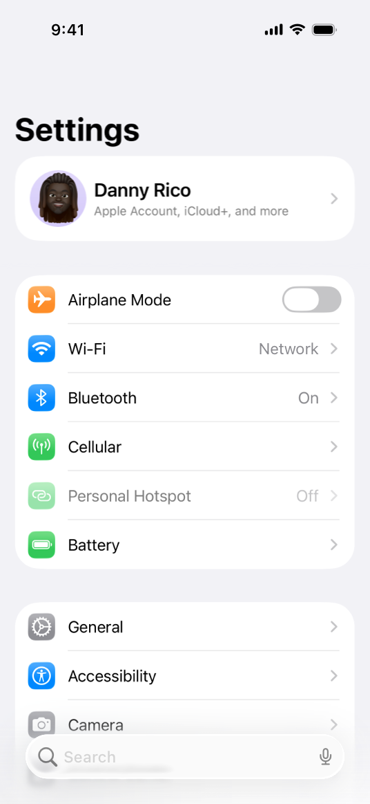

> 导航：[技术](../technologies.md) · [UIKit](../uikit.md)

# UITableView

<sub>类</sub>

一种以单列形式排列行来呈现数据的视图。

<sub>iOS, iPadOS, Mac Catalyst, tvOS, visionOS</sub>

```swift
@MainActor class UITableView
```

## 概述

iOS 中的表格视图在单列中显示垂直滚动的行。表格中的每一行都包含你 App 的一部分内容。你可以将表格配置为显示一长串列表行，也可以将相关的行分组为分区（section），以更轻松地浏览内容。

当你将表格中的行组织成分区时，你可以选择以普通或分组视觉[样式](uitableview/style-swift.enum.md)呈现分区。例如，“通讯录” App 将每位联系人的姓名显示在单独的行中，并按联系人姓氏首字母分组为分区。它以普通样式呈现这些分区。“设置” App 的主页面将可用设置组织成相关的分区，并以分组视觉样式呈现这些分区。




表格在具有高度结构化或层次化组织数据的 App 中很常见。包含层次化数据的 App 通常将表格与导览视图控制器（navigation view controller）结合使用，后者有助于在层次结构的不同层级之间进行导览。例如，“设置” App 使用表格和导览控制器来组织系统设置。

[UITableView](uitableview.md) 管理表格的基本外观，但你的 App 提供显示实际内容的单元格（[UITableViewCell](uitableviewcell.md) 对象）。标准单元格配置显示文本和图像的简单组合，但你可以定义显示任何所需内容的自定义单元格。你还可以提供页眉和页脚视图，为单元格组提供附加信息。

### 向界面添加表格视图

要向界面添加表格视图，请将表格视图控制器（[UITableViewController](uitableviewcontroller.md)）对象拖到 Storyboard 中。Xcode 会创建一个新的场景（scene），其中包含视图控制器和表格视图，可供你配置和使用。

表格视图是数据驱动的，通常从你提供的数据源（data source）对象获取数据。数据源对象管理你 App 的数据，并负责创建和配置表格的单元格。如果你的表格内容从不更改，你也可以直接在 Storyboard 文件中配置这些内容。

有关如何指定表格数据的信息，请参阅[用数据填充表格](filling-a-table-with-data.md)。

### 保存和恢复表格的当前状态

表格视图支持 UIKit App 恢复。要保存和恢复表格的数据，请为表格视图的 [restorationIdentifier](uiviewcontroller/restorationidentifier.md) 属性分配一个非空值。当你保存其父视图控制器时，表格视图会自动保存当前选中和可见行的索引路径（index path）。如果表格的数据源对象采用了 [UIDataSourceModelAssociation](uidatasourcemodelassociation.md) 协议，表格会存储你为这些项目提供的唯一 ID，而非其索引路径。

有关如何保存和恢复 App 状态的信息，请参阅[在启动之间保留你的 App 的 UI](preserving-your-app-s-ui-across-launches.md)。

## 关系

- **继承自**：[UIScrollView](uiscrollview.md)

- **遵循协议**：[CALayerDelegate](../quartzcore/calayerdelegate.md), [CLBodyIdentifiable](../corelocation/clbodyidentifiable.md), [CMBodyIdentifiable](../coremotion/cmbodyidentifiable.md), [CVarArg](../swift/cvararg.md), [Copyable](../swift/copyable.md), [CustomDebugStringConvertible](../swift/customdebugstringconvertible.md), [CustomStringConvertible](../swift/customstringconvertible.md), [Equatable](../swift/equatable.md), [Escapable](../swift/escapable.md), [Hashable](../swift/hashable.md), [NSCoding](../foundation/nscoding.md), [NSObjectProtocol](../objectivec/nsobjectprotocol.md), [NSTouchBarProvider](../appkit/nstouchbarprovider.md), [Sendable](../swift/sendable.md), [SendableMetatype](../swift/sendablemetatype.md), [UIAccessibilityIdentification](uiaccessibilityidentification.md), [UIActivityItemsConfigurationProviding](uiactivityitemsconfigurationproviding.md), [UIAppearance](uiappearance.md), [UIAppearanceContainer](uiappearancecontainer.md), [UICoordinateSpace](uicoordinatespace.md), [UIDataSourceTranslating](uidatasourcetranslating.md), [UIDynamicItem](uidynamicitem.md), [UIFocusEnvironment](uifocusenvironment.md), [UIFocusItem](uifocusitem.md), [UIFocusItemContainer](uifocusitemcontainer.md), [UIFocusItemScrollableContainer](uifocusitemscrollablecontainer.md), [UILargeContentViewerItem](uilargecontentvieweritem.md), [UIPasteConfigurationSupporting](uipasteconfigurationsupporting.md), [UIPopoverPresentationControllerSourceItem](uipopoverpresentationcontrollersourceitem.md), [UIResponderStandardEditActions](uiresponderstandardeditactions.md), [UISpringLoadedInteractionSupporting](uispringloadedinteractionsupporting.md), [UITraitChangeObservable](uitraitchangeobservable-67e94.md), [UITraitEnvironment](uitraitenvironment.md), [UIUserActivityRestoring](uiuseractivityrestoring.md)

## 主题

### 创建表格视图

- [- initWithFrame:style:](<uitableview/init(frame_style_).md>) — 使用指定的 frame 和样式创建并返回一个表格视图。
- [- initWithCoder:](<uitableview/init(coder_).md>) — 从解档器（unarchiver）中的数据创建表格视图对象。

### 提供数据和单元格

- [dataSource](uitableview/datasource.md) — 充当表格视图数据源的对象。
- [prefetchDataSource](uitableview/prefetchdatasource.md) — 充当表格视图预取数据源的对象，接收即将有单元格数据需求的通知。
- [prefetchingEnabled](uitableview/isprefetchingenabled.md) — 一个布尔值，指示是否允许单元格和数据的预取。
- [UITableViewDataSource](uitableviewdatasource.md) — 对象为管理数据并为表格视图提供单元格所需采纳的方法。
- [UITableViewDataSourcePrefetching](uitableviewdatasourceprefetching.md) — 一个协议，提前通知表格视图的数据需求，让你能够提前启动可能耗时的数据操作。

### 回收表格视图单元格

- [- registerNib:forCellReuseIdentifier:](<uitableview/register(__forcellreuseidentifier_)-5q6bo.md>) — 在指定标识符下向表格视图注册一个包含单元格的 nib 对象。
- [- registerClass:forCellReuseIdentifier:](<uitableview/register(__forcellreuseidentifier_)-3l3ct.md>) — 注册一个用于创建新表格单元格的类。
- [- dequeueReusableCellWithIdentifier:forIndexPath:](<uitableview/dequeuereusablecell(withidentifier_for_).md>) — 返回指定重用标识符的可重用表格视图单元格对象，并将其添加到表格中。
- [- dequeueReusableCellWithIdentifier:](<uitableview/dequeuereusablecell(withidentifier_).md>) — 通过标识符定位后，返回一个可重用的表格视图单元格对象。

### 回收分区页眉和页脚

- [- registerNib:forHeaderFooterViewReuseIdentifier:](<uitableview/register(__forheaderfooterviewreuseidentifier_)-1rgvc.md>) — 在指定标识符下向表格视图注册一个包含页眉或页脚的 nib 对象。
- [- registerClass:forHeaderFooterViewReuseIdentifier:](<uitableview/register(__forheaderfooterviewreuseidentifier_)-20ybb.md>) — 注册一个用于创建新的表格页眉或页脚视图的类。
- [- dequeueReusableHeaderFooterViewWithIdentifier:](<uitableview/dequeuereusableheaderfooterview(withidentifier_).md>) — 通过标识符定位后，返回一个可重用的页眉或页脚视图。

### 管理与表格的交互

- [delegate](uitableview/delegate.md) — 充当表格视图委托（delegate）的对象。
- [UITableViewDelegate](uitableviewdelegate.md) — 用于管理选择、配置分区页眉和页脚、删除和重排单元格以及在表格视图中执行其他操作的方法。

### 配置表格的外观

- [style](uitableview/style-swift.property.md) — 表格视图的样式。
- [Style](uitableview/style-swift.enum.md) — 表格视图样式的常量。
- [tableHeaderView](uitableview/tableheaderview.md) — 显示在表格内容上方的视图。
- [tableFooterView](uitableview/tablefooterview.md) — 显示在表格内容下方的视图。
- [backgroundView](uitableview/backgroundview.md) — 表格视图的背景视图。

### 配置单元格高度和布局

- [rowHeight](uitableview/rowheight.md) — 表格视图中每行的默认高度（以点为单位）。
- [estimatedRowHeight](uitableview/estimatedrowheight.md) — 表格视图中行的估计高度。
- [fillerRowHeight](uitableview/fillerrowheight.md) — 填充表格视图的空行的高度。
- [cellLayoutMarginsFollowReadableWidth](uitableview/celllayoutmarginsfollowreadablewidth.md) — 一个布尔值，指示单元格边距是否源自可读内容指南的宽度。
- [insetsContentViewsToSafeArea](uitableview/insetscontentviewstosafearea.md) — 一个布尔值，指示表格视图是否调整其单元格、页眉和页脚的内容视图以适应安全区（safe area）。

### 配置页眉和页脚外观

- [sectionHeaderHeight](uitableview/sectionheaderheight.md) — 表格视图中分区页眉的高度。
- [sectionFooterHeight](uitableview/sectionfooterheight.md) — 表格视图中分区页脚的高度。
- [estimatedSectionHeaderHeight](uitableview/estimatedsectionheaderheight.md) — 表格视图中分区页眉的估计高度。
- [estimatedSectionFooterHeight](uitableview/estimatedsectionfooterheight.md) — 表格视图中分区页脚的估计高度。
- [sectionHeaderTopPadding](uitableview/sectionheadertoppadding.md) — 每个分区页眉上方的内边距（padding）量。

### 自定义分隔线外观

- [separatorStyle](uitableview/separatorstyle.md) — 表格单元格用作分隔线的样式。
- [SeparatorStyle](uitableviewcell/separatorstyle.md) — 单元格用作分隔线的样式。
- [separatorColor](uitableview/separatorcolor.md) — 表格视图中分隔行的颜色。
- [separatorEffect](uitableview/separatoreffect.md) — 应用于表格分隔线的效果。
- [separatorInset](uitableview/separatorinset.md) — 单元格分隔线的默认内缩。
- [separatorInsetReference](uitableview/separatorinsetreference-swift.property.md) — 指示如何解释分隔线内缩值的标志。
- [SeparatorInsetReference](uitableview/separatorinsetreference-swift.enum.md) — 指示如何解释表格视图分隔线内缩值的常量。

### 获取行数和分区数

- [- numberOfRowsInSection:](<uitableview/numberofrows(insection_).md>) — 返回指定分区中的行数（表格单元格）。
- [numberOfSections](uitableview/numberofsections.md) — 表格视图中的分区数。

### 获取单元格和基于分区的视图

- [- cellForRowAtIndexPath:](<uitableview/cellforrow(at_).md>) — 返回你指定的索引路径处的表格单元格。
- [- headerViewForSection:](<uitableview/headerview(forsection_).md>) — 返回指定分区的页眉视图。
- [- footerViewForSection:](<uitableview/footerview(forsection_).md>) — 返回指定分区的页脚视图。
- [- indexPathForCell:](<uitableview/indexpath(for_).md>) — 返回一个索引路径，它表示指定表格视图单元格的行和分区。
- [- indexPathForRowAtPoint:](<uitableview/indexpathforrow(at_).md>) — 返回一个索引路径，它标识指定点处的行和分区。
- [- indexPathsForRowsInRect:](<uitableview/indexpathsforrows(in_).md>) — 返回一个索引路径数组，每个索引路径表示指定矩形所包围的一行。
- [visibleCells](uitableview/visiblecells.md) — 表格视图中可见的表格单元格。
- [indexPathsForVisibleRows](uitableview/indexpathsforvisiblerows.md) — 一个索引路径数组，每个索引路径标识表格视图中的可见行。

### 选择行

- [indexPathForSelectedRow](uitableview/indexpathforselectedrow.md) — 标识选中行的行和分区的索引路径。
- [indexPathsForSelectedRows](uitableview/indexpathsforselectedrows.md) — 表示选中行的索引路径。
- [- selectRowAtIndexPath:animated:scrollPosition:](<uitableview/selectrow(at_animated_scrollposition_).md>) — 选择索引路径标识的表格视图中的行，并可选择将行滚动到表格视图中的某个位置。
- [- deselectRowAtIndexPath:animated:](<uitableview/deselectrow(at_animated_).md>) — 取消选择索引路径标识的行，并可选择为取消选择添加动画。
- [allowsSelection](uitableview/allowsselection.md) — 一个布尔值，决定用户是否可以选择行。
- [allowsMultipleSelection](uitableview/allowsmultipleselection.md) — 一个布尔值，决定用户是否可以在编辑模式之外选择多行。
- [allowsSelectionDuringEditing](uitableview/allowsselectionduringediting.md) — 一个布尔值，决定用户是否可以在表格视图处于编辑模式时选择单元格。
- [allowsMultipleSelectionDuringEditing](uitableview/allowsmultipleselectionduringediting.md) — 一个布尔值，控制用户是否可以在编辑模式下同时选择多个单元格。
- [selectionFollowsFocus](uitableview/selectionfollowsfocus.md) — 一个布尔值，当焦点移动到单元格时触发自动选择。
- [UITableViewSelectionDidChangeNotification](uitableview/selectiondidchangenotification.md) — 当发布通知的表格视图中的选中行更改时发布的通知。

### 插入、删除和移动行与分区

- [- insertRowsAtIndexPaths:withRowAnimation:](<uitableview/insertrows(at_with_).md>) — 在索引路径数组标识的位置处插入表格视图中的行，并可选择为插入添加动画。
- [- deleteRowsAtIndexPaths:withRowAnimation:](<uitableview/deleterows(at_with_).md>) — 删除索引路径数组标识的行，并可选择为删除添加动画。
- [- insertSections:withRowAnimation:](<uitableview/insertsections(__with_).md>) — 在表格视图中插入一个或多个分区，并可选择为插入添加动画。
- [- deleteSections:withRowAnimation:](<uitableview/deletesections(__with_).md>) — 删除表格视图中的一个或多个分区，并可选择为删除添加动画。
- [RowAnimation](uitableview/rowanimation.md) — 插入或删除行时使用的动画类型。
- [- moveRowAtIndexPath:toIndexPath:](<uitableview/moverow(at_to_).md>) — 将指定位置的行移动到目标位置。
- [- moveSection:toSection:](<uitableview/movesection(__tosection_).md>) — 将分区移动到表格视图中的新位置。

### 对行和分区执行批量更新

- [- performBatchUpdates:completion:](<uitableview/performbatchupdates(__completion_).md>) — 将多个插入、删除、重载和移动操作作为一个组进行动画。
- [- beginUpdates](<uitableview/beginupdates().md>) — 开始一系列插入、删除或选择表格视图行和分区的方法调用。
- [- endUpdates](<uitableview/endupdates().md>) — 结束一系列插入、删除、选择或重载表格视图行和分区的方法调用。

### 重载表格视图

- [hasUncommittedUpdates](uitableview/hasuncommittedupdates.md) — 一个布尔值，指示表格视图的外观是否包含其数据源中不存在的更改。
- [- reconfigureRowsAtIndexPaths:](<uitableview/reconfigurerows(at_).md>) — 更新你指定的索引路径处的行的数据，保留这些行的现有单元格。
- [- reloadData](<uitableview/reloaddata().md>) — 重载表格视图的行和分区。
- [- reloadRowsAtIndexPaths:withRowAnimation:](<uitableview/reloadrows(at_with_).md>) — 使用提供的动画效果重载指定的行。
- [- reloadSections:withRowAnimation:](<uitableview/reloadsections(__with_).md>) — 使用提供的动画效果重载指定的分区。
- [- reloadSectionIndexTitles](<uitableview/reloadsectionindextitles().md>) — 重载表格视图右侧索引栏中的项目。

### 管理拖放交互

- [dragDelegate](uitableview/dragdelegate.md) — 管理从表格视图拖拽项目的委托对象。
- [UITableViewDragDelegate](uitableviewdragdelegate.md) — 用于从表格视图发起拖拽的接口。
- [hasActiveDrag](uitableview/hasactivedrag.md) — 一个布尔值，指示表格视图当前是否正在跟踪一个拖拽会话。
- [dragInteractionEnabled](uitableview/draginteractionenabled.md) — 一个布尔值，指示表格视图是否支持拖拽内容。

### 管理放置交互

- [dropDelegate](uitableview/dropdelegate.md) — 管理将内容放置到表格视图中的委托对象。
- [UITableViewDropDelegate](uitableviewdropdelegate.md) — 用于处理表格视图中放置的接口。
- [hasActiveDrop](uitableview/hasactivedrop.md) — 一个布尔值，指示表格视图当前是否正在跟踪一个放置会话。

### 滚动表格视图

- [- scrollToRowAtIndexPath:atScrollPosition:animated:](<uitableview/scrolltorow(at_at_animated_)>) — 滚动表格视图，直到索引路径标识的行位于屏幕上的特定位置。
- [- scrollToNearestSelectedRowAtScrollPosition:animated:](<uitableview/scrolltonearestselectedrow(at_animated_)>) — 滚动表格视图，使最接近表格视图中指定位置的选中行位于该位置。
- [ScrollPosition](uitableview/scrollposition.md) — 表格视图中（顶部、中间、底部）用于滚动指定行的位置。

### 将表格置于编辑模式

- [- setEditing:animated:](<uitableview/setediting(__animated_)>) — 切换表格视图进入和退出编辑模式。
- [editing](uitableview/isediting.md) — 一个布尔值，决定表格视图是否处于编辑模式。

### 配置表格索引

- [sectionIndexMinimumDisplayRowCount](uitableview/sectionindexminimumdisplayrowcount.md) — 在表格右侧边缘显示索引列表所需的表格行数。
- [sectionIndexColor](uitableview/sectionindexcolor.md) — 用于表格视图索引文本的颜色。
- [sectionIndexBackgroundColor](uitableview/sectionindexbackgroundcolor.md) — 用于表格视图分区索引背景的颜色。
- [sectionIndexTrackingBackgroundColor](uitableview/sectionindextrackingbackgroundcolor.md) — 用于表格视图索引背景区域的跟踪颜色。
- [UITableViewIndexSearch](uitableview/indexsearch.md) — 用于向表格视图的分区索引添加放大镜图标的常量。

### 获取表格的绘制区域

- [- rectForSection:](<uitableview/rect(forsection_)) — 返回表格视图指定分区的绘制区域。
- [- rectForRowAtIndexPath:](<uitableview/rectforrow(at_)) — 返回索引路径标识的行的绘制区域。
- [- rectForFooterInSection:](<uitableview/rectforfooter(insection_)) — 返回指定分区页脚的绘制区域。
- [- rectForHeaderInSection:](<uitableview/rectforheader(insection_)) — 返回指定分区页眉的绘制区域。

### 处理焦点

- [allowsFocus](uitableview/allowsfocus.md) — 一个布尔值，决定表格视图是否允许其单元格获得焦点。
- [allowsFocusDuringEditing](uitableview/allowsfocusduringediting.md) — 一个布尔值，决定表格视图是否允许其单元格在编辑模式下获得焦点。
- [selectionFollowsFocus](uitableview/selectionfollowsfocus.md) — 一个布尔值，当焦点移动到单元格时触发自动选择。
- [remembersLastFocusedIndexPath](uitableview/rememberslastfocusedindexpath.md) — 一个布尔值，指示表格视图是否自动将焦点返回到最后聚焦的索引路径处的单元格。

### 管理上下文菜单

- [contextMenuInteraction](uitableview/contextmenuinteraction.md) — 表格视图的上下文菜单交互。

### 调整自定大小单元格

- [selfSizingInvalidation](uitableview/selfsizinginvalidation-swift.property.md) — 表格视图用于使自定大小（self-sizing）单元格失效的模式。
- [SelfSizingInvalidation](uitableview/selfsizinginvalidation-swift.enum.md) — 描述使自定大小（self-sizing）表格视图单元格大小失效模式的常量。

### 管理内容拥抱行为

- [contentHuggingElements](uitableview/contenthuggingelements.md) — 一个设置，决定哪些类型的项目紧密拥抱（content hugging）其内容。
- [UITableViewContentHuggingElements](uitableviewcontenthuggingelements.md) — 常量，决定表格视图中哪些类型的项目紧密拥抱（content hugging）其内容。

### 结构体

- [SelectionDidChangeMessage](uitableview/selectiondidchangemessage.md)

### 实例属性

- [appIntentsDataSource](uitableview/appintentsdatasource.md) — 充当表格视图数据源的对象，用于提供使单元格内容可被 Apple Intelligence 和 Siri 发现的 App 实体标识符。
