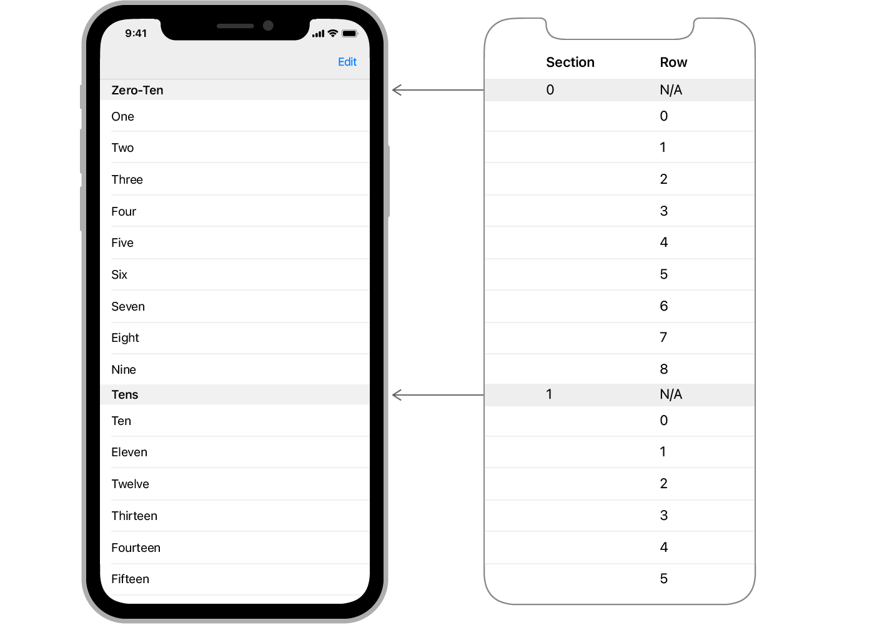

> 导航：[技术](../technologies.md) · [UIKit](../uikit.md)

# UITableViewDataSource

<sub>协议</sub>

一个对象为了管理数据和为表格视图提供单元格而采用的协议方法。

<sub>iOS, iPadOS, Mac Catalyst, tvOS, visionOS</sub>

```swift
@MainActor protocol UITableViewDataSource : NSObjectProtocol
```

## 概述

表格视图（Table View）只管理它们数据的呈现方式，而不管理数据本身。为了管理数据，你需要为表格提供一个数据源对象（data source object）——一个实现了 [UITableViewDataSource](uitableviewdatasource.md) 协议的对象。数据源对象响应表格发起的与数据相关的请求。它还可以直接管理表格的数据，或与你 App 的其他部分协作来管理这些数据。数据源对象的其他职责包括：

- 报告表格中的分区（section）和行（row）的数量。
- 为表格的每一行提供单元格（cell）。
- 提供分区页眉（header）和页脚（footer）的标题。
- 配置表格的索引（如果有的话）。
- 响应用户或表格发起的、需要更改底层数据的更新。

该协议只有两个方法是必需的，如下面的示例代码所示。

```swift
// 返回表格中的行数。     
override func tableView(_ tableView: UITableView, numberOfRowsInSection section: Int) -> Int {
   return 0
}

// 为每一行提供单元格对象。
override func tableView(_ tableView: UITableView, cellForRowAt indexPath: IndexPath) -> UITableViewCell {
   // 获取合适类型的单元格。
   let cell = tableView.dequeueReusableCell(withIdentifier: "cellTypeIdentifier", for: indexPath)
   
   // 配置单元格的内容。
   cell.textLabel!.text = "Cell text"
       
   return cell
}
```

使用此协议中的其他方法来为你的表格启用特定功能。例如，你必须实现 [- tableView:commitEditingStyle:forRowAtIndexPath:](<uitableviewdatasource/tableview(__commit_forrowat_).md>) 方法来启用行的滑动删除功能。

有关如何使用数据源对象创建和配置表格单元格的信息，请参阅[用数据填充表格](filling-a-table-with-data.md)。

### 指定行和分区的位置

表格视图通过 [NSIndexPath](../foundation/nsindexpath.md) 对象的 [row](../foundation/nsindexpath/row.md) 和 [section](../foundation/nsindexpath/section.md) 属性来向你传递单元格的位置。行和分区的索引是从零开始的，因此第一个分区的索引为 `0`，第二个为 `1`，以此类推。同样，每个分区的第一行的索引为 `0`，这意味着你需要同时使用 [section](../foundation/nsindexpath/section.md) 和 [row](../foundation/nsindexpath/row.md) 值来唯一标识一行。如果你的表格没有分区，你只需要 [row](../foundation/nsindexpath/row.md) 值。



<sub>图示展示了一个包含多个分区的表格。第一个分区索引为 0，无行值。该分区的九行索引在 0 到 8 之间。第二个分区索引为 1，无行值。其第一行再次从索引 0 开始。</sub>

## 关系

- **继承自**：[NSObjectProtocol](../objectivec/nsobjectprotocol.md)

- **遵循类型**：[UITableViewController](uitableviewcontroller.md)、[UITableViewDiffableDataSource](uitableviewdiffabledatasource-2euir.md)、[UITableViewDiffableDataSourceReference](uitableviewdiffabledatasourcereference.md)

## 主题

### 提供行和分区的数量

- [- tableView:numberOfRowsInSection:](<uitableviewdatasource/tableview(__numberofrowsinsection_).md>) — 告知数据源返回表格视图指定分区中的行数。
- [- numberOfSectionsInTableView:](<uitableviewdatasource/numberofsections(in_).md>) — 要求数据源返回表格视图中的分区数。

### 提供单元格、页眉和页脚

- [- tableView:cellForRowAtIndexPath:](<uitableviewdatasource/tableview(__cellforrowat_).md>) — 要求数据源提供一个单元格，以插入到表格视图的特定位置。
- [- tableView:titleForHeaderInSection:](<uitableviewdatasource/tableview(__titleforheaderinsection_).md>) — 要求数据源返回表格视图指定分区的页眉标题。
- [- tableView:titleForFooterInSection:](<uitableviewdatasource/tableview(__titleforfooterinsection_).md>) — 要求数据源返回表格视图指定分区的页脚标题。

### 插入或删除表格行

- [- tableView:commitEditingStyle:forRowAtIndexPath:](<uitableviewdatasource/tableview(__commit_forrowat_).md>) — 要求数据源提交对指定行的插入或删除操作。
- [- tableView:canEditRowAtIndexPath:](<uitableviewdatasource/tableview(__caneditrowat_).md>) — 要求数据源验证指定行是否可编辑。

### 重新排列表格行

- [- tableView:canMoveRowAtIndexPath:](<uitableviewdatasource/tableview(__canmoverowat_).md>) — 询问数据源指定行是否可以移动到表格视图中的其他位置。
- [- tableView:moveRowAtIndexPath:toIndexPath:](<uitableviewdatasource/tableview(__moverowat_to_).md>) — 告知数据源将表格视图中特定位置的行移动到另一个位置。

### 配置索引

- [- sectionIndexTitlesForTableView:](<uitableviewdatasource/sectionindextitles(for_).md>) — 要求数据源返回表格视图各分区的标题。
- [- tableView:sectionForSectionIndexTitle:atIndex:](<uitableviewdatasource/tableview(__sectionforsectionindextitle_at_).md>) — 要求数据源返回具有给定标题和分区标题索引的分区的索引。

## 另请参阅

### 数据

- [用数据填充表格](filling-a-table-with-data.md) — 使用数据源对象动态创建和配置表格的单元格，或从故事板静态提供它们。
- [异步加载图像到表格和集合视图](asynchronously-loading-images-into-table-and-collection-views.md) — 异步存储和获取图像，让你的 App 响应更迅速。
- [UITableViewDataSourcePrefetching](uitableviewdatasourceprefetching.md) — 一个提供表格视图数据需求预通知的协议，允许你提前启动可能耗时的数据操作。
- [UITableViewDiffableDataSource](uitableviewdiffabledatasource-2euir.md) — 你用来管理数据和为表格视图提供单元格的对象。
- [NSDiffableDataSourceSnapshot](nsdiffabledatasourcesnapshot-swift.struct.md) — 视图中数据在特定时间点状态的一种表示。
- [UILocalizedIndexedCollation](uilocalizedindexedcollation.md) — 一个为带有分区索引的表格视图整理、排序和本地化数据的对象。
- [UIDataSourceTranslating](uidatasourcetranslating.md) — 用于管理数据源对象的高级接口。
- [UIRefreshControl](uirefreshcontrol.md) — 一个可以触发滚动视图内容刷新的标准控制。
