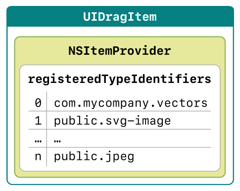

> 导航：[技术](../technologies.md) · [UIKit](../uikit.md) · [拖放](drag-and-drop.md)

# 将拖动条目理解为承诺

文章

使用拖动条目，在来源 App 与目标 App 之间传达数据表示承诺。

## 概述

当用户拖动你的 App 中某个条目的屏幕视觉表示（例如照片、地图位置、日历日程或所选文本）时，你的 App 会将底层数据与一个_拖动条目（drag item）_相关联。拖动条目继而使用一个_条目提供程序（item provider）_。你的 App 使用[统一类型标识符（UTI）](https://developer.apple.com/library/content/documentation/General/Conceptual/DevPedia-CocoaCore/UniformTypeIdentifier.html)填充条目提供程序的 [registeredTypeIdentifiers](../foundation/nsitemprovider/registeredtypeidentifiers.md) 数组。

UTI 数组构成了来源 App 的承诺，指明它能够应目标 App 的请求交付哪些具体的数据表示。_承诺（promise）_一词表示：你的 App 在构造拖动条目时，承诺提供某些数据表示，但尚未执行创建这些表示所需的工作。虽然在用户看来是条目本身正在被拖动，但拖动条目实际由这些承诺以及一个始终位于用户屏幕触点下方的预览图像组成。

你的 App 中构造拖动条目的部分是_拖动交互委托（drag interaction delegate）_（[UIDragInteractionDelegate](uidraginteractiondelegate.md)）。在目标端，App 的_放置交互委托（drop interaction delegate）_（[UIDropInteractionDelegate](uidropinteractiondelegate.md)）会与拖动条目交互，以使用所承诺的数据。

下表展示了你为支持构造或使用拖动条目而实现的协议，具体取决于 App 中的视图充当来源还是目标：

| 拖放（drag and drop）角色 | 协议 | 你的实现 |
|---|---|---|
| 来源 App | [NSItemProviderWriting](../foundation/nsitemproviderwriting.md) | 注册 UTI |
| 目标 App | [NSItemProviderReading](../foundation/nsitemproviderreading.md) | 请求条目 |

以下类会自动支持这些协议：[NSString](../foundation/nsstring.md)、[NSAttributedString](../foundation/nsattributedstring.md)、[NSURL](../foundation/nsurl.md)、[UIColor](uicolor.md) 和 [UIImage](uiimage.md)。

## 另请参阅

### 基础

- [将视图设为拖动来源](making-a-view-into-a-drag-source.md) — 采用拖动交互 API 来提供可供拖动的条目。
- [将视图设为放置目标](making-a-view-into-a-drop-destination.md) — 采用放置交互 API 来有选择地使用拖动内容。
- [在自定视图中采用拖放](adopting-drag-and-drop-in-a-custom-view.md) — 演示如何为 `UIImageView` 实例启用拖放。
- [在表格视图中采用拖放](adopting-drag-and-drop-in-a-table-view.md) — 演示如何为表格视图启用并实现拖放。
