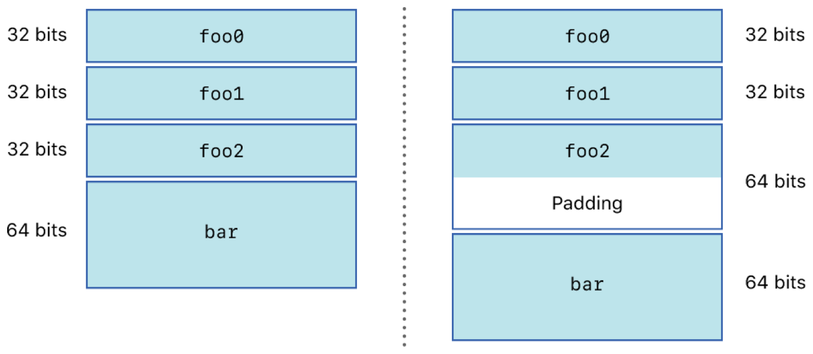

> 导航：[技术](../technologies.md) · [UIKit](../uikit.md) · [App 与环境](app-and-environment.md) · [将你的 App 从 32 位架构更新到 64 位架构](updating-your-app-from-32-bit-to-64-bit-architecture.md)

# 更新数据结构

<sub>文章</sub>

检查你的 App 的数据设计，并将其更新为符合 64 位架构。

## 概述

将 App 迁移到 64 位架构时，请重新审视代码中的结构体。检查具有 32 位表示的 C 结构体。64 位运行时对结构体内容的对齐方式不同，因此你需要特别注意将数据存储到文件或通过网络传输数据的结构体。架构位数不同的设备都可能使用这些结构体。

未使用显式大小类型的代码可能会给审查代码的其他开发者带来问题。显式大小的类型声明可明确对数据大小的预期，并消除对架构的假设。

函数中的类型声明与其在代码中的用法不一致，会导致运行时行为不一致。你需要确保传给函数的数据或作为返回值捕获的数据，与声明的参数类型相同。

### 对齐 64 位整数类型

由于 64 位架构的大小增加，运行时中所有 64 位整数类型的对齐从 4 字节变为 8 字节。即使明确指定了每种整数类型，两个结构体在两种运行时中也仍可能并不相同。如果你需要在 64 位版本中读取 App 的 32 位版本所创建的数据，了解这一点十分重要。

在以下代码中，即使字段使用显式整数类型声明，对齐方式仍然会发生变化。

```objc
struct bar {
    int32_t foo0;
    int32_t foo1;
    int32_t foo2;
    int64_t bar;
};
```

使用 32 位编译器编译此代码时，字段 `bar` 位于距结构体起始位置 12 字节处。使用 64 位编译器编译相同代码时，字段 `bar` 位于距结构体起始位置 16 字节处。系统会在 `foo2` 后添加 4 个填充字节，使 `bar` 与 8 字节边界对齐。



如果你正在定义新的数据结构，请将对齐值最大的元素放在前面，对齐值最小的元素放在最后。这种组织方式能让你无需使用大多数填充字节。如果你正在处理包含未对齐 64 位整数的现有结构体，可以使用 pragma 强制采用适当的对齐方式。以下代码展示了相同的数据结构，但在这里强制它使用 32 位对齐规则。

```objc
#pragma pack(4)
struct bar {
    int32_t foo0;
    int32_t foo1;
    int32_t foo2;
    int64_t bar;
};
#pragma options align=reset
```

请谨慎使用此选项，因为未对齐访问会造成性能损失。例如，你可以使用此选项来维持与 App 32 位版本中已部署数据结构的向后兼容性。

### 使用显式整数数据类型

C99 标准提供内建数据类型，无论底层硬件架构如何，都保证具有特定大小。下表列出了 C99 类型以及为每种类型定义的值范围。

| 类型 | 定义的范围 |
|---|---|
| `int16_t` | -32,768 至 32,767 |
| `int32_t` | -2,147,483,648 至 2,147,483,647 |
| `int64_t` | -9,223,372,036,854,775,808 至 9,223,372,036,854,775,807 |
| `uint8_t` | 0 至 255 |
| `uint16_t` | 0 至 65,535 |
| `uint32_t` | 0 至 4,294,967,295 |
| `uint64_t` | 0 至 18,446,744,073,709,551,615 |

避免使用 `short`、`int` 或 `unsigned int` 等类型。请改用无论底层硬件架构如何都保证具有特定大小的类型。

选择固定宽度类型还可避免分配取值范围远大于实际需要的变量，从而节省内存。

### 保持数据类型一致

代码中不一致的数据类型用法可能会截断计算结果，并产生不正确的结果。尽管编译器会警告你许多因数据类型不一致而导致的问题，但了解这些模式的几种变体仍很有帮助，以便在代码中识别它们。

调用函数时，始终让接收结果的变量与函数的返回类型相匹配。如果返回类型的整数宽度大于接收变量的宽度，值就会被截断。以下代码展示了会出现此问题的一种简单模式。

```objc
long PerformCalculation(void);

int  x = PerformCalculation(); // 错误。

long y = PerformCalculation(); // 正确。
```

`PerformCalculation` 函数返回一个长整数。在 32 位运行时中，`int` 和 `long` 都是 32 位，因此即使代码不正确，赋值给 `int` 类型仍然可行。在 64 位运行时中，赋值时会丢失结果的高 32 位。结果应当赋给长整数；这种方式在两种运行时中都能保持一致。

将值作为参数传入时也会发生同样的问题。这里，在 64 位运行时中执行时，输入参数会被截断。

```objc
int PerformAnotherCalculation(int input);

long i = LONG_MAX;

int x = PerformCalculation(i);
```

在以下代码中，返回值在 64 位运行时中也会被截断，因为返回的值超出了函数返回类型的范围。

```objc
int ReturnMax()
{
    return LONG_MAX;
}
```

所有这些示例都源于代码假设 `int` 与 `long` 相同。ANSI C 标准并未做出这一假设，而在 64 位运行时中，这一假设明确是错误的。默认情况下，如果你按照[将你的 App 从 32 位架构更新到 64 位架构](updating-your-app-from-32-bit-to-64-bit-architecture.md)中的说明将项目现代化，`-Wshorten-64-to-32` 编译器选项会自动启用，因此编译器会自动警告许多值被截断的情况。如果你没有将项目现代化，应显式启用该编译器选项。你也可以选择加入 `-Wconversion` 选项；它会输出更多信息，也能发现更多潜在错误。

### 为枚举值选择适当的数据类型

在 LLVM 编译器中，枚举类型可以定义枚举的大小，因此某些枚举类型可能比你预期的更大。与其他所有情况一样，解决方案是不要对数据类型的大小做出假设。请将所有枚举值赋给具有适当数据类型的变量。

### 查找常见的类型转换问题

系统在声明数值类型时广泛使用 `NSInteger` 类型。它在 32 位运行时中是 32 位整数，在 64 位运行时中是 64 位整数。绝不要假设 `NSInteger` 类型与 `int` 类型大小相同。请在代码中查找以下几种情况：

- 与 [NSNumber](../foundation/nsnumber.md) 对象相互转换。
- 使用 [NSCoder](https://developer.apple.com/library/archive/releasenotes/MacOSX/WhatsNewInOSX/Articles/MacOSX10_11.html#//apple_ref/doc/uid/TP40016227-SW42) 类编码和解码数据。特别是，如果你在 64 位设备上编码 `NSInteger`，之后又在 32 位设备上将其解码，当值超出 32 位整数范围时，解码方法会抛出异常。你可能需要改用显式整数类型。
- 使用框架中定义为 `NSInteger` 的常量。尤其需要注意 `NSNotFound` 常量。在 64 位运行时中，它的值大于 `int` 类型的最大范围，因此截断该值经常会导致 App 出错。

不要假设 `CGFloat` 的大小。转换后，`CGFloat` 类型会变为 64 位浮点数。与 `NSInteger` 类型一样，你不能假设 `CGFloat` 是 `float` 或 `double`，所以请始终一致地使用它。以下代码展示了一个使用 Core Foundation 创建 `CFNumber` 的示例：

```objc
// 错误。
CGFloat value = 200.0;
CFNumberCreate(kCFAllocatorDefault, kCFNumberFloatType, &value);

// 正确。
CGFloat value = 200.0;
CFNumberCreate(kCFAllocatorDefault, kCFNumberCGFloatType, &value);
```

代码的第一部分假设 `CGFloat` 与 `float` 大小相同，这是错误的。第二部分正确地将 `kCFNumberCGFloatType` 指定为要创建的类型。

## 另请参阅

### 内存与指针访问

- [审核指针用法](auditing-pointer-usage.md) — 确保代码中的指针对 64 位运行时是安全的。
- [管理函数和函数指针](managing-functions-and-function-pointers.md) — 确保你的代码正确处理函数、函数指针和 Objective-C 消息。
