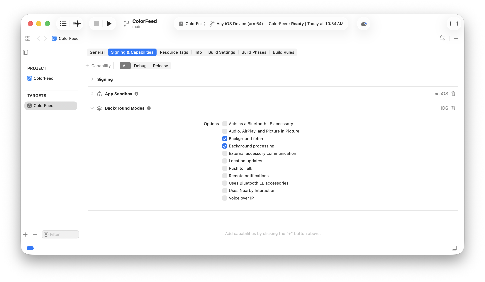
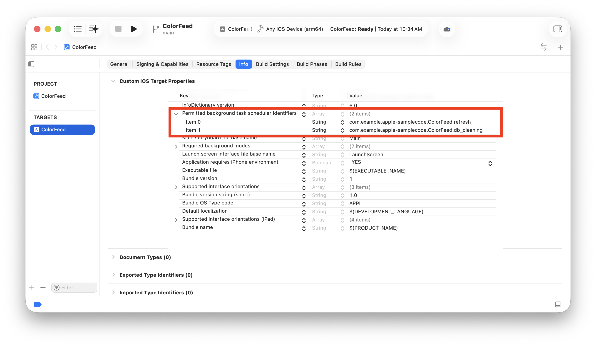
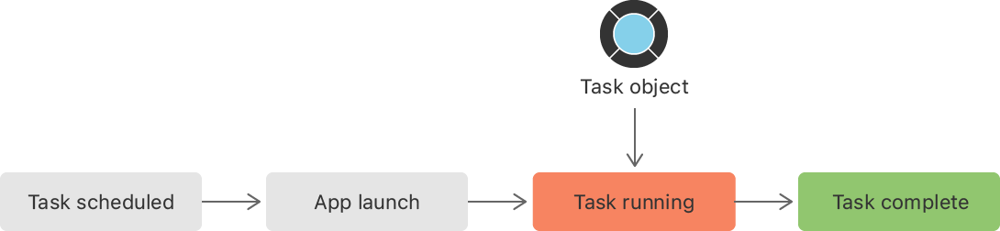

> 导航：[技术](../technologies.md) · [UIKit](../uikit.md) · [App 与环境](app-and-environment.md) · [场景](scenes.md) · [准备让你的用户界面在后台运行](preparing-your-ui-to-run-in-the-background.md)

# 使用后台任务更新你的 App

<sub>文章</sub>

配置你的 App，让它在后台执行任务，以高效利用处理时间和电量。

## 概述

_任务（task）_是 App 执行的一项独立活动，通常会定期重复。任务示例包括维护数据库、优化机器学习模型或更新显示的数据。你可以配置 App，让它在后台启动并运行任务，从而利用设备未被使用时的处理时间。

若要调度一个任务在后台运行，请在 Xcode 中启用后台模式，确定所需的具体任务，然后向 [BGTaskScheduler](../backgroundtasks/bgtaskscheduler.md) 对象注册这些任务。

### 启用并调度后台任务

若要配置 App 以允许后台任务，请启用所需的后台功能，然后为每个任务创建唯一标识符列表。

后台任务分为两种类型：[BGAppRefreshTask](../backgroundtasks/bgapprefreshtask.md) 和 [BGProcessingTask](../backgroundtasks/bgprocessingtask.md)。[BGAppRefreshTask](../backgroundtasks/bgapprefreshtask.md) 用于预期快速得到结果的短时任务，例如下载股票报价。[BGProcessingTask](../backgroundtasks/bgprocessingtask.md) 用于可能耗时较长的任务，例如下载大文件或同步数据。你的 App 可以使用其中一种或同时使用两种。

若要添加这些功能：

1. 打开项目编辑器并选择所需的目标。
2. 点按「Signing & Capabilities」。
3. 展开「Background Modes」部分。如果目标没有「Background Modes」部分，请点按「+ Capability」，然后选择「Background Modes」。
4. 如果你使用 [BGAppRefreshTask](../backgroundtasks/bgapprefreshtask.md)，请选择「Background fetch」。
5. 如果你使用 [BGProcessingTask](../backgroundtasks/bgprocessingtask.md)，请选择「Background processing」。



你可以通过注册允许的任务标识符列表，控制哪些任务在后台运行。若要创建此列表，请将标识符添加到 `Info.plist` 文件。

1. 打开项目导览器并选择你的目标。
2. 点按「Info」，然后展开「Custom iOS Target Properties」。
3. 向列表添加一个新条目并选择「Permitted background task scheduler identifiers」，它对应于 [BGTaskSchedulerPermittedIdentifiers](../bundleresources/information-property-list/bgtaskschedulerpermittedidentifiers.md) 数组。
4. 将每个获准任务标识符的字符串分别添加为数组中的一个条目。



<sub>插图显示「Info」面板的「Custom iOS Target Properties」编辑器。一个方框圈出了「Permitted background task schedule identifiers」数组中的示例条目，该数组显示两个标识符：条目 0 是 refresh，条目 1 是 db_cleaning。</sub>

在 iOS 13 及更高版本中，向 `Info.plist` 添加 [BGTaskSchedulerPermittedIdentifiers](../bundleresources/information-property-list/bgtaskschedulerpermittedidentifiers.md) 键会停用 [- application:performFetchWithCompletionHandler:](<uiapplicationdelegate/application(__performfetchwithcompletionhandler_).md>) 和 [- setMinimumBackgroundFetchInterval:](<uiapplication/setminimumbackgroundfetchinterval(__).md>) 方法。

### 注册、调度并运行任务

对于每个任务，请向 [BGTaskScheduler](../backgroundtasks/bgtaskscheduler.md) 对象提供一个_启动处理程序（launch handler）_（运行任务的一小段代码）和一个唯一标识符。在 App 启动序列结束前注册所有任务。有关更多信息，请参阅[关于 App 启动序列](about-the-app-launch-sequence.md)。

> [!note] 注意
> 扩展可以调度任务，但必须由你的主 App 注册任务。系统会启动该 App 来运行任务。



<sub>流程图显示任务对象何时运行。流程从 App 启动开始，随后任务被调度、运行并完成。</sub>

以下代码注册一个处理程序 `handleAppRefresh(task:)`，当系统运行标识符为 `com.example.apple-samplecode.ColorFeed.refresh` 的任务请求时，会调用该处理程序。

```swift
BGTaskScheduler.shared.register(forTaskWithIdentifier: "com.example.apple-samplecode.ColorFeed.refresh", using: nil) { task in
     self.handleAppRefresh(task: task as! BGAppRefreshTask)
}
```

若要提交任务请求，让系统稍后在后台启动你的 App，请使用 [submit(_:)](<../backgroundtasks/bgtaskscheduler/submit(__).md>)。重新提交任务时，新提交会取代先前的提交。

以下代码为你先前注册的任务标识符 `com.example.apple-samplecode.ColorFeed.refresh` 调度一个刷新任务请求。

```swift
func scheduleAppRefresh() {
   let request = BGAppRefreshTaskRequest(identifier: "com.example.apple-samplecode.ColorFeed.refresh")
   // 最早从现在起 15 分钟后获取。
   request.earliestBeginDate = Date(timeIntervalSinceNow: 15 * 60)
        
   do {
      try BGTaskScheduler.shared.submit(request)
   } catch {
      print("Could not schedule app refresh: \(error)")
   }
}
```

当系统在后台打开你的 App 时，它会调用启动处理程序来运行任务。

你的任务提供一个到期处理程序（expiration handler），当系统需要终止任务时会调用它。你还需要添加代码，通知系统任务是否成功完成。

```swift
func handleAppRefresh(task: BGAppRefreshTask) {
   // 调度一个新的刷新任务。
   scheduleAppRefresh()

   // 创建一个执行后台任务主要部分的操作。
   let operation = RefreshAppContentsOperation()
   
   // 为后台任务提供一个取消该操作的到期处理程序。
   task.expirationHandler = {
      operation.cancel()
   }

   // 当操作完成时，通知系统
   // 后台任务已经完成。
   operation.completionBlock = {
      task.setTaskCompleted(success: !operation.isCancelled)
   }

   // 开始该操作。
   operationQueue.addOperation(operation)
 }
```

## 另请参阅

### 后台运行

- [延长你的 App 的后台运行时间](extending-your-app-s-background-execution-time.md) — 确保 App 进入后台时关键任务能够完成。
- [关于后台运行序列](about-the-background-execution-sequence.md) — 了解 App 进入后台时执行自定代码的顺序。
