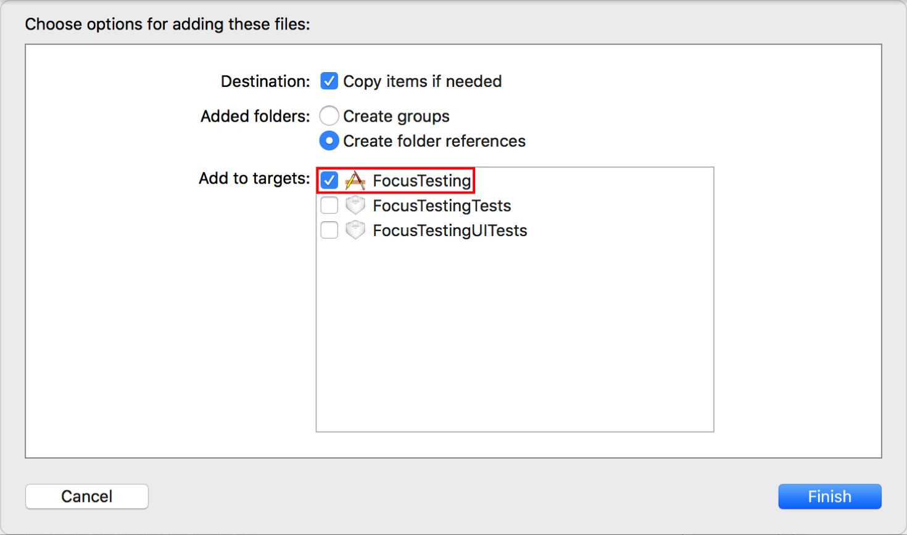

> 导航：[技术](../technologies.md) · [UIKit](../uikit.md) · [基于焦点的导览](focus-based-navigation.md) · [UIFocusEnvironment](uifocusenvironment.md)

# 为焦点移动使用自定声音

<sub>文章</sub>

自定焦点移动时用户听到的声音。

## 概述

默认的焦点（focus）移动声音足以满足绝大多数 App 的需要。不过，有时你可能想把默认声音改为更适合你的 App 的自定声音。

### 向你的 App 添加自定声音文件

将自定焦点声音文件拖入你的 Xcode 项目。确保将该 App 选为目标。你可以使用任何符合标准 iOS 声音文件格式且时长少于 30 秒的声音文件。不过，请务必确保你创建的声音适合你的 App。如果用户每次移动焦点时都要播放一段 20 秒的声音，就无法带来良好的用户体验。



### 注册你的声音文件

向 App 添加声音文件后，你必须向焦点环境注册该文件。注册声音文件之前，必须使用 [UIFocusSoundIdentifier](uifocussoundidentifier.md) 为声音创建一个标识符。该标识符在 App 中必须唯一。创建标识符后，在 App 包中找到声音文件，并使用 [+ registerURL:forSoundIdentifier:](<uifocussystem/register(__forsoundidentifier_).md>) 注册该文件。

```swift
let myPing = UIFocusSoundIdentifier.init(rawValue: "customPing")
let soundURL = Bundle.main.url(forResource: "ping", withExtension: "aif")!
UIFocusSystem.register(_: soundURL, forSoundIdentifier: myPing)
```

注册声音文件时，需要记住以下几点：

- 在 App 生命周期的早期注册声音文件。为播放准备声音的成本不可忽略，因此你需要在焦点更新发生时确保声音已经完全准备就绪。
- 你可以在 App 中注册多个声音文件。
- 每个声音文件只注册一次。注册已经注册过的声音文件会产生错误，并立即导致断言失败。
- 若要了解条目获得焦点时会播放哪种焦点声音，请参阅 [WWDC 2017 视频《tvOS 11 中的焦点交互》](https://developer.apple.com/videos/play/wwdc2017/224/)。

### 覆盖默认焦点声音

焦点发生变化时，系统会调用 [- soundIdentifierForFocusUpdateInContext:](<uifocusenvironment/soundidentifierforfocusupdate(in_).md>) 函数。如果未实现此函数，系统会播放默认焦点声音。覆盖该函数，以便在焦点变化时播放你的自定声音。

```swift
override func soundIdentifierForFocusUpdate(in context: UIFocusUpdateContext) -> UIFocusSoundIdentifier? {    
    return myPing
}
```

## 另请参阅

### 获取更新期间要播放的声音

- [- soundIdentifierForFocusUpdateInContext:](<uifocusenvironment/soundidentifierforfocusupdate(in_).md>) — 向委托（delegate）询问对象获得焦点时要播放的声音标识符。
- [UIFocusSoundIdentifier](uifocussoundidentifier.md) — 焦点相关声音的标识符。
