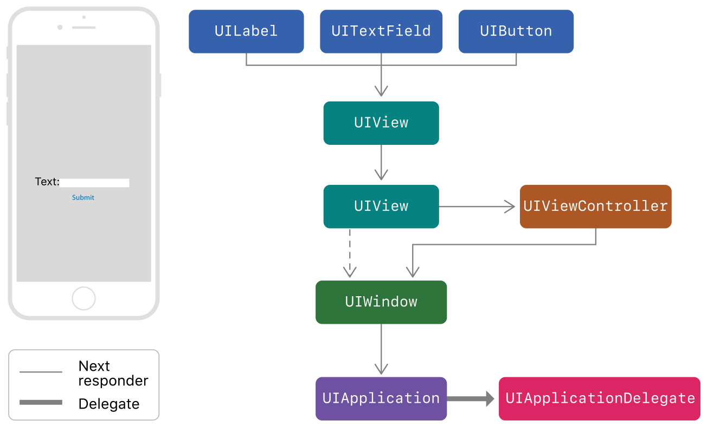

> 导航：[Technologies](../technologies.md) · [UIKit](../uikit.md) · [触控、按压和手势](touches-presses-and-gestures.md)

# 使用响应者和响应者链处理事件

文章

了解如何处理在 App 中传播的事件。

## 概述

App 使用*响应者对象（responder object）*接收和处理事件。响应者对象是 [UIResponder](uiresponder.md) 类的任何实例，常见子类包括 [UIView](uiview.md)、[UIViewController](uiviewcontroller.md) 和 [UIApplication](uiapplication.md)。响应者接收原始事件数据，并且必须处理事件或将其转发给另一个响应者对象。当 App 收到事件时，UIKit 会自动将该事件定向到最适合的响应者对象，称为*第一响应者（first responder）*。

未处理的事件会在活跃的*响应者链（responder chain）*中从一个响应者传递到另一个响应者。响应者链是 App 响应者对象的动态配置。下图显示了一个 App 中的响应者，其界面包含一个标签、一个文本栏、一个按钮和两个背景视图。图中还显示了事件如何沿响应者链从一个响应者移动到下一个响应者。

一个流程图：左侧的示例 App 包含标签（UILabel）、供用户输入文本的文本栏（UITextField），以及输入文本后要按下的按钮（UIButton）。右侧的流程图显示用户按下按钮后，事件如何沿响应者链移动——从 UIView 到 UIViewController，再到 UIWindow、UIApplication，最后到 UIApplicationDelegate。

如果文本栏不处理某个事件，UIKit 会将该事件发送到文本栏的父 [UIView](uiview.md) 对象，然后发送到窗口的根视图。从根视图开始，响应者链会转向所属的视图控制器（view controller），然后再将事件定向到窗口。如果窗口无法处理事件，UIKit 会将事件递送给 [UIApplication](uiapplication.md) 对象；如果 App 委托（app delegate）是 [UIResponder](uiresponder.md) 的实例且尚不属于响应者链，还可能递送给 App 委托。

### 确定事件的第一响应者

UIKit 根据事件类型将一个对象指定为该事件的第一响应者。事件类型包括：

| 事件类型 | 第一响应者 |
|---|---|
| 触控事件 | 触控发生所在的视图。 |
| 按压事件 | 具有焦点的对象。 |
| 摇动事件 | 由你（或 UIKit）指定的对象。 |
| 远程控制事件 | 由你（或 UIKit）指定的对象。 |
| 编辑菜单消息 | 由你（或 UIKit）指定的对象。 |

> [!note] 注意
> 与加速计、陀螺仪和磁力计相关的运动事件不遵循响应者链。Core Motion 会将这些事件直接递送给指定对象。有关更多信息，请参阅 [Core Motion Framework](https://developer.apple.com/library/archive/documentation/Miscellaneous/Conceptual/iPhoneOSTechOverview/CoreServicesLayer/CoreServicesLayer.html#//apple_ref/doc/uid/TP40007898-CH10-SW27)。

控制使用操作消息直接与关联的目标对象通信。用户与控制交互时，控制会向目标对象发送操作消息。操作消息不是事件，但仍可利用响应者链。当控制的目标对象为 `nil` 时，UIKit 会从目标对象开始遍历响应者链，直到找到实现相应操作方法的对象。例如，UIKit 编辑菜单会使用此行为搜索实现了 [- cut:](<uiresponderstandardeditactions/cut(__).md>)、[- copy:](<uiresponderstandardeditactions/copy(__).md>) 或 [- paste:](<uiresponderstandardeditactions/paste(__).md>) 等方法的响应者对象。

手势识别器（gesture recognizer）会先于其视图接收触控和按压事件。如果视图的手势识别器无法识别一系列触控，UIKit 会将这些触控发送到视图。如果视图不处理这些触控，UIKit 会沿响应者链向上传递它们。有关使用手势识别器处理事件的更多信息，请参阅[处理 UIKit 手势](handling-uikit-gestures.md)。

### 确定包含触控事件的响应者

UIKit 使用基于视图的命中测试（hit-testing）来确定触控事件发生的位置。具体来说，UIKit 会将触控位置与视图层级结构（view hierarchy）中视图对象的边界进行比较。[UIView](uiview.md) 的 [- hitTest:withEvent:](<uiview/hittest(__with_).md>) 方法会遍历视图层级结构，查找包含指定触控的最深层子视图，该子视图将成为触控事件的第一响应者。

> [!note] 注意
> 如果触控位置位于视图边界之外，[- hitTest:withEvent:](<uiview/hittest(__with_).md>) 方法会忽略该视图及其所有子视图。因此，当视图的 [clipsToBounds](uiview/clipstobounds.md) 属性（property）为 [false](../swift/false.md) 时，即使位于该视图边界之外的子视图恰好包含该触控，也不会返回这些子视图。有关命中测试行为的更多信息，请参阅 [UIView](uiview.md) 中对 [- hitTest:withEvent:](<uiview/hittest(__with_).md>) 方法的讨论。

触控发生时，UIKit 会创建一个 [UITouch](uitouch.md) 对象，并将其与视图关联。当触控位置或其他参数发生变化时，UIKit 会使用新信息更新同一个 [UITouch](uitouch.md) 对象。唯一不变的属性是视图。（即使触控位置移动到原视图之外，触控的 [view](uitouch/view.md) 属性值也不会变化。）触控结束时，UIKit 会释放 [UITouch](uitouch.md) 对象。

### 更改响应者链

你可以通过覆盖响应者对象的 [nextResponder](uiresponder/next.md) 属性来更改响应者链。执行此操作时，下一个响应者就是你返回的对象。

许多 UIKit 类已经覆盖此属性并返回特定对象，其中包括：

- [UIView](uiview.md) 对象。如果视图是视图控制器的根视图，则下一个响应者是该视图控制器；否则，下一个响应者是该视图的父视图。
- [UIViewController](uiviewcontroller.md) 对象。
- 如果视图控制器的视图是窗口的根视图，则下一个响应者是窗口对象。
- 如果视图控制器由另一个视图控制器呈现，则下一个响应者是进行呈现的视图控制器。
- [UIWindow](uiwindow.md) 对象。窗口的下一个响应者是 [UIApplication](uiapplication.md) 对象。
- [UIApplication](uiapplication.md) 对象。下一个响应者是 App 委托，但前提是 App 委托是 [UIResponder](uiresponder.md) 的实例，且不是视图、视图控制器或 App 对象本身。

## 另请参阅

### 基础

- [UIResponder](uiresponder.md) — 用于响应和处理事件的抽象接口。
- [UIEvent](uievent.md) — 描述用户与 App 的单次交互的对象。
