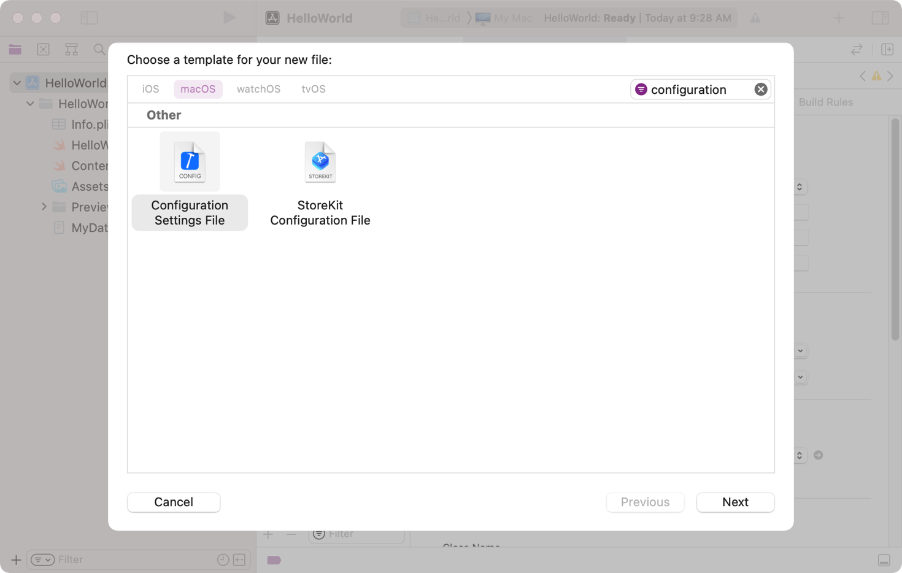
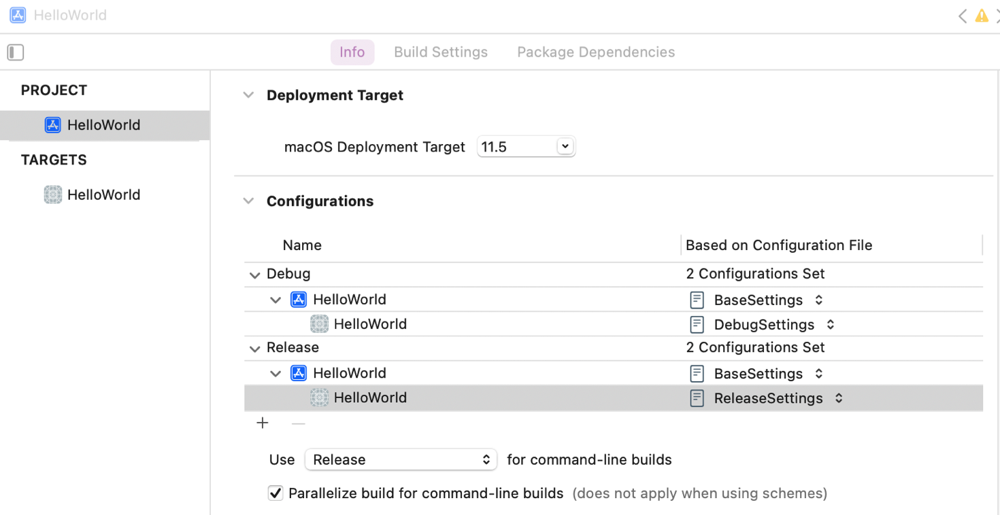

> 导航：[Technologies](../technologies.md) · [Xcode](../xcode.md) · [Build system](build-system.md)

# 向你的项目添加构建配置文件

<sub>文章</sub>

以纯文本文件的形式指定你项目的构建设置，并为调试构建和发行版构建提供不同的设置。

## 概述

构建配置文件是一个纯文本文件，你用它来为某个特定的 target 或你的整个项目指定构建设置。构建配置文件让你更容易自行管理构建设置，也更容易针对不同的架构和平台自动更改构建设置。使用构建配置文件时，你只需在文本文件中放入你想要修改的设置。你可以创建多个文件，每个文件包含不同的构建设置组合，并且可以快速为你的 target 或项目更改设置。Xcode 会把你的设置叠加在项目其他相关设置之上，从而生成最终的构建配置。

在以下情况中，构建配置文件尤其有用：

- 你希望根据当前平台、架构或构建类型使用不同的构建设置。
- 你希望以更便于查看的方式存储构建设置。
- 你希望在 Xcode 之外编辑构建设置。

有关构建配置文件如何与你项目的其他设置值集成的更多信息，请参阅[配置 target 的构建设置](configuring-the-build-settings-of-a-target.md)。

### 向你的项目添加构建配置文件

构建配置文件是一个你添加到项目中的文本文件，扩展名为 `.xcconfig`。你可以创建任意数量的构建配置文件，并在每个文件中配置不同的设置。例如，你可能会用一个构建配置文件存放调试设置，另一个存放发行版设置。

要创建一个构建配置文件：

1. 选择 File \> New File。
2. 选择 Configuration Settings File。
3. 点按 Next。
4. 为你的构建配置文件输入名称和位置。
5. 取消选中所有 target，防止 Xcode 将该文件作为资源嵌入到 target 的 bundle 中。
6. 点按 Create 将其添加到你的项目中。



### 将构建设置映射到某个构建配置

你可以为调试构建和发行版构建指定不同的构建配置文件，也可以将配置文件叠加在其他设置之上。要指定构建配置文件：

1. 在项目编辑器中选择你的项目。
2. 点按 Info 标签页。
3. 点按显示三角形，展开 Configurations 区域中的 Debug 和 Release 构建配置。
4. 从弹出式菜单中，为你的 Debug 和 Release 构建选择配置设置文件。你也可以选择一个同时应用于这两种构建类型的文件。



<sub>显示项目编辑器 Info 标签页的插图。Configurations 部分显示了分配给某个 target 及其项目的调试构建和发行版构建的构建配置文件。</sub>

Xcode 会先应用构建配置文件中的设置，再应用项目或 target 的 Build Settings 标签页中相应的设置。例如，如果你为你的 target 提供了一个构建配置文件，Xcode 会先应用项目设置，然后应用构建配置设置，最后应用 target 设置。

有关 Xcode 应用设置顺序的更多信息，请参阅[配置 target 的构建设置](configuring-the-build-settings-of-a-target.md)。

### 为某项设置赋值

要为某项设置指定新值，请使用以下格式将该设置添加到你的配置文件中：

```
<SettingName> = <SettingValue>
```

将每项设置放在单独一行，并且只在你的构建配置文件中包含你想要更改的设置。Xcode 会忽略行首和行尾的空格，因此你可以根据需要缩进设置。如果你多次添加同一项设置，Xcode 会使用该设置的最后一个实例，忽略之前的实例。

设置可能有许多种值类型，但下表列出了最常见的几种：

| 值类型 | 说明 |
|---|---|
| `Boolean` | 值为 `YES` 或 `NO`。 |
| `string` | 一个文本字符串。 |
| `enumeration (string)` | 一个预定义的文本字符串。有效值列表请参阅设置参考文档。 |
| `string list` | 由空格分隔的一组 `string` 值。如果列表中的某个字符串包含空格，请用引号将该字符串括起来。 |
| `path` | 采用 POSIX 形式的文件或目录路径。 |
| `path list` | 由空格分隔的一组 `path` 值。如果列表中的某个路径包含空格，请用引号将该路径括起来。 |

以下是一些设置示例：

```
ONLY_ACTIVE_ARCH = YES
MACOSX_DEPLOYMENT_TARGET = 11.0
OTHER_LDFLAGS = -lncurses
```

有关构建设置的列表，请参阅 [Build settings reference](build-settings-reference.md)。

### 用附加值扩充某项设置

在某些情况下，你可能想要扩充某项设置，而不是覆盖其当前值。例如，你可能想要为编译器添加更多标志，而不是替换现有的标志。要扩充某项设置的现有值，请将 `$(inherited)` 关键字添加到该设置的值中，如下例所示：

```
OTHER_SWIFT_FLAGS = $(inherited) -v
```

### 引用另一项设置的值

要复用某个已有构建设置的值，请将该设置的名称放入形如 `$(SettingName)` 的字符串中。在计算你的构建设置时，Xcode 会用相应设置的值替换这些引用。例如，以下定义将 `SYMROOT` 构建设置的值赋给了 `OBJROOT` 设置：

```
OBJROOT = $(SYMROOT)
```

在替换引用时，Xcode 会将该设置的值插入到与原始引用相同的位置。你可以在某个新值的中间插入引用，也可以使用多个其他值来定义某项设置，如下例所示：

```
DSTROOT = /tmp/$(PROJECT_NAME).dst
CONFIGURATION_BUILD_DIR = $(BUILD_DIR)/$(CONFIGURATION)$(EFFECTIVE_PLATFORM_NAME)
```

### 有条件地将某项设置应用于某个平台或架构

在某项构建设置后面添加一个条件表达式，可以让该设置只在特定平台或架构处于激活状态时才生效。要指定条件表达式，请将其放在构建设置名称后面的方括号中，如下例所示：

```
OTHER_LDFLAGS[arch=x86_64] = -lncurses
```

只有当某项设置的条件表达式求值为 true 时，Xcode 才会应用该构建设置。Xcode 支持以下条件：

| 条件 | 值 |
|---|---|
| `sdk` | 一个 SDK，例如 `macosx12.0` 或 `iphoneos15.0`。要匹配某个特定平台的所有版本，请用星号（*）替换版本号。例如，指定 `macosx*` 即可匹配任意 macOS SDK。 |
| `arch` | 一个 CPU 架构，例如 `arm64` 或 `x86_64`。 |
| `config` | 构建配置，例如 `Debug` 或 `Release`。 |

要为同一项构建设置添加多个条件，请将每个条件放在该设置名称后面各自独立的方括号中，如下例所示：

```
OTHER_LDFLAGS[sdk=macos*][arch=x86_64] = -lncurses
```

### 包含来自其他构建配置文件的设置

在为你的 target 指定构建配置文件时，你必须只选择一个文件，但该文件可以包含来自其他配置文件的设置。要导入来自另一个配置文件的设置，请添加一条 `#include` 语句：

```
#include "MyOtherConfigFile.xcconfig"
```

如果 Xcode 找不到被包含的构建配置文件，就会生成构建警告。要抑制这些警告，请在 `#include` 命令中添加一个问号（?），如下例所示：

```
#include? "MyOtherConfigFile.xcconfig"
```

Xcode 会在当前文件所在的同一个目录中查找被包含的构建配置文件。如果你的构建配置文件位于不同的目录中，请指定相对路径或绝对路径，如下例所示：

```
#include "../MyOtherConfigFile.xcconfig"    // 位于父目录中。
#include "/Users/MyUserName/Desktop/MyOtherConfigFile.xcconfig" // 位于指定路径。
```

### 为你的设置添加注释

在你的构建配置文件中添加注释，以包含与你相关的说明或其他信息。请在单独一行中、以两个正斜杠（`//`）开头指定你的注释。构建系统会忽略从注释分隔符到当前行末尾的所有内容。例如：

```
//
//  Base Settings.xcconfig
//  Base Settings
//
//  Created by Johnny Appleseed on 7/21/21.
//
```

你也可以在包含某项构建设置定义的行末尾添加注释，如下例所示：

```
ASSETCATALOG_COMPILER_APPICON_NAME = MyAppIcon // 这是一条注释。
```

## 另请参阅

### 构建设置

- [Configuring the build settings of a target](configuring-the-build-settings-of-a-target.md) — 指定用于编译、链接并从 target 生成产品的选项，并识别从项目或系统继承的设置。
- [Build settings reference](build-settings-reference.md) — 详细列出各项控制或改变 target 构建方式的 Xcode 构建设置。
- [Identifying and addressing framework module issues](identifying-and-addressing-framework-module-issues.md) — 使用模块验证器检测并修复框架模块中的常见问题。
- [Understanding build product layout changes in Xcode](understanding-build-product-layout-changes.md)
