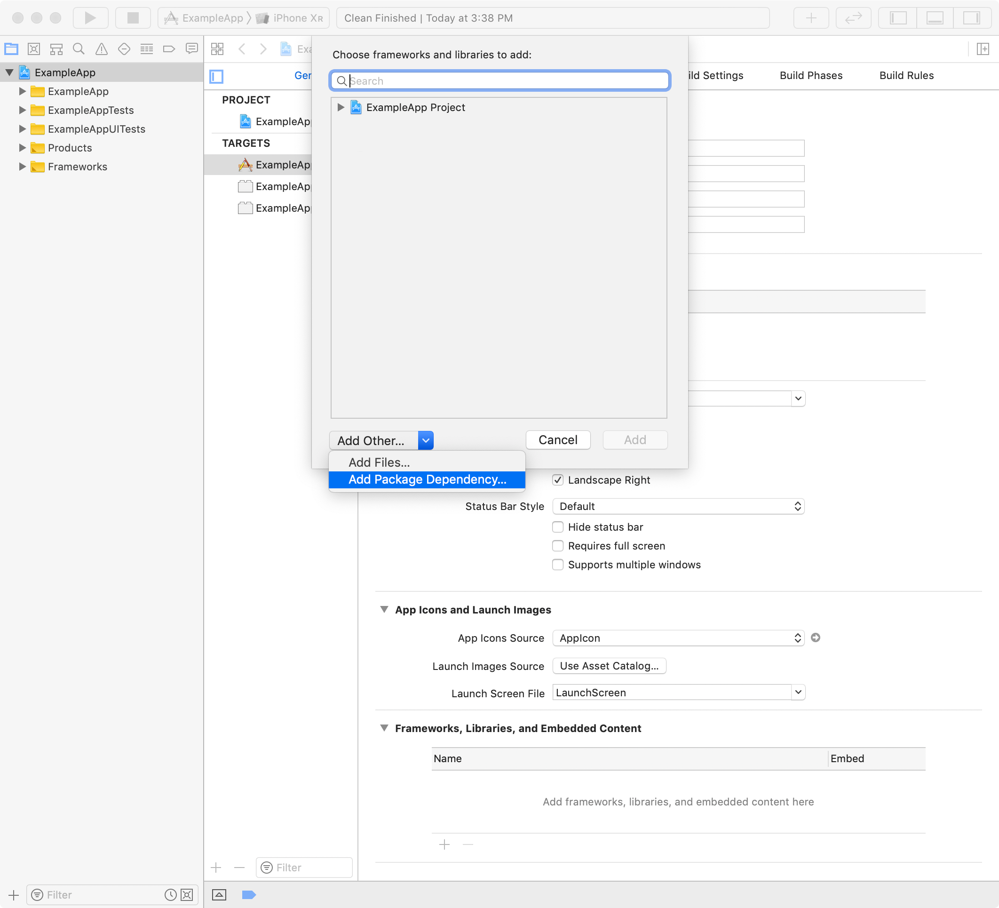
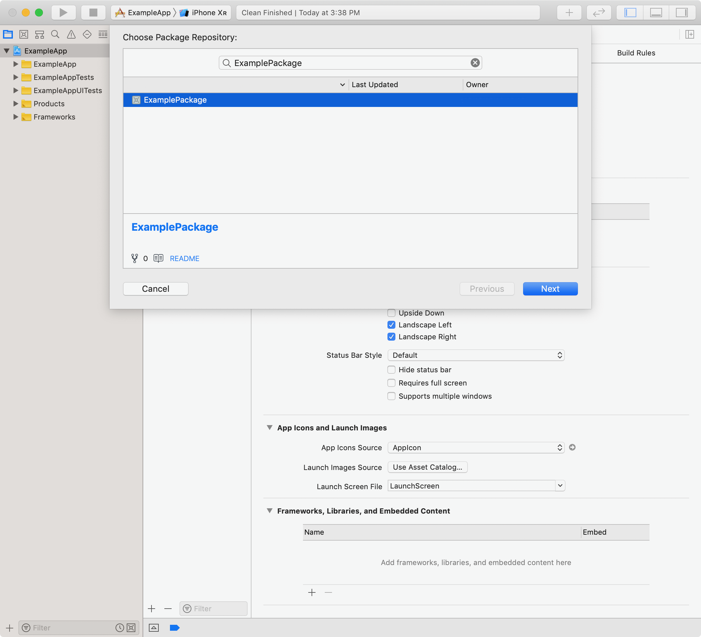
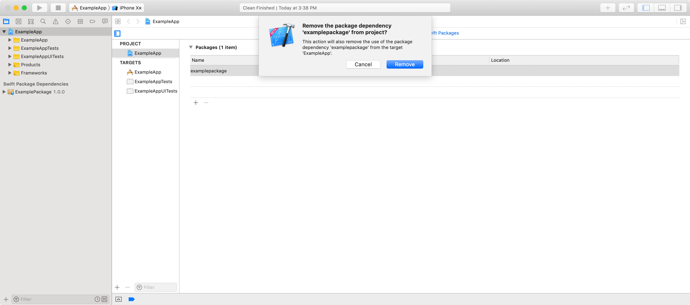

> 导航：[Technologies](../technologies.md) · [Xcode](../xcode.md) · [Projects and workspaces](projects-and-workspaces.md)

# 向你的 App 添加包依赖项

<sub>文章</sub>

集成包依赖项，以便在多个项目之间共享代码，或利用其他开发者的代码。

## 概述

Xcode 内置了对源代码管理账户的支持，让你能够轻松利用可用的 Swift 包。使用 Xcode 管理包依赖项的版本，并确保你的项目使用的是最新的代码变更。

> [!note] 注意
> 包的作者可以将其 Swift 包发布到公开或私有仓库中。Xcode 同时支持私有包和公开发布的包。

### 添加一个包依赖项

要向你的 Xcode 项目添加一个包依赖项，请选择 File \> Add Package Dependency，并输入其源代码管理仓库的 URL。你也可以导览到你 target 的 General 面板，在 "Frameworks, Libraries, and Embedded Content" 部分中，点按 + 按钮，选择 Add Other，然后选择 Add Package Dependency。



<sub>截图显示了向 "Frameworks, Libraries, and Embedded Content" 添加内容的对话框，其中选中了 Add Package Dependency…。</sub>

除了添加源代码管理仓库的 URL 之外，你还可以在 [GitHub](https://github.com) 或 [GitHub Enterprise](https://github.com/enterprise) 上搜索某个包。在 Xcode 的设置中添加你的 GitHub 或 GitHub Enterprise 账户后，随着你的输入会出现一份包仓库列表。下面这张截图显示了某位在 Xcode 设置中添加了其 Git 提供方的用户，搜索词 `ExamplePackage` 对应的仓库列表。



如果你已经在 Xcode 的设置中添加了源代码管理账户，并且尚未输入搜索词，该列表会包含来自以下位置的包仓库：

- 你的 Git 仓库
- 你团队的 Git 仓库
- 你在 [GitHub](https://github.com)、[GitHub Enterprise](https://github.com/enterprise)、[GitLab](https://gitlab.com) 或你[自行托管的 GitLab](https://about.gitlab.com/free-trial/self-managed/) 实例上加星标的仓库

> [!important] 重要
> 只添加来自可信作者的包依赖项。另外，与添加基于源代码的依赖项相比，添加二进制依赖项存在一些弊端。参阅 [Identifying binary dependencies](identifying-binary-dependencies.md) 了解更多信息。

### 决定包的要求

当你输入包依赖项的 URL，或从包列表中选取某个 Swift 包时，需要选择三种 _包要求（package requirement）_ 之一。包要求决定了你项目中该包依赖项所允许的版本，Xcode 会根据你选择的要求来更新你的包依赖项。

- **Version（版本）** — 决定你的项目是接受某个包依赖项直到下一个主版本的更新，还是直到下一个次版本的更新。要更严格地限制，可以选择一个特定的版本范围或一个精确版本。主版本的变化通常比次版本更显著，更新时可能需要你修改代码。版本规则要求 Swift 包遵循语义化版本规范。要了解关于语义化版本规范的更多信息，请访问[语义化版本 2.0.0](https://semver.org)。选择版本要求是添加包依赖项的推荐方式，它能让你在限制变更与获取改进和新功能之间取得平衡。
- **Branch（分支）** — 选择你的包依赖项要跟随的分支名称。当你同时开发多个包，且不想发布这些包依赖项的正式版本时，请使用基于分支的依赖项。
- **Commit（提交）** — 选择你的包依赖项要跟随的 commit 哈希值。不建议选择此选项，你应该只在特殊情况下使用它。虽然将你的包依赖项固定到某个特定的 commit，可以确保该包依赖项不发生变化、让你的代码保持稳定，但你将不会收到任何更新。如果你担心某个远程包的稳定性，请考虑使用基于版本的要求中限制更严格的选项之一。

选定包要求之后，Xcode 会解析并获取该包依赖项。选择你需要的该包的产品，并将它们添加到你项目中的各个 target。

在 Xcode 的项目导航器中，Swift Package Dependencies 部分会显示新添加的包依赖项。点按显示三角形即可查看该包在你 Mac 本地的实际内容。

> [!tip] 提示
> 虽然 Xcode 会自动更新你的包依赖项并解析包的版本，你也可以从 File \> Packages 菜单中触发这两个操作。

### 使用某个 Swift 包提供的功能和素材

要在你的 App 中使用某个 Swift 包的功能，请将该包的产品作为一个 Swift 模块导入。以下代码片段展示了一个视图控制器，它导入了某个 Swift 包的 `MyLibrary` 模块，并使用了该包的功能：

```swift
import UIKit

// 导入与该 Swift 包的库产品 MyLibrary 相对应的模块。
import MyLibrary

class ViewController: UIViewController {

    @IBOutlet var aLabel: UILabel!
    @IBOutlet var aButton: UIButton!
    @IBOutlet var anImageView: UIImageView!
    @IBOutlet var aCustomView: CustomView!

    override func viewDidLoad() {
        super.viewDidLoad()

        // 使用该包在 MyLibrary 文件中作为属性公开的一个字符串。
        self.aLabel.text = MyLibrary.titleText

        // 加载一张 MyLibrary 包通过类方法提供的图像。
        if let imagePath = MyClass.exampleImagePath() {
            self.anImageView.image = UIImage(contentsOfFile: imagePath)
        }

        // 使用该 Swift 包的 CustomView 类。
        self.aCustomView = CustomView()
    }

    // 通过调用该包的 API 显示一个提醒。
    @IBAction func showAlert(_ sender: Any) {
        MyClass.showAlertUsing(viewController: self)
    }
}
```

### 编辑一个包依赖项

你不能直接编辑你包依赖项的内容。如果你想要对某个包依赖项进行更改，需要将其作为 _本地包（local package）_ 添加到你的项目中。参阅 [Editing a package dependency as a local package](editing-a-package-dependency-as-a-local-package.md) 了解如何用本地包覆盖某个包依赖项并进行编辑。

### 在团队中协调包的版本

在项目上协作时，请确保每个人都使用相同版本的包依赖项。当你向项目添加一个包依赖项时，Xcode 会创建 `Package.resolved` 文件。该文件列出了每个包依赖项所解析到的具体 Git commit，以及每个二进制依赖项的 [checksum](../packagedescription/target/checksum.md)。在 Git 中提交此文件，以确保每个人使用的都是同一版本的包依赖项。

> [!tip] 提示
> 你可以在你的 `.xcodeproj` 目录中的 _[appName]_`.xcodeproj/project.workspace/xcshareddata/swiftpm/Package.resolved` 处找到 `Package.resolved` 文件。

### 删除一个包依赖项

要从你的 Xcode 项目中移除一个包依赖项：

1. 在 Project Editor 中选择你的项目，并导览到 Packages Dependencies 面板。
2. 从包依赖项列表中选择该包。
3. 点按列表底部的 - 按钮，然后点按 Remove 进行确认。



## 另请参阅

### 项目配置

- [Managing your app's information property list values](../bundleresources/managing-your-app-s-information-property-list.md) — 使用 Xcode 自定你 App 的信息属性列表值。
- [Creating a Mac version of your iPad app](../uikit/creating-a-mac-version-of-your-ipad-app.md) — 使用 Mac Catalyst 将你的 iPad App 移植到 macOS。
- [Setting up a watchOS project](../watchos-apps/setting-up-a-watchos-project.md) — 创建一个新的 watchOS 项目，或向现有的 iOS 项目添加一个 watch target。
- [Embedding a command-line tool in a sandboxed app](embedding-a-helper-tool-in-a-sandboxed-app.md) — 向沙盒化 App 的 Xcode 项目添加一个命令行工具，让生成的 App 可以将其作为辅助工具运行。
