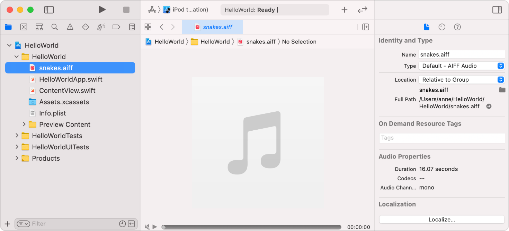

> 导航：[Technologies](../technologies.md) · [Xcode](../xcode.md) · [Localization](localization.md)

# 向本地化中添加资源

文章

在你添加到项目中的本地化里包含更多资源。

## 概述

当你向项目添加更多资源时，也可以将它们添加到你的本地化中。请在导出本地化之前执行此步骤，以便占位资源出现在本地化导出文件夹中。

### 使资源可本地化

在项目导航器中，选择该资源。然后在检查器中，在 Localization 下点按 Localize。在出现的对话框中，从弹出式菜单里选择要为该资源添加的本地化，然后点按 Localize。

项目编辑器的截图，其中选中了一个图像文件资源，右下角可见 Localize 按钮。

在检查器中，在 Localization 下，你还可以为该资源选中或取消选中各个本地化。如果你选中了多个本地化，该资源就会在项目导航器中变成一个组，其中包含该文件特定于各本地化的版本。

> [!note] 注意
> 如果你向项目中添加了 Settings Bundle 或 WatchKit Settings Bundle 文件，它会自动变为可本地化。

## 另请参阅

### 资源与素材

- [Localizing assets in a catalog](localizing-assets-in-a-catalog.md) — 使用素材目录（asset catalog）本地化颜色、图像、符号、表冠复杂功能等内容。
