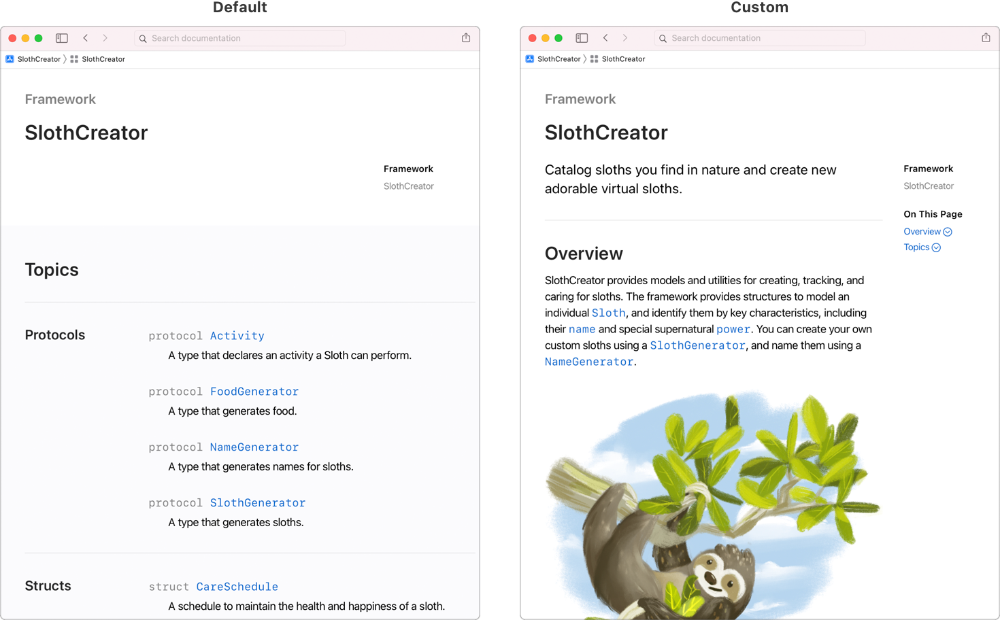
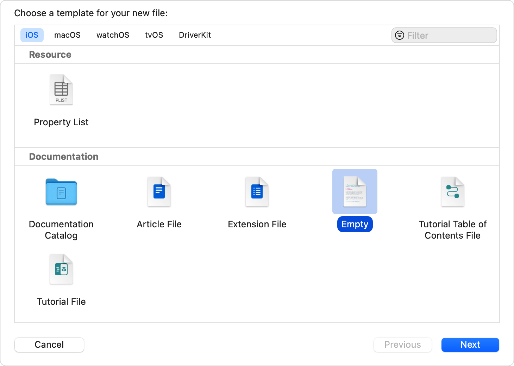
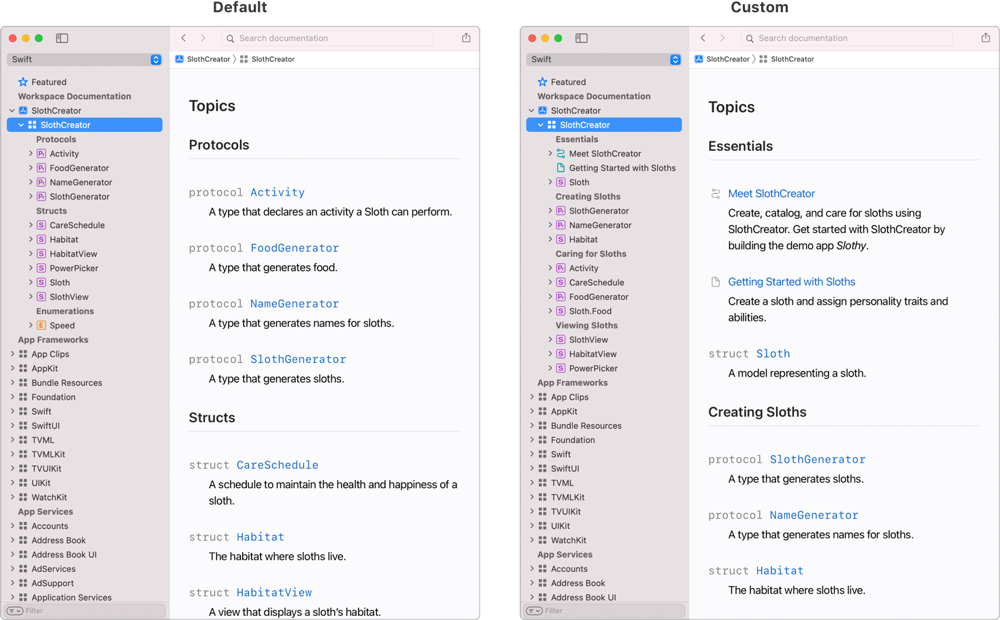
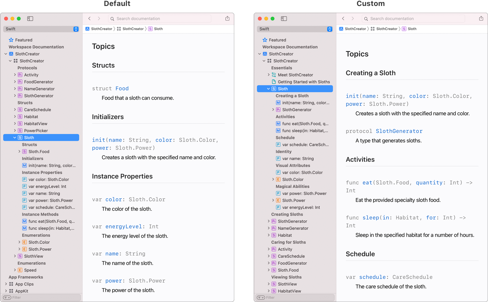
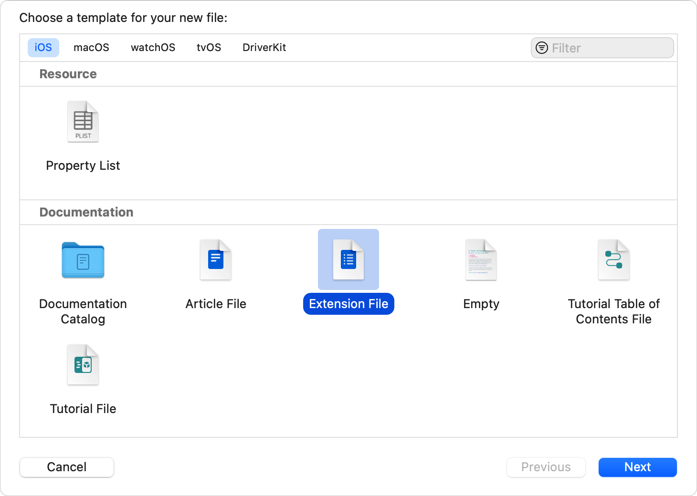

> 导航：[技术](../technologies.md) · [Xcode](../xcode.md) · [编写文档](writing-documentation.md)

# 向文档页面添加结构

<sub>文章</sub>

通过将符号排列成组和集合，让符号更易于查找。

## 概述

默认情况下，DocC 为项目生成文档时，会创建一个按种类对符号分组的顶层页面。对于框架和包，DocC 会包含公开符号；对于 App target，则同时包含内部符号和公开符号。然后，你可以提供额外上下文，说明 App 或框架的工作方式，以及不同符号之间的关系。

若要提供更具针对性的学习体验，请使用以下一种或多种方法：

- 自定义文档目录的主落地页，以介绍技术并组织其顶层符号。
- 添加特定于符号的扩展文件，以组织方法和属性等嵌套符号。
- 使用集合对多个符号进行分组，并在文档页面的导览（navigation）中引入层级结构。

有关如何使用 DocC 为文档添加结构的更多信息，请参阅 [Swift.org 上的“向文档页面添加结构”](https://www.swift.org/documentation/docc/adding-structure-to-your-documentation-pages)。

### 自定义文档的落地页

_落地页_概述你的技术、介绍重要术语，并组织_文档目录_中的资源；文档目录是用于丰富源文档注释的文件集合。你可以利用落地页简化读者的学习路径、讨论技术的主要功能，并提供能让读者在需要时回来查阅的学习动机。



<sub>两张并排的框架顶层页面图像。左图显示 DocC 默认生成的基本空白页面。右图显示包含额外内容和彩色图形的自定义落地页。</sub>

向项目添加文档目录时，Xcode 会自动包含一个空白落地页。有关更多信息，请参阅[记录 App、框架和包](documenting-apps-frameworks-and-packages.md)。

如果需要手动向文档目录添加落地页，请按照以下步骤操作：

1. 在 Xcode 中，选择 Project navigator 中的文档目录。
2. 选取 File \> New \> File from Template。
3. 选择 Documentation 部分中的 Empty 模板，然后点按 Next。
4. 输入文件名并点按 Create。Xcode 会创建一个仅包含页面标题占位符的 Markdown 文件。



请使用与 target 产品模块名称匹配的文件名。例如，对于 `SlothCreator` 框架，文件名为 `SlothCreator.md`。

> [!note] 注意
> 对于产品名称中含空格的 target，Xcode 会在产品模块名称中用下划线替换空格。若要在 Xcode 项目中查找产品模块名称，请在项目编辑器中选择 target，点按 Build Settings 标签页，然后在搜索栏中输入 Product Module Name。

### 使用主题组排列顶层符号

默认情况下，DocC 会根据种类排列项目中的符号。例如，编译器会为类、结构体、协议等生成主题组。然后，你可以添加信息来解释这些符号之间的关系。

为了帮助读者更轻松地浏览框架，请将符号排列到名称有意义的组中。将重要符号放在页面中更靠上的位置，并将辅助符号嵌套在其他符号中。组名应当唯一、互斥且清晰。尝试不同的排列方式，找出最适合你的方案。



<sub>两张并排的图像，显示框架顶层符号的不同排列方式。左图显示 DocC 默认生成的基本排列。右图显示包含描述性更强的标题和内容的自定义排列。</sub>

若要覆盖默认组织方式并手动排列技术中的顶层符号，请向技术的落地页添加 Topics 部分。在 Markdown 文件的任何现有内容下方，添加两个井号（`##`）、一个空格和 `Topics` 关键字。

```markdown
## Topics
```

在 Topics 标题之后，使用三个井号（`###`）为每个组创建一个命名部分，并向每个部分添加一个或多个顶层符号。在每个符号前添加短划线（`-`），并用一对双反引号（``）将其括起来。

```markdown
## Topics

### Creating sloths

- ``SlothGenerator``
- ``NameGenerator``
- ``Habitat``

### Caring for sloths

- ``Activity``
- ``CareSchedule``
- ``FoodGenerator``
- ``Sloth/Food``
```

DocC 使用双反引号格式创建符号链接，并添加符号的类型信息和摘要。有关更多信息，请参阅 [Swift.org 上的“设置文档内容格式”](https://www.swift.org/documentation/docc/formatting-your-documentation-content)。

重新构建文档后，文档查看器会在导览面板和落地页中反映这些组织更改，如上图所示。

### 在扩展文件中排列嵌套符号

并非所有符号都会出现在顶层落地页上。例如，类和结构体会定义方法和属性；在某些情况下，嵌套类或结构体还会引入额外的层级。

与顶层落地页一样，DocC 会根据嵌套符号的类型为其生成默认主题组。使用扩展文件覆盖这种默认组织方式，为符号提供更合适的结构。



<sub>两张并排的图像，显示符号的方法和属性的不同排列方式。左图显示 DocC 默认生成的基本排列。右图显示包含描述性更强的标题和内容的自定义排列。</sub>

若要为特定符号向文档目录添加扩展文件，请执行以下操作：

1. 在 Xcode 中，选择 Project navigator 中的文档目录。
2. 选取 File \> New \> File from Template。
3. 选择 Documentation 部分中的 Extension File 模板，然后点按 Next。
4. 输入符号名称作为文件名，然后点按 Create。



<sub>一张 Xcode 文件模板选取器的屏幕截图，其中 Documentation 部分的 Extension File 模板处于选中状态。</sub>

在扩展文件中，将 `Symbol` 占位符替换为符号的绝对路径。绝对路径由 target 的产品模块名称和符号名称组成。

```markdown
# ``SlothCreator/Sloth``
```

Extension File 模板包含一个 Topics 部分，其中有一个可供填写的命名组。如果文档目录已经包含特定符号的扩展文件，也可以按照上一节中的步骤向其添加 Topics 部分。

与落地页一样，使用三个井号（`###`）为每个主题组创建命名部分，并使用双反引号（``）语法向每个部分添加所需符号。

```markdown
# ``SlothCreator/Sloth``

## Topics

### Creating a sloth

- ``init(name:color:power:)``
- ``SlothGenerator``

### Activities

- ``eat(_:quantity:)``
- ``sleep(in:for:)``

### Schedule

- ``schedule``
```

> [!tip] 提示
> 使用符号的完整路径，可以从文档层级中的其他位置包含该符号。

排列扩展文件中的嵌套符号后，选取 Product \> Build Documentation 编译更改，并在 Xcode 的文档查看器中检查结果。
