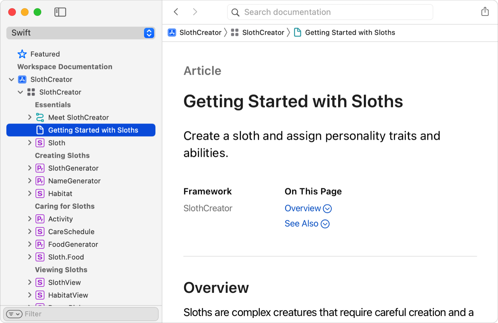
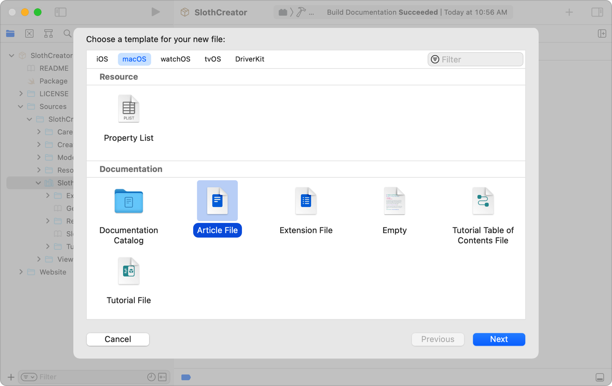
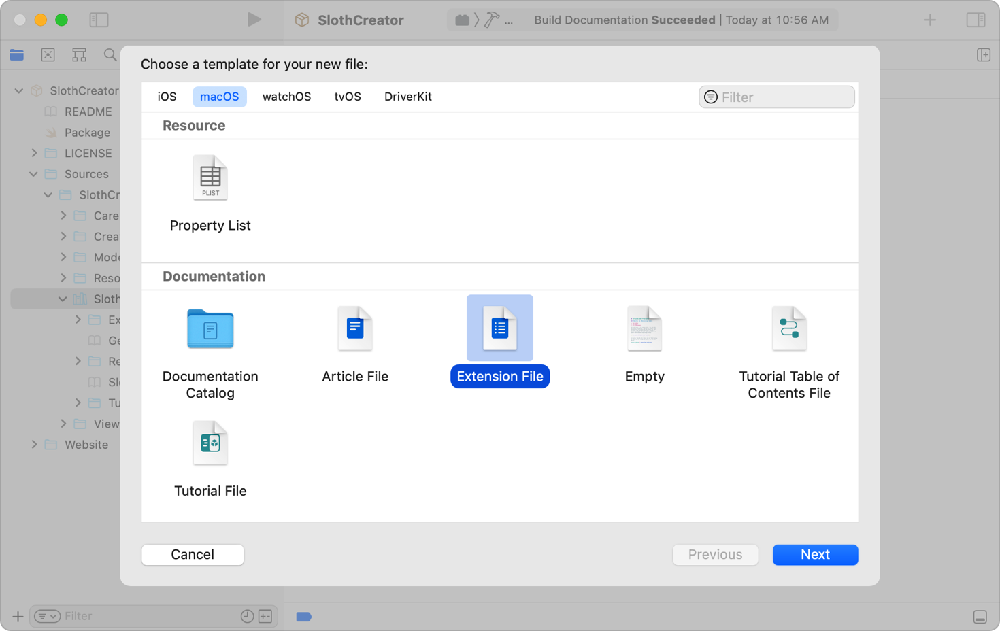

> 导航：[技术](../technologies.md) · [Xcode](../xcode.md) · [编写文档](writing-documentation.md)

# 向文档目录添加补充内容

<sub>文章</sub>

加入文章和扩展文件，以扩展源文档注释或提供辅助性的概念内容。

## 概述

创作优秀文档是一门艺术。你的内容独一无二；你最清楚除源文档注释外，哪些元素能为读者带来最大价值。有关使用 DocC 向文档目录添加补充内容的信息，请参阅 [Swift.Org 上的“向文档目录添加补充内容”](https://www.swift.org/documentation/docc/adding-supplemental-content-to-a-documentation-catalog)。

### 添加文章以解释概念或描述任务

如果文档目录中包含名为 `GettingStarted.md` 的文章文件，Xcode 会在文档查看器中以文档图标显示该文章。



<sub>一张 Xcode 文档查看器的屏幕截图，其中左侧 Project navigator 中的 Getting started with sloths 文章处于选中状态。右侧面板显示了带文档图标的文章页面。</sub>

文章结构与符号文件或顶层落地页类似，区别在于第一个一级标题是普通内容，而不是符号引用。例如，Getting Started with Sloths 文章包含以下标题、单句摘要或总结，以及 Overview 部分：

```markdown
# Getting started with sloths

Create a sloth and assign personality traits and abilities.

## 概述

Sloths are complex creatures that require careful creation and a suitable
habitat.
...
```

在 Overview 部分之后，其他章节和小节分别使用两个井号（##）表示二级标题，使用三个井号（###）表示三级标题。在井号后添加一个空格，再添加该章节或小节的标题。

要在 Xcode 中向文档目录添加文章，请执行以下操作：

1. 在 Project navigator 中选择文档目录。
2. 选取 File \> New \> File from Template。
3. 选择 Documentation 部分中的 Article File 模板，然后点按 Next。
4. 输入文件名并点按 Create。Xcode 会创建一个使用默认名称的新文章文件。
5. 修改文件的第一行以指定标题。
6. 将文件中的摘要和占位符替换为适当内容。



### 添加扩展文件以补充或覆盖源文档注释

DocC 支持使用扩展文件中的内容补充或完全替换源文档注释。要向文档目录添加扩展文件，请执行以下操作：

1. 在 Xcode 中，选择 Project navigator 中的文档目录。
2. 选取 File \> New \> File from Template。
3. 选择 Documentation 部分中的 Extension File 模板，然后点按 Next。
4. 输入符号名称作为文件名，然后点按 Create。
5. 修改文件的第一行，以标识该文件所关联的符号。

在扩展文件中，将 `Symbol` 占位符替换为符号的绝对路径。绝对路径由 target 的产品模块名称和符号名称组成。



## 另请参阅

### 文档内容

- [在源文件中编写符号文档](writing-symbol-documentation-in-your-source-files.md) — 为你的符号添加参考文档，说明如何使用它们。
- [SlothCreator：在 Xcode 中构建 DocC 文档](slothcreator-building-docc-documentation-in-xcode.md) — 为包含 DocC 目录的 Swift 包构建 DocC 文档。
