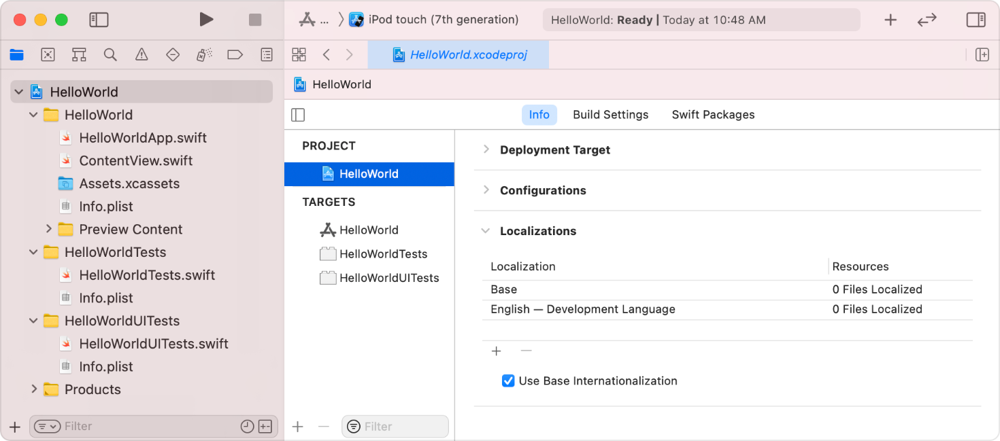
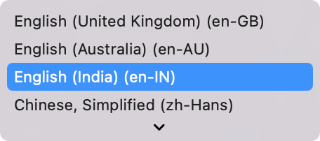
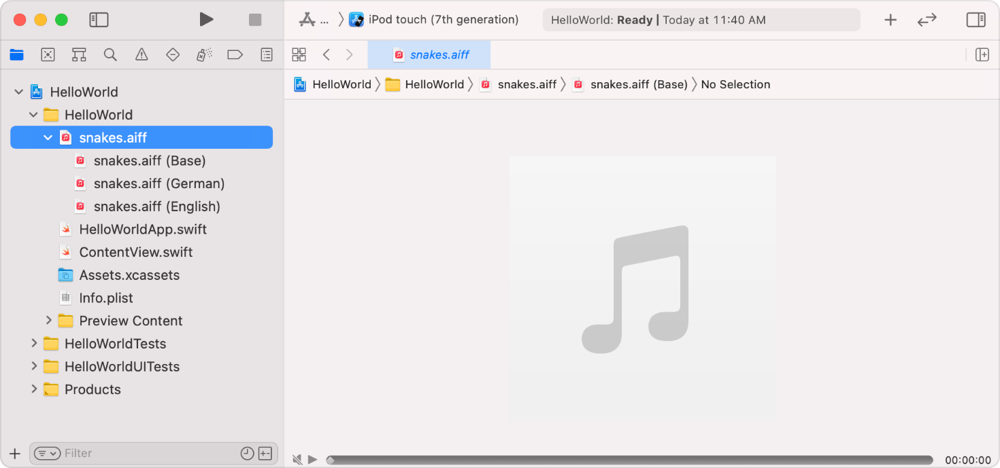

> 导航：[技术](../technologies.md) · [Xcode](../xcode.md) · [本地化](localization.md)

# 添加语言和区域支持

文章

为你支持的每种语言和区域选择要本地化的资源。

## 概述

向项目添加你希望支持的语言和区域组合。对于每项本地化，请选择要本地化的资源，例如图像和音频文件。

### 添加本地化

在项目编辑器中，选择 Project 下的项目名称，然后点按 Info。在 Localizations 下点按添加按钮（+），然后从弹出式菜单中选取语言和区域组合。

弹出式菜单包含语言名称，后跟括号中的语言 ID，例如 German (de)、Japanese (ja) 和 Arabic (ar)。对于区域变体和文字，括号中会显示区域，后跟括号中的语言 ID，例如 English (India) (en-IN)，其中 en-IN 是语言 ID。Other 子菜单（位于菜单底部）包含其他可供选择的语言和区域。有关指导，请参阅[选择本地化区域和文字](choosing-localization-regions-and-scripts.md)。

如果项目中有可本地化资源，请在出现的表单（sheet）中选择要本地化的资源文件，然后点按 Finish。例如，选择添加到项目中的图像、音频、字符串和 `.stringsdict` 文件。

对于 storyboard 和 XIB 界面，请选择用户界面文件（扩展名为 `.storyboard` 或 `.xib` 的文件）。Xcode 会向本地化文件夹添加一个字符串文件，其中包含要翻译的文本以及描述用户界面组件的注释。例如，如果向使用 storyboard 的 iOS App 添加德语，`LaunchScreen.storyboard` 会变成一个组，其中包含 `LaunchScreen.storyboard (Base)` 和 `LaunchScreen.strings (German) ` 文件。

> [!note] 注意
> Xcode 默认会将 `Base` 和开发语言添加到本地化表格中。对于支持在运行时进行字符串替换的资源（例如 storyboard、XIB 和 Siri 意图定义文件），请使用 Base 本地化。

### 查看可本地化资源

你可以在 Project navigator 和 Finder 中验证每项本地化的资源。

首次添加本地化时，Xcode 会将要本地化的每个资源转换为一个组，其中包含原始文件和本地化专用版本。下次添加本地化时，Xcode 会向该组添加另一个本地化专用文件。

在文件系统中，Xcode 会创建单独的本地化文件夹来存储本地化专用资源。文件夹名称是语言 ID 后跟 `.lproj` 扩展名，例如，如果从本地化菜单中选取 German (de)，则为 `de.lproj `。

## 另请参阅

### 语言和区域

- [选择本地化区域和文字](choosing-localization-regions-and-scripts.md) — 添加仅语言本地化，或针对区域变体和文字的本地化。
