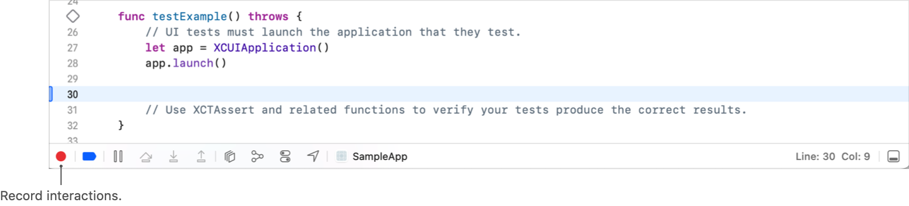

> ???[Technologies](../technologies.md) ? [Xcode](../xcode.md) ? [Testing](testing.md)

# ? Xcode ??????

<sub>??</sub>

????????????? target?????????????????????? UI ??????????

## ??

? Xcode 16 ????????????????????????????? Testing System?? Xcode ???? bundle ?????

Xcode ?????????

- **[Swift Testing](../testing.md)** ? ???????????????? Swift ????????????????????????????????????????????????????????????????????
- **[XCTest](../xctest.md)** ? ???????????????????????????????UI ????????

???????? Swift Test with XCTest UI Tests ? XCTests for Unit and UI Tests?????Xcode ?????????? target??????????????Tests????????? UI ???????UITests???????? Project navigator ?????? target ????????????????????????????????????? Xcode ???????????????????? Xcode ?????????? Include Tests ??????? target?????? XCTest ??????

### ?????? target

??????? target ?????????? target ?????

1. ?? File \> New \> Target?
2. ??????????Test??
3. ?? Unit Testing Bundle ? UI Testing Bundle?
4. ?? Next?
5. ?????
6. ?? Finish?

> [!note] ??
> Swift Testing ? XCTest ??????? target ??????????? bundle ?????????????? XCTest ????????? bundle?????????? Unit Testing Bundle ?????? Swift Testing ??????????? target ???? Swift Testing ?????????????????????

### ??????

??????????? target ????????????????????????????????? target ???????????? File \> New \> New File From Template????? Swift Testing Unit Test ? XCTest Unit Test??????????????????????????????????????

1. **???Arrange?** ? ?????????????????????????????????????????????????????????????????????????? App ????????????????????????
2. **???Act?** ? ?????????????????????????????
3. **???Assert?** ? ?? Swift Testing ??[?????](../testing/expectations.md)?? [XCTest](../xctest.md) ??????????????????????????????????? false ????????????

? Swift Testing ??????????? `Test` ????? Swift ???????????????????????????????? `Suite` ?????????????????????????????? async ? throws???????????? actor?

???? XCTest ????????? [XCTestCase](../xctest/xctestcase.md) ???????????? `XCTestCase` ?????????????? `Void` ????????????`test`????

**Swift Testing**

```swift
struct MyAPITests {
    @Test func myAPIWorks() {
        // ????????????
        // ??????????????? myAPIWorks?
        #expect(/* ? */, "The function didn't return the expected result")
    }
}
```

**XCTest**

```swift
class MyAPITests : XCTestCase {
    func testMyAPIWorks() {
        // ????????????
        // ????????????????? API?
        XCTAssertTrue(/* ? */, "The function didn't return the expected result")
    }
}
```

???????????????????????????????????? `nil` ?? `nil` ???????????????????????????????????????????? Swift Testing ?????????????????????????????????????[???????](../testing/parameterizedtesting.md)?? XCTest ???????????????????????????????????????????????????????

???? Swift Testing ?????????????[??????](../testing/definingtests.md)????? XCTest ?????????????[???????????](../xctest/defining-test-cases-and-test-methods.md)?

> [!note] ??
> Swift ???????????????????? internal ???????????????? internal ?????????????????????? [Enable Testability](build-settings-reference.md#Enable-Testability)??????? import ???? `@testable` ?????????????[????](https://docs.swift.org/swift-book/documentation/the-swift-programming-language/accesscontrol/#Access-Levels-for-Unit-Test-Targets)?

### ??????

??????????????????? API???????????????????????????????????????????? App ??????????????????????????????????????????????????????????????????????

???????????????????????????????????????????????? App ?????????????????????????????????????????????????????

### ?? UI ??

UI ?????????????????????????? XCTest UI Test ???? UI ???????????? [XCTestCase](../xctest/xctestcase.md) ????? XCTest ?? App ? UI ???UI ???????? App ??????? App ???????????????? App ???????

?? UI ?????? App ????????????????????? UI ????????????????? UI ???????? App ?????????????????? App ? UI ?????????????????????????????

??? `XCTestCase` ???????? UI ?????? Xcode ?? Record UI Test ????? App ?????? UI ?????????????????????????????????????????



????????????????????????????? UI ??????????????????????????

```swift
class MyUITests: XCTestCase {
    let app = XCUIApplication()

    // MARK: - ?????

    override func setUp() {
        super.setUp()
        // ? UI ????????????????????
        continueAfterFailure = false
        // UI ?????????? App????????????? App ???????????
        XCUIApplication().launch()
    }

    override func tearDown() {
        // ???????????????????????????????????
        super.tearDown()
    }

    func testAddition() {
        // ?? UI ????????
        // ????? UI ????
        if let value = app.<ui_type>[<ui_identifier>].value as? String {
            XCTAssertTrue(value = /* ? */, "The function didn't return the expected result")
        }
    }
}
```

?? UI ??????????????????????? [XCTActivity](../xctest/xctactivity.md) ???????????????????????????????????

### ??????

???????????????????????????????????XCTest ??????????????????????????????????????????XCTest ????????

?????????????????? [measure(_:)](<../xctest/xctestcase/measure(__).md>)??? `measure(_:)` ????????? App ??????????????????????????????????? [measure(metrics:block:)](<../xctest/xctestcase/measure(metrics_block_).md>)?

```swift
class PerformanceTests : XCTestCase {
    func testCodeIsFastEnough() {
        self.measure() {
          // ??????????????
        }
    }
}
```

## ????

### ????

- [??????????????](updating-your-existing-codebase-to-accommodate-unit-tests.md) ? ???????????????????????
- [???????????](determining-how-much-code-your-tests-cover.md) ? ?????????????????????????????
- [??????????????????](organizing-tests-to-improve-feedback.md) ? ??????????????????????????????????
