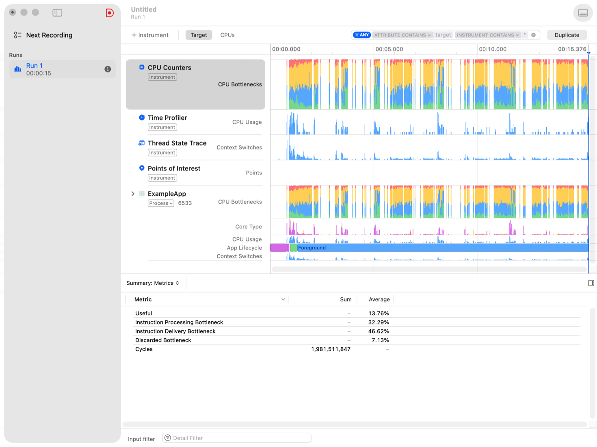
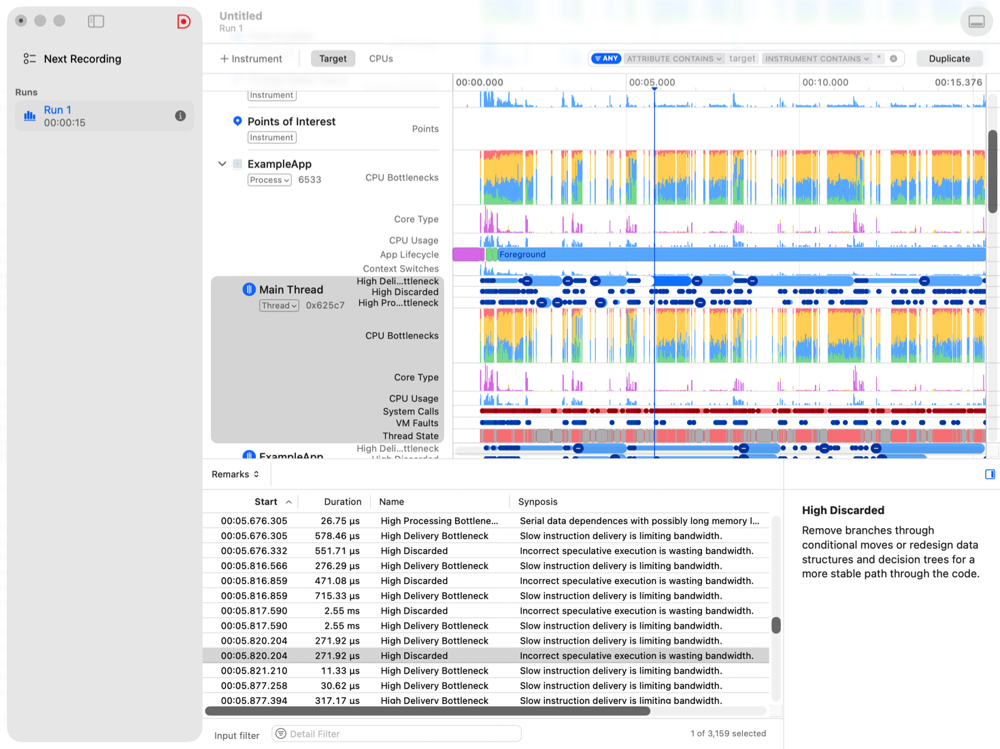

> 导航：[Technologies](../technologies.md) · [Xcode](../xcode.md) · [Performance and metrics](performance-and-metrics.md)

# 处理 CPU 瓶颈

文章

定位并修复管线停顿、缓存未命中和其他性能问题。

## 概述

为了让设备 CPU 在处理 App 时以最高效率运行，请调整 App，使其充分利用 CPU 指令集，并确保 CPU 微架构能够高效传递和处理指令。现代处理器具有多种用于改善指令处理流的机制，包括：

- **流水线** — 处理器并行运行不同指令的不同部分；例如，它可以在执行一条指令所请求操作的同时，对另一条指令进行解码。
- **乱序执行** — 检测即将执行且不依赖代码中更早指令结果的指令，并并行运行这些独立指令的逻辑。
- **推测执行** — 尝试猜测程序计数器是否会跟随条件跳转指令，并指示处理器以推测方式运行后续指令的逻辑。
- **超标量架构** — 处理器包含并行组件，可并行对多条指令执行同一步骤；例如，同时为多条指令取回数据。
- **内存缓存** — 位于片上系统中的复制内存，用于保存指令和数据，从而加快对主内存中相同位置的重复访问或可预测访问模式。这些区域按层级排列，每个 CPU 附近都有速度更快但容量更小的存储。

如果 App 的设计或你向编译器提供的提示无法让 CPU 利用这些功能，CPU 就可能遇到_瓶颈_，无法以最高效率运行。CPU 瓶颈的示例包括：CPU 因下一条需要处理的指令尚不可用而等待；或因 CPU 等待相对缓慢的内存访问，导致指令处理_停顿_。CPU 瓶颈会降低处理器完成 App 工作的速率，增加用户等待 App 完成任务的时间。App 主线程上发生的瓶颈会导致 App UI 冻结和卡顿。

此外，低效使用 CPU 会增加运行 App 时 CPU 的功耗。有关测量 App 功耗的信息，请参阅[使用 Power Profiler 测量 App 功耗](measuring-your-app-s-power-use-with-power-profiler.md)。

请采用能够避免 CPU 瓶颈的编码策略。识别 App 中需要提升性能的区域，设置性能目标，并编写性能测试来验证更改能否改善性能。使用 Instruments 检测 CPU 运行 App 代码时遇到瓶颈的情况。采取措施消除瓶颈，提升 App 性能。

> [!note] 注意
> 调查 CPU 瓶颈前，请先消除其他处理器开销来源，包括低效算法和冗余内存管理代码。有关更多信息，请参阅[使用 Processor Trace instrument 分析 CPU 使用情况](analyzing-cpu-usage-with-processor-trace.md)。

### 设计 App 以避免 CPU 瓶颈

以下设计原则有助于系统在用户使用 App 时优化 CPU 性能。

使用系统框架。如果系统提供了执行某项任务的框架，该框架的实现已经过优化，可以高效使用设备资源。

相比静态线程池，优先采用动态任务分配。系统会将 App 的线程分配到处理器的不同核心上运行；根据核心类型以及设备上运行的其他工作，这些核心可能以不同速率完成工作。分配给静态池中线程的工作可能会在不同时间完成，导致某些线程无事可做，只能等待其他线程赶上进度。

考虑使用 [Background Tasks](../backgroundtasks.md) 创建由系统根据资源可用情况动态调度的任务。

为后台任务指定服务质量。系统使用服务质量信息动态调度任务，并高效利用可用的处理资源。

如果使用 Background Tasks，请为分配给任务的工作选择正确的任务类型。有关更多信息，请参阅[为 App 选择后台策略](../backgroundtasks/choosing-background-strategies-for-your-app.md)。如果使用 Grand Central Dispatch，请将工作分派到具有适当 [DispatchQoS](../dispatch/dispatchqos.md) 的队列。

有关针对 Apple 芯片优化代码的更多指导，请参阅[针对 Apple 芯片调整代码性能](../apple-silicon/tuning-your-code-s-performance-for-apple-silicon.md)。

### 确立性能目标

使用 Metrics Organizer 中的信息，以及测试和使用 App 的人员所提供的反馈，识别性能问题并定义改进目标。有关更多信息，请参阅[提升 App 性能](improving-your-app-s-performance.md)。

### 编写性能测试

识别出需要提升性能的功能后，请创建性能测试，自动运行这些功能并测量其性能。设置性能基线，并在更改代码时运行测试，将 App 性能与基线进行比较并检测回归。

使用 [XCTCPUMetric](../xctest/xctcpumetric.md) 测量测试中的 CPU 活动，使用 [XCTClockMetric](../xctest/xctclockmetric.md) 测量测试期间经过的时间。有关更多信息，请参阅[编写并运行性能测试](writing-and-running-performance-tests.md)。

### 检测 CPU 瓶颈

当性能测试显示 App 未达到性能目标时，请使用 CPU Counters instrument，识别系统运行 App 时遇到 CPU 瓶颈的情况。

按照以下步骤记录 App 的 CPU 访问模式：

1. 在 Xcode 中，按住 Control 键点按表现出性能问题的测试旁边的测试指示器，然后选取 Profile _测试名称_。
2. Instruments 的 Choose a Template… 窗口打开后，选择 CPU Counters 模板。
3. 将 CPU Counters instrument 模式设为 CPU Bottlenecks。
4. 点按录制以开始收集数据。

如果没有针对所分析功能的性能测试，请改为按照以下步骤操作：

1. 在 Xcode 中，选取 Product \> Profile。
2. Instruments 的 Choose a Template… 窗口打开后，选择 CPU Counters 模板。
3. 选择要录制的目标设备和 App。
4. 将 CPU Counters instrument 模式设为 CPU Bottlenecks。
5. 点按录制以开始收集数据。
6. 与 App 中要分析的功能交互。
7. 在 Instruments 中点按 Stop 按钮停止收集数据。

### 发现导致 CPU 瓶颈的代码

CPU Counters instrument 会向 CPU Counters、进程和线程轨道添加特定于模式的泳道，以供你分析处理器工作负载。在初始 CPU bottlenecks 模式下，泳道将最大可持续 CPU 带宽分为四类：

- **Useful** — CPU 未遇到瓶颈，并完成有助于推进 App 代码的指令。
- **Instruction Delivery Bottleneck** — CPU 取回指令的速率低于完成指令的速率，因而遇到瓶颈；例如，处理器需要跟随大量跳转指令，才能找到需要取回的指令。
- **Instruction Processing Bottleneck** — CPU 完成指令的速率低于取回指令的速率，因而遇到瓶颈；例如，许多指令要求处理器从内存载入数据，需要很长时间才能完成。
- **Discarded Bottleneck** — CPU 忙于处理无助于推进 App 代码的指令，因而遇到瓶颈；例如，CPU 作出错误的分支预测，完成指令后却只能丢弃结果。

一张 Instruments 的屏幕截图，其中 CPU Counters 泳道将 CPU 带宽分为有效带宽和瓶颈。

存在 CPU 瓶颈表示有机会提升 App 性能，但没有瓶颈并不一定意味着代码已经尽可能高效。例如，可能存在实现 App 功能的更高效算法，或者 App 可能遇到不会导致 CPU 瓶颈的其他开销。

使用 Time Profiler 轨道和 App 线程的轨道，将 CPU 瓶颈的出现与 App 中运行的代码关联起来。此外，使用采样模式在 Instruments 中录制另一份跟踪，以检查经常导致 CPU 瓶颈的特定指令。

点按 CPU Counters 轨道，查看 Summary: Metrics 视图，其中显示 CPU 用于执行有效工作或遇到瓶颈的时间比例。在时间线中选择一个范围，让 Summary: Metrics 视图聚焦于该范围。

### 识别 CPU 瓶颈的原因

定位 App 中导致 CPU 瓶颈的代码以及处理器遇到的瓶颈类别后，请收集更详细的信息，以确定导致 CPU 瓶颈的具体情况，并规划如何在代码中处理这些瓶颈。

> [!tip] 提示
> 使用 [OSSignposter](../os/ossignposter.md) 向导致 CPU 瓶颈的代码添加路标，以便在后续分析工作中更轻松地识别时间线中的相关区域。

在 Instruments 中按照以下步骤操作：

1. 展开 App 线程的线程时间线，显示指明 App 何时遇到瓶颈的泳道。
2. 点按线程时间线中的某个瓶颈，使详细信息视图滚动到该瓶颈。
3. 在详细信息视图中按住 Control 键点按瓶颈，然后选取“Suggested Next”，在 Instruments 中开始一次新录制；这会更改 CPU Counters instrument 模式，以收集有关该瓶颈的更多信息。
4. 如果没有分析性能测试，请与 App 中在首次录制时导致瓶颈的功能交互，然后点按 Stop 按钮停止收集数据。

CPU Counters 轨道和 Summary: Metrics 视图会显示处理器遇到的特定 CPU 瓶颈类别所占比例。切换到 Remarks 视图，查看 Instruments 检测到的瓶颈事件信息。点按详细信息视图中的指标或备注，阅读有关此类 CPU 瓶颈原因的更多信息，以及缓解瓶颈的建议编码策略。

一张 Instruments 的屏幕截图。Remarks 视图中高亮显示了一个 CPU 瓶颈，Instruments 提供了缓解该瓶颈的建议。

有关 Apple 芯片的更多信息以及优化代码的指导，请参阅 [Apple 芯片 CPU 优化指南第 4 版](../apple-silicon/cpu-optimization-guide.md)。

更改代码后，请重新运行性能测试，并再次使用 CPU Counters instrument 验证更改能否改善 App 的处理器使用情况。

## 另请参阅

### 处理器使用情况

- [使用 Processor Trace instrument 分析 CPU 使用情况](analyzing-cpu-usage-with-processor-trace.md) — 识别 App 低效使用 CPU 的代码。
- [使用调用树视图分析 CPU 概要](analyzing-cpu-profiles-with-call-tree-views.md) — 使用调用树可视化，在 Instruments 中查找性能瓶颈。
