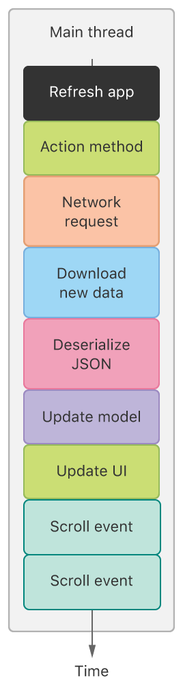
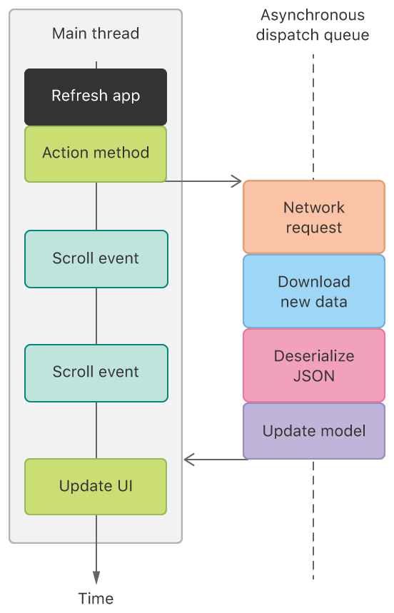

> 导航：[Technologies](../technologies.md) · [Xcode](../xcode.md) · [Debugging](debugging.md) · [Diagnosing issues using crash reports and device logs](diagnosing-issues-using-crash-reports-and-device-logs.md) · [Identifying the cause of common crashes](identifying-the-cause-of-common-crashes.md)

# 处理看门狗终止

<sub>文章</sub>

识别被看门狗终止的无响应 App 的特征，并处理该问题。

## 概述

用户期望 App 能快速启动，并对触摸和手势做出响应。操作系统采用看门狗来监控启动时间和 App 的响应能力，并终止无响应的 App。看门狗终止会在崩溃报告的 Termination Reason 中使用代码 `0x8badf00d`（读作 "ate bad food"）：

```other
Exception Type:  EXC_CRASH (SIGKILL)
Exception Codes: 0x0000000000000000, 0x0000000000000000
Exception Note:  EXC_CORPSE_NOTIFY
Termination Reason: Namespace SPRINGBOARD, Code 0x8badf00d
```

看门狗会终止那些长时间阻塞主线程的 App。有许多方式会导致主线程被长时间阻塞，例如：

- 同步网络请求
- 处理大量数据，例如大型 JSON 文件或 3D 模型
- 同步触发针对大型 [Core Data](../coredata.md) 存储的轻量级迁移
- 使用 [Vision](../vision.md) 发出分析请求

要理解阻塞主线程为何是个问题，可以考虑最常见的例子：通过同步网络调用向界面加载数据。如果主线程正忙于处理某个网络请求，系统在该网络调用完成之前，就无法处理诸如多次滚动事件之类的界面事件。如果网络调用耗时较长，从用户滚动到 App 响应滚动事件之间就会出现明显的时间差，这会让 App 显得无响应。



### 解读 App 响应能力看门狗信息

当某个 App 启动缓慢或响应事件缓慢时，崩溃报告中的终止信息会包含有关该 App 时间花费情况的重要信息。例如，某个 iOS App 在启动后未能快速渲染界面，其崩溃报告中会有以下内容：

```other
Termination Description: SPRINGBOARD, 
    scene-create watchdog transgression: application<com.example.MyCoolApp>:667
    exhausted real (wall clock) time allowance of 19.97 seconds 
    | ProcessVisibility: Foreground 
    | ProcessState: Running 
    | WatchdogEvent: scene-create 
    | WatchdogVisibility: Foreground 
    | WatchdogCPUStatistics: ( 
    |  "Elapsed total CPU time (seconds): 15.290 (user 15.290, system 0.000), 28% CPU", 
    |  "Elapsed application CPU time (seconds): 0.367, 1% CPU" 
    | )
```

> [!note] 注意
> 为便于阅读，此示例中包含了额外的换行。在该示例对应的原始崩溃报告文件中，看门狗信息所占的行数更少。

当 `Termination Description` 中出现 `scene-create` 时，表示该 App 未能在允许的实际时间内将其界面的第一帧渲染到屏幕上。如果 `Termination Description` 中出现的是 `scene-update` 而不是 `scene-create`，则表示该 App 因主线程过于繁忙而未能足够快地更新其界面。

> [!note] 注意
> 崩溃报告中使用的 `scene-create` 和 `scene-update` 术语，指的是绘制到设备屏幕上的任何内容。这一术语与基于场景的 [UIKit](../uikit.md) App 中的 [UIScene](../uikit/uiscene.md) 没有关系。

`Elapsed total CPU time` 显示的是在这段实际时间内，CPU 为系统上所有进程运行所花费的总时间。这个 CPU 时间以及应用 CPU 时间，都是跨所有 CPU 核心的总利用率，可能超过 100%。例如，如果一个 CPU 核心的利用率为 100%，另一个 CPU 核心的利用率为 20%，那么总 CPU 利用率就是 120%。

`Elapsed application CPU time` 显示的是在这段实际时间内，该 App 在 CPU 上运行所花费的时间。如果这个数字处于任一极端，都是问题的一个提示。如果这个数字很高，说明该 App 正在其所有线程上执行大量工作——这个数字汇总了所有线程，并非专指主线程。如果这个数字很低，说明该 App 大部分时间处于空闲状态，因为它正在等待某些系统资源，例如网络连接。

### 解读后台任务看门狗信息（watchOS）

除了 App 响应能力看门狗之外，watchOS 还针对后台任务设有看门狗。在下面这个例子中，某个 App 未能在规定时间内完成对某个 [Watch Connectivity](../watchconnectivity.md) 后台任务的处理：

```other
Termination Reason: CAROUSEL, WatchConnectivity watchdog transgression. 
    Exhausted wall time allowance of 15.00 seconds.
Termination Description: SPRINGBOARD,
    CSLHandleBackgroundWCSessionAction watchdog transgression: xpcservice<com.example.MyCoolApp.watchkitapp.watchextension>:220:220 
    exhausted real (wall clock) time allowance of 15.00 seconds 
    | <FBExtensionProcess: 0x16df02a0; xpcservice<com.example.MyCoolApp.watchkitapp.watchextension>:220:220; typeID: com.apple.watchkit> 
      Elapsed total CPU time (seconds): 24.040 (user 24.040, system 0.000), 81% CPU 
    | Elapsed application CPU time (seconds): 1.223, 6% CPU, lastUpdate 2020-01-20 11:56:01 +0000
```

> [!note] 注意
> 为便于阅读，此示例中包含了额外的换行。在该示例对应的原始崩溃报告文件中，看门狗信息所占的行数更少。

按照[解读 App 响应能力看门狗信息](addressing-watchdog-terminations.md#Interpret-the-app-responsiveness-watchdog-information)中所述的方式，解读有关实际时间和 CPU 时间的信息。

### 找出看门狗触发的原因

回溯记录有时有助于识别究竟是什么占用了 App 主线程的大量时间。例如，如果某个 App 在主线程上使用同步网络请求，网络相关的函数就会出现在主线程的回溯记录中。

```other
Thread 0 name:  Dispatch queue: com.apple.main-thread
Thread 0 Crashed:
0   libsystem_kernel.dylib            0x00000001c22f8670 semaphore_wait_trap + 8
1   libdispatch.dylib                 0x00000001c2195890 _dispatch_sema4_wait$VARIANT$mp + 24
2   libdispatch.dylib                 0x00000001c2195ed4 _dispatch_semaphore_wait_slow + 140
3   CFNetwork                         0x00000001c57d9d34 CFURLConnectionSendSynchronousRequest + 388
4   CFNetwork                         0x00000001c5753988 +[NSURLConnection sendSynchronousRequest:returningResponse:error:] + 116  + 14728
5   Foundation                        0x00000001c287821c -[NSString initWithContentsOfURL:usedEncoding:error:] + 256
6   libswiftFoundation.dylib          0x00000001f7127284 NSString.__allocating_init+ 680580 (contentsOf:usedEncoding:) + 104
7   libswiftFoundation.dylib          0x00000001f712738c String.init+ 680844 (contentsOf:) + 96
8   MyCoolApp                         0x00000001009d31e0 ViewController.loadData() (in MyCoolApp) (ViewController.swift:21)
```

然而，主线程的回溯记录并不总是包含问题的根源。举例来说，假设你的 App 在总共 5 秒的实际时间预算中，恰好需要 4 秒来完成某项任务。当看门狗在 5 秒后终止该 App 时，那段耗时 4 秒的代码不会出现在回溯记录中，因为它已经执行完毕——尽管它几乎耗尽了全部的时间预算。崩溃报告记录的反而是看门狗终止该 App 那一刻，App 正在执行的回溯帧，即便所记录的这些回溯帧并非问题的根源。

你或许可以利用崩溃报告中所有回溯记录里的信息，来帮助确定你当前处于 App 启动流程中的哪个阶段。基于这些信息反向推导，你可以确定哪些代码已经执行完毕，从而将调查范围缩小到那部分代码。

此外，在开发期间对你 App 的性能进行分析，以便在发布之前消除问题，并在 App 发布后继续监控其性能。[缩短你 App 的启动时间](reducing-your-app-s-launch-time.md)和[提升 App 响应能力](improving-app-responsiveness.md)提供了有关这些技巧的更多信息。

### 识别隐藏的同步网络请求代码

阻塞主线程并导致看门狗终止的同步网络请求，有时会隐藏在掩盖了其危险性的抽象层背后。[找出看门狗触发的原因](addressing-watchdog-terminations.md#Identify-the-reason-the-watchdog-triggered)中的示例回溯记录显示，该 App 在第 7 帧通过对某个 `https` URL 调用 `init(contentsOf:)` 触发了同步下载。这个 API 会在初始化方法返回之前，隐式地发起一次同步网络请求。即使这个初始化方法很快完成、没有出现在崩溃报告中，它仍然可能导致看门狗终止。其他带有接受 URL 参数的初始化方法的类，例如 [XMLParser](../foundation/xmlparser.md) 和 [NSData](../foundation/nsdata.md)，行为方式相同。

其他常见的隐藏同步网络请求的例子包括：

- [SCNetworkReachability](../systemconfiguration/scnetworkreachability-g7d.md)（可达性 API）默认以同步方式运作。像 [SCNetworkReachabilityGetFlags(_:_:)](<../systemconfiguration/scnetworkreachabilitygetflags(____).md>) 这类看似无害的函数，也可能触发看门狗终止。
- BSD 提供的 DNS 函数，例如 `gethostbyname(_:)` 和 `gethostbyaddr(_:_:_:)`，在主线程上调用永远不安全。像 `getnameinfo(_:_:_:_:_:_:_:)` 和 `getaddrinfo(_:_:_:_:)` 这类函数，仅在你完全使用 IP 地址而非 DNS 名称时才安全（也就是说，分别指定了 `AI_NUMERICHOST` 和 `NI_NUMERICHOST`）。

同步网络请求的问题在很大程度上取决于网络环境。如果你总是在网络连接良好的办公室里测试你的 App，就永远不会遇到这类问题。然而，一旦你开始向用户部署 App——而用户会在各种各样的网络环境中运行 App——同步网络请求的问题就会变得常见。在 Xcode 中，你可以模拟不利的网络条件，帮助你在用户可能遇到的条件下测试你的 App。请参阅[在不利的设备条件下进行测试（iOS）](https://help.apple.com/xcode/mac/current/#/dev308429d42)。

### 将代码移出主线程

将所有对 App 界面并非必需的长时间运行代码，移到后台队列中。通过将这项工作移到后台队列，App 的主线程可以更快地完成 App 的启动，并更快地处理事件。以网络请求为例，与其在主线程上执行同步网络调用，不如将其移到异步后台队列。通过将这项工作移到后台队列，主线程就能在滚动事件发生时及时处理它们，从而让 App 响应更灵敏。



<sub>一张时序图，展示了两个线程：主线程和一个调度队列线程。主线程将该调度队列用作处理网络请求的异步线程，使主线程能在网络请求进行期间处理滚动事件。网络请求完成后，相应的界面更新在主线程上完成。</sub>

如果长时间运行的代码来自某个系统框架，请确定该框架是否提供了将工作移出主线程的替代方案。例如，考虑在 [RealityKit](../realitykit.md) 中使用 [loadAsync(contentsOf:withName:)](<../realitykit/entity/loadasync(contentsof_withname_).md>) 加载复杂的 3D 模型，而不是使用同步的 [load(contentsOf:withName:)](<../realitykit/entity/load(contentsof_withname_).md>)。另一个例子是，[Vision](../vision.md) 提供了 [preferBackgroundProcessing](../vision/vnrequest/preferbackgroundprocessing.md)，这是一个提示，告诉系统应将分析请求的处理移出主线程。

如果网络请求代码是导致看门狗终止的原因，可以考虑以下常见解决方案：

- 使用 [URLSession](../foundation/urlsession.md) 异步运行你的网络请求代码。这是最佳解决方案。异步网络请求代码有许多优点，包括能安全地访问网络，而无需担心线程问题。
- 不要使用 [SCNetworkReachability](../systemconfiguration/scnetworkreachability-g7d.md)，改用 [NWPathMonitor](../network/nwpathmonitor.md) 来接收网络路径变化时的更新。系统会在你调用 [start(queue:)](<../network/nwpathmonitor/start(queue_).md>) 时传入的队列上传递更新，因此路径更新可以安全地在主线程之外运作。
- 在次级线程上执行同步网络请求。如果异步运行你的网络请求代码难度过大——例如你使用了一个假定为同步网络请求的大型可移植代码库——可以通过在次级线程上运行同步网络请求代码来避开看门狗。
- 大多数情况下不建议手动解析 DNS。使用 [URLSession](../foundation/urlsession.md) 让系统代你处理 DNS 解析。如果切换的难度过大、你仍然需要手动解析 DNS 地址，请使用 `CFHost` 或 `<dns_sd.h>` 中的 API 之类的异步 API。

## 另请参阅

### 相关文档

- [分析崩溃报告](analyzing-a-crash-report.md) — 识别崩溃报告中有助于诊断问题的线索。
